# Enerqa Website Developer Handoff Revised

Source: [Enerqa Website Developer Handoff Revised.pdf](<Enerqa Website Developer Handoff Revised.pdf>) (229 pages; prepared 14 September 2026).

This is a page-by-page Markdown copy of the PDF. Each **Page N** section contains the content from PDF page N, so the page references in [HANDOFF-TASKS.md](HANDOFF-TASKS.md) still apply. The source wording, tables, diagrams and link destinations are preserved. Paragraph wrapping and heading formatting are adapted for Markdown; the repeated PDF footer is represented by each page heading. These numbers identify the original PDF pages; printing Markdown may produce a different page count.

## Page index

[1](#page-1) · [2](#page-2) · [3](#page-3) · [4](#page-4) · [5](#page-5) · [6](#page-6) · [7](#page-7) · [8](#page-8) · [9](#page-9) · [10](#page-10)

[11](#page-11) · [12](#page-12) · [13](#page-13) · [14](#page-14) · [15](#page-15) · [16](#page-16) · [17](#page-17) · [18](#page-18) · [19](#page-19) · [20](#page-20)

[21](#page-21) · [22](#page-22) · [23](#page-23) · [24](#page-24) · [25](#page-25) · [26](#page-26) · [27](#page-27) · [28](#page-28) · [29](#page-29) · [30](#page-30)

[31](#page-31) · [32](#page-32) · [33](#page-33) · [34](#page-34) · [35](#page-35) · [36](#page-36) · [37](#page-37) · [38](#page-38) · [39](#page-39) · [40](#page-40)

[41](#page-41) · [42](#page-42) · [43](#page-43) · [44](#page-44) · [45](#page-45) · [46](#page-46) · [47](#page-47) · [48](#page-48) · [49](#page-49) · [50](#page-50)

[51](#page-51) · [52](#page-52) · [53](#page-53) · [54](#page-54) · [55](#page-55) · [56](#page-56) · [57](#page-57) · [58](#page-58) · [59](#page-59) · [60](#page-60)

[61](#page-61) · [62](#page-62) · [63](#page-63) · [64](#page-64) · [65](#page-65) · [66](#page-66) · [67](#page-67) · [68](#page-68) · [69](#page-69) · [70](#page-70)

[71](#page-71) · [72](#page-72) · [73](#page-73) · [74](#page-74) · [75](#page-75) · [76](#page-76) · [77](#page-77) · [78](#page-78) · [79](#page-79) · [80](#page-80)

[81](#page-81) · [82](#page-82) · [83](#page-83) · [84](#page-84) · [85](#page-85) · [86](#page-86) · [87](#page-87) · [88](#page-88) · [89](#page-89) · [90](#page-90)

[91](#page-91) · [92](#page-92) · [93](#page-93) · [94](#page-94) · [95](#page-95) · [96](#page-96) · [97](#page-97) · [98](#page-98) · [99](#page-99) · [100](#page-100)

[101](#page-101) · [102](#page-102) · [103](#page-103) · [104](#page-104) · [105](#page-105) · [106](#page-106) · [107](#page-107) · [108](#page-108) · [109](#page-109) · [110](#page-110)

[111](#page-111) · [112](#page-112) · [113](#page-113) · [114](#page-114) · [115](#page-115) · [116](#page-116) · [117](#page-117) · [118](#page-118) · [119](#page-119) · [120](#page-120)

[121](#page-121) · [122](#page-122) · [123](#page-123) · [124](#page-124) · [125](#page-125) · [126](#page-126) · [127](#page-127) · [128](#page-128) · [129](#page-129) · [130](#page-130)

[131](#page-131) · [132](#page-132) · [133](#page-133) · [134](#page-134) · [135](#page-135) · [136](#page-136) · [137](#page-137) · [138](#page-138) · [139](#page-139) · [140](#page-140)

[141](#page-141) · [142](#page-142) · [143](#page-143) · [144](#page-144) · [145](#page-145) · [146](#page-146) · [147](#page-147) · [148](#page-148) · [149](#page-149) · [150](#page-150)

[151](#page-151) · [152](#page-152) · [153](#page-153) · [154](#page-154) · [155](#page-155) · [156](#page-156) · [157](#page-157) · [158](#page-158) · [159](#page-159) · [160](#page-160)

[161](#page-161) · [162](#page-162) · [163](#page-163) · [164](#page-164) · [165](#page-165) · [166](#page-166) · [167](#page-167) · [168](#page-168) · [169](#page-169) · [170](#page-170)

[171](#page-171) · [172](#page-172) · [173](#page-173) · [174](#page-174) · [175](#page-175) · [176](#page-176) · [177](#page-177) · [178](#page-178) · [179](#page-179) · [180](#page-180)

[181](#page-181) · [182](#page-182) · [183](#page-183) · [184](#page-184) · [185](#page-185) · [186](#page-186) · [187](#page-187) · [188](#page-188) · [189](#page-189) · [190](#page-190)

[191](#page-191) · [192](#page-192) · [193](#page-193) · [194](#page-194) · [195](#page-195) · [196](#page-196) · [197](#page-197) · [198](#page-198) · [199](#page-199) · [200](#page-200)

[201](#page-201) · [202](#page-202) · [203](#page-203) · [204](#page-204) · [205](#page-205) · [206](#page-206) · [207](#page-207) · [208](#page-208) · [209](#page-209) · [210](#page-210)

[211](#page-211) · [212](#page-212) · [213](#page-213) · [214](#page-214) · [215](#page-215) · [216](#page-216) · [217](#page-217) · [218](#page-218) · [219](#page-219) · [220](#page-220)

[221](#page-221) · [222](#page-222) · [223](#page-223) · [224](#page-224) · [225](#page-225) · [226](#page-226) · [227](#page-227) · [228](#page-228) · [229](#page-229)

---

## Page 1

[Open PDF page 1](<Enerqa Website Developer Handoff Revised.pdf#page=1>)

### Enerqa website developer handoff

##### Sitemap page layouts content and API specifications

Prepared for the website development team   \|   14 September 2026

We are revamping Enerqa’s website as a corporate website, knowledge hub, data portal and tools platform. The structure should make our role as a project originator and developer clear while allowing visitors to discover useful news, research and data. This document specifies the page hierarchy, laptop placement, page copy and external-source integration requirements for that build.

Use six primary navigation sections: Homepage, Domains and Industries, Knowledge Hub, Data Portal, Tools and About. Do not publish project showcases, case studies, experience sections, work-history counters or project-client galleries at this stage. Retain the offering descriptions, the cross-domain Project Development and Lifecycle Support page and project-enquiry calls to action.

Every API used by the website must be free for Enerqa’s public corporate use. The Data Portal relies entirely on free APIs. Every reading and dataset destination must be lawfully open access, without payment, subscription or compulsory sign-in. A free API that discovers paywalled material does not make that material eligible. Knowledge Hub has exactly two collections: Enerqa Publication and Global Intelligence, each searchable by keyword and topic.

#### How to use this document

Start with the sitemap and shared navigation. For each page, review the laptop wireframes before its segment-mapped copy and API recommendations. The diagrams show successive browser views, including the top and bottom viewport folds. They are layout instructions rather than a finished brand design.

Copy IDs such as C01 and C01N belong to the same page’s diagram. Provider IDs link to the complete API specifications near the end. The approved narrative domain and industry copy and capability descriptions form the core offering. New interface headings and supporting copy are identified as proposed where they complete an undeveloped page. Publish only working data, downloads and tools with cleared rights and tested access.

---

## Page 2

[Open PDF page 2](<Enerqa Website Developer Handoff Revised.pdf#page=2>)

#### Document contents

- [Sitemap](<#page-3>)

- [Shared navigation and mega menu](<#page-7>)

- [Homepage](<#page-9>)

- [Domains and Industries overview](<#page-16>)

- [Four domain pages](<#page-21>)

- [Thirteen industry pages](<#page-61>)

- [Project Development and Lifecycle Support](<#page-139>)

- [Knowledge Hub](<#page-152>)

- [Data Portal](<#page-157>)

- [Tools](<#page-162>)

- [About](<#page-167>)

- [Detail and utility page templates](<#page-171>)

- [API provider specifications](<#page-209>)

- [Developer implementation and acceptance requirements](<#page-225>)

---

## Page 3

[Open PDF page 3](<Enerqa Website Developer Handoff Revised.pdf#page=3>)

### Sitemap

##### Page hierarchy and build status

The six lines below are the primary navigation. Indented items are subordinate pages or reusable detail templates, not extra top-level menu items. Capability headings stay inside domain pages at launch.

- Homepage  /

- Domains and Industries  /domains-and-industries

  - Domains  /domains/{domain-slug}

    - Climate Action & Carbon Management

    - Energy Systems & Transition

    - Environment, Nature & Circularity

    - Sustainable Business, ESG & Finance

  - Industries  /industries/{industry-slug}

    - Government, Regulators & Public Institutions

    - Financial Institutions, Investors & Development Finance

    - Energy & Utilities

    - Oil, Gas & Petrochemicals

    - Industry, Manufacturing & Materials

    - Infrastructure, Real Estate & Industrial Zones

    - Transport, Logistics & Mobility

    - Water, Waste & Circular Economy

    - Agriculture, Food & Aquaculture

    - Mining & Natural Resources

    - Tourism, Hospitality & Destinations

    - Technology, Telecoms & Data Infrastructure

    - Healthcare, Education & Institutional Estates

  - Project Development and Lifecycle Support  /project-development

- Knowledge Hub  /knowledge-hub

  - Enerqa Publication  /knowledge-hub

    - Publication detail  /knowledge-hub/{publication-slug}

  - Global Intelligence  /knowledge-hub/global-intelligence

- Data Portal  /data-portal

  - Dataset detail  /data-portal/datasets/{dataset-slug}

  - Dashboard  /data-portal/dashboards/{dashboard-slug}  \[only when built\]

  - Sources and Methodology  /data-portal/sources

- Tools  /tools

  - ESG Readiness Tool  /tools/esg-readiness

  - easySOLAR  /tools/easysolar

  - GreenScale Pro  /tools/greenscale-pro

  - Other tool detail pages  \[only after validation\]

- About  /about

  - Contact and project enquiry  /contact

---

## Page 4

[Open PDF page 4](<Enerqa Website Developer Handoff Revised.pdf#page=4>)

Team information  \[within About only when approved\] Careers  /about/careers  \[only with actual content\]

#### Utility destinations outside primary navigation

- AI search and answers: /search?q=…; accessible from the homepage and header.

- Privacy, terms, cookie choices and accessibility: genuine utility destinations in the footer.

- Newsletter confirmation and unsubscribe: transactional states, not primary menu pages.

- Sources, attribution and data licences: /data-portal/sources, accessible from all numerical views.

- 404 and source-unavailable states: direct visitors to search and the nearest relevant section.

#### Page inventory and scope

| Type | Count | Build instruction |
| --- | --- | --- |
| Primary landing pages | 6 | Create the six main destinations. |
| Domain pages | 4 | Reuse one domain template; retain distinct copy and topic filters. |
| Industry pages | 13 | Reuse one industry template; differentiate offering and data context. |
| Canonical lifecycle page | 1 | Complete narrative; no featured project examples. |
| Publication dataset and tool detail | Variable | Create from validated content records using templates. |
| Utility destinations | As required | Forms and approved policy pages; no empty or fake links. |

Do not create standalone pages for each capability solely to increase page count or target a keyword. Use anchored H2/H3 sections on the parent domain page. Add separate pages later only when substantive unique content justifies them.

---

## Page 5

[Open PDF page 5](<Enerqa Website Developer Handoff Revised.pdf#page=5>)

### Sitemap hierarchy

Six primary navigation sections. The two Knowledge Hub collections share search and filtering. Optional pages publish only when validated content is available.

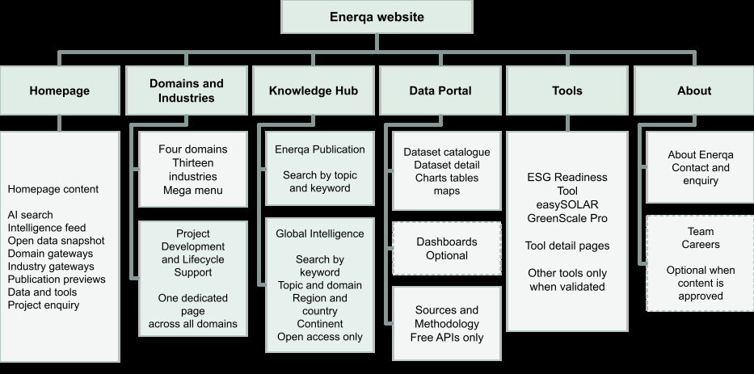

Diagram labels and connectors are editable Word shapes. Dashed outlines indicate conditional pages; the homepage box lists content modules rather than separate pages. All API integrations must be free to use and every full-reading or dataset link must be open access. Search, enquiry, accessibility and policy utilities support the six primary sections. The expanded Domains and Industries hierarchy follows on the next page.

---

## Page 6

[Open PDF page 6](<Enerqa Website Developer Handoff Revised.pdf#page=6>)

### Domains and Industries hierarchy

The mega menu exposes the four domains, all thirteen industries and the dedicated cross-domain lifecycle page.

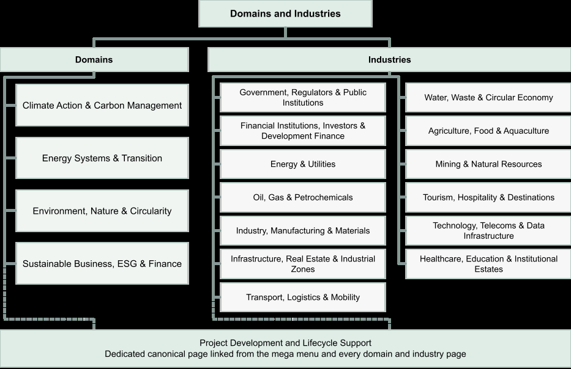

The lifecycle page applies across all four domains and thirteen industries; it is not a fifth domain. No project or experience pages are included.

---

## Page 7

[Open PDF page 7](<Enerqa Website Developer Handoff Revised.pdf#page=7>)

### Shared navigation and mega menu

#### Header and footer placement

Use a compact sticky header approximately 70 px high. Place the Enerqa logo on the left, the six primary navigation links across the centre, and language selection, search access and a Contact link on the right. The homepage can use the short visible label Home while the sitemap identifies Homepage. Keep the primary label About consistent.

On a laptop, the Domains and Industries item opens a wide mega menu under the header. Use click and keyboard activation as well as pointer access; do not rely on hover alone. Escape and an outside click close the panel. Focus must remain visible and follow the visual reading order. On mobile, convert the same groups into labelled expandable sections rather than removing industry links.

#### Domains and Industries mega menu

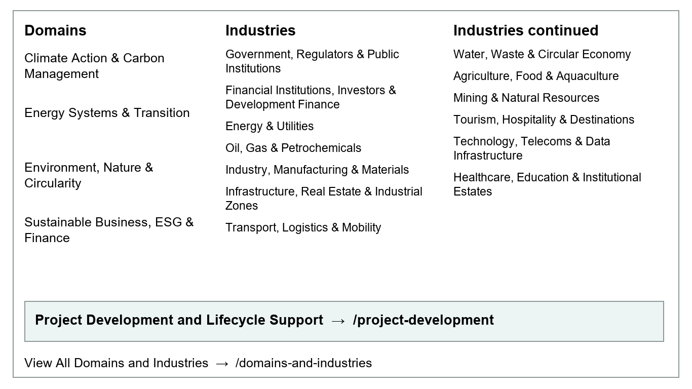

Use the exact lifecycle link label shown above. It is a cross-domain method, not a fifth domain. The menu can visually subgroup industries for scanning, but every one of the 13 industry pages must remain directly reachable.

#### Placement within each segment

Within text segments, place the heading at the top left, the narrative directly below it and the main action below the narrative. In a two-column capability row, use matching top alignment and allow each narrative to wrap naturally. Domain and industry introductory actions sit below the opening narrative, with section links alongside or beneath them. Do not float an enquiry button over the text.

The AI input occupies the full available width with its submit button at the right; suggestion chips sit immediately below. News cards place headline and permitted teaser above their source/date/original-link row. The compact market panel places instrument rows above a short sourced commentary item. Dataset filters sit above the chart, source/unit/period information below it, and

---

## Page 8

[Open PDF page 8](<Enerqa Website Developer Handoff Revised.pdf#page=8>)

download/citation actions beneath the visual. Tool cards use the purpose first and the access button at the bottom left. The diagrams locate the segment; these rules specify the internal placement of its parts.

#### Shared footer content

Repeat the six navigation groups with concise links, then show info@enerqa.co.uk, Contact, newsletter access, data-source attribution, Privacy, Terms, Cookie Choices and Accessibility. Add only currently approved contact details. Do not use project logos, experience counters or a portfolio teaser in the footer.

Breadcrumbs should identify the current section and parent page. Language switching should retain the equivalent page where a translation exists; otherwise explain availability rather than silently returning to the homepage. Footer labels must lead to genuine destinations, not Contact pages disguised as legal or accessibility information.

---

## Page 9

[Open PDF page 9](<Enerqa Website Developer Handoff Revised.pdf#page=9>)

### Homepage

#### Laptop page design

Route: /   \|   Reference browser viewport: 1366 × 768 px

Segment IDs map to the copy below. Views advance about 698 px below the sticky header; the final view stops at the page end. Test folds with final fonts, real feeds and Arabic text.

Initial view   \|   Top viewport fold y 0   \|   Bottom viewport fold y 768

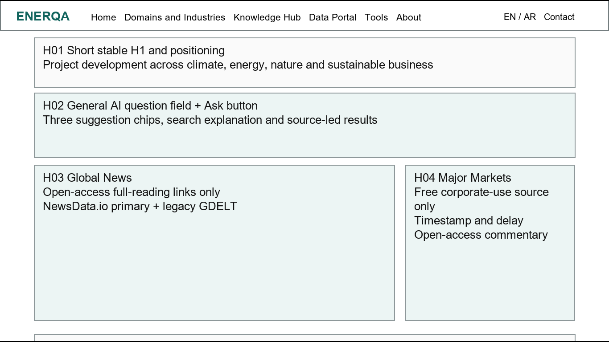

---

## Page 10

[Open PDF page 10](<Enerqa Website Developer Handoff Revised.pdf#page=10>)

Scroll view 1   \|   Top viewport fold y 698   \|   Bottom viewport fold y 1466

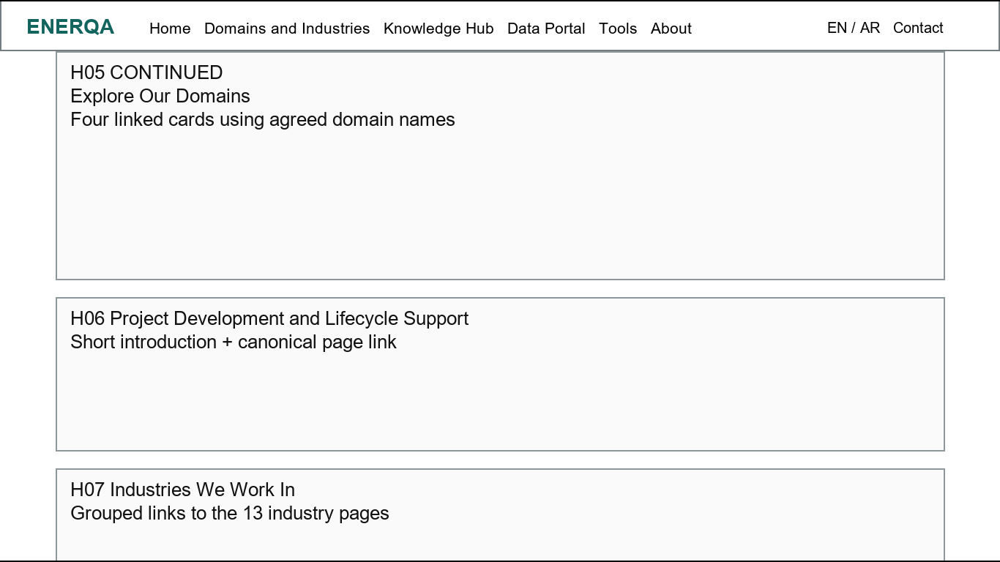

---

## Page 11

[Open PDF page 11](<Enerqa Website Developer Handoff Revised.pdf#page=11>)

#### Homepage continued layout

Scroll view 2   \|   Top viewport fold y 1396   \|   Bottom viewport fold y 2164

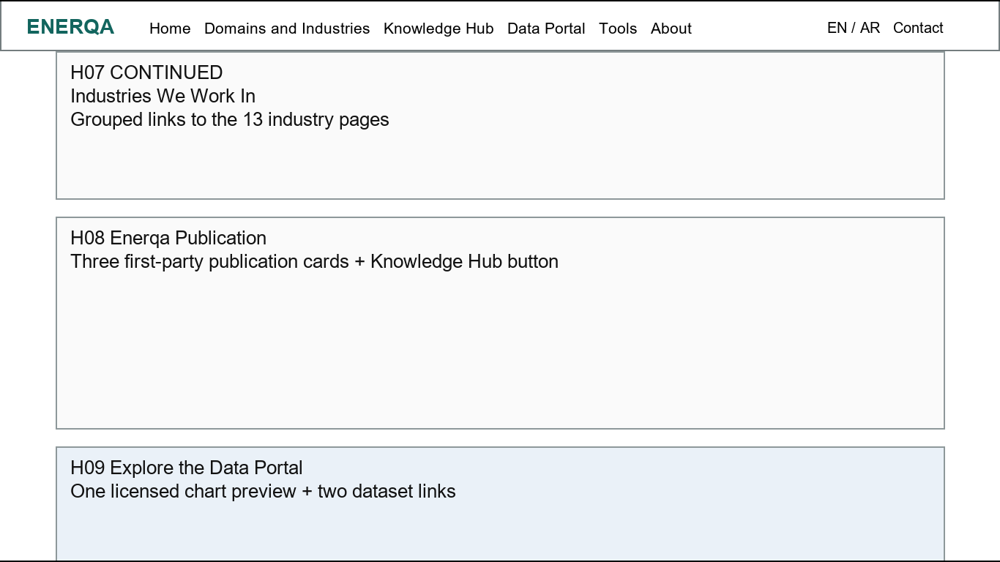

Scroll view 3   \|   Top viewport fold y 2094   \|   Bottom viewport fold y 2862

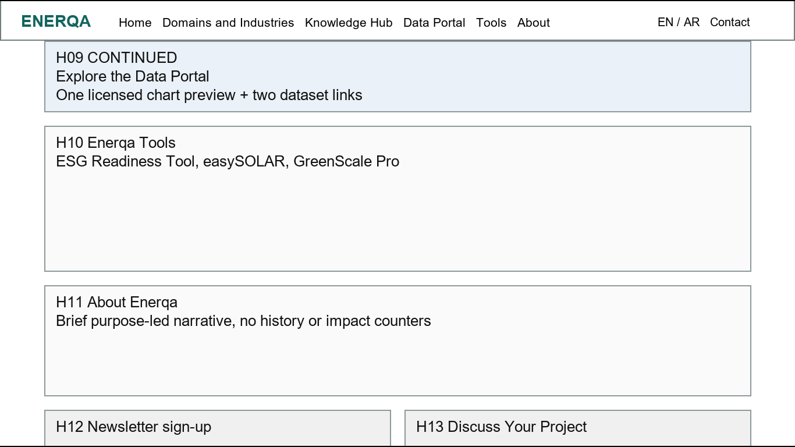

---

## Page 12

[Open PDF page 12](<Enerqa Website Developer Handoff Revised.pdf#page=12>)

#### Homepage continued layout

Scroll view 4   \|   Top viewport fold y 2394   \|   Bottom viewport fold y 3162

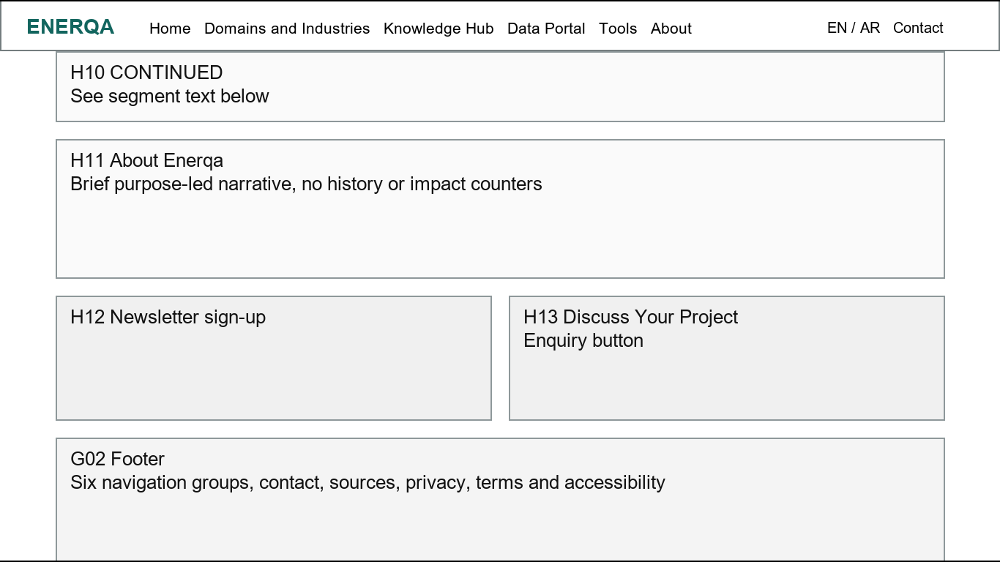

---

## Page 13

[Open PDF page 13](<Enerqa Website Developer Handoff Revised.pdf#page=13>)

#### Page text and API placement

Proposed supporting interface copy. The offering language follows the agreed domain and lifecycle content.

##### H01 Project Development for a Sustainable Future

Website heading: Project Development for a Sustainable Future

From an initial idea to feasibility, finance and implementation, Enerqa develops projects across climate action, energy transition, environment, nature, circularity, ESG and sustainable finance.

##### H02 Ask Explore Discover

Website heading: Ask Explore Discover

Search placeholder: Ask a question or explore a topic.

Search guidance: Ask about any topic. Where relevant, explore Enerqa’s capabilities, publications, data and tools alongside a source-led answer.

Button or link: Ask → /search?q={query}

Suggested chips: How can a climate project attract finance? \| Explore renewable-energy feasibility \| What does ESG readiness involve?

H02 AI placement: one input, clear submit button and loading state. Expand to a dedicated answer page on submission. Do not force a capability recommendation into unrelated questions. Use current first-party retrieval rather than claiming the model is trained exclusively on Enerqa content. Inference and supporting API calls must use a free corporate-use service within its free quota or a self-hosted appropriately licensed model; no paid fallback or automatic upgrade. Quota exhaustion falls back to keyword results and an honest status. See the AI provider policy.

##### H03 Global News

Website heading: Global News

Follow developments in climate action, energy, environment, nature, circularity, sustainable business and finance.

Button or link: View All News → /knowledge-hub/global-intelligence

H03 news cards: headline, source, publication date/time, permitted short description and verified open-access full-reading link. Filters: All \| Climate \| Energy \| Environment and Nature \| Business and Finance. Lead story plus two shorter stories fit inside the first viewport. No auto-rotating or infinite-scrolling feed. Use NewsData.io’s delayed free feed and additional legacy GDELT coverage; deduplicate and quality-filter before display. Reject paywalled or sign-in-only results before they reach any page.

Provider specifications: [newsdata](<#page-210>) \| [gdelt](<#page-211>)

##### H04 Major Markets

Website heading: Major Markets

Read commentary on major market developments, investment conditions and economic trends from openly accessible sources.

H04 launch requirement: a numerical feed is eligible only if it is free for public corporate display of the exact instruments and its linked source is openly accessible. No paid API, trial, paid fallback or licence purchase is permitted. A free display-only widget is not a downloadable data API and must never supply the Data Portal. If no compliant feed is confirmed, use this small panel for open-access market commentary only and omit numerical rows and live claims. Commentary uses eligible items from the same free news pool. Correct index-futures versus cash-index names if numerical rows are later enabled. Preserve the first-fold footprint.

---

## Page 14

[Open PDF page 14](<Enerqa Website Developer Handoff Revised.pdf#page=14>)

##### H05 Explore Our Domains

Website heading: Explore Our Domains

Four interconnected domains combine technical analysis, project development and investment thinking. Explore the work relevant to your priorities.

Card: Climate Action & Carbon Management → /domains/climate-action-carbon-management

Card: Energy Systems & Transition → /domains/energy-systems-transition

Card: Environment, Nature & Circularity → /domains/environment-nature-circularity

Card: Sustainable Business, ESG & Finance → /domains/sustainable-business-esg-finance

##### H06 Project Development and Lifecycle Support

Website heading: Project Development and Lifecycle Support

Ideas become practical projects when the opportunity is clearly defined, tested and structured. Concept development, feasibility studies, business and financial modelling, finance preparation and implementation support connect each stage. Clients can engage Enerqa at any point in the lifecycle.

Button or link: Explore Our Project Development Approach → /project-development

##### H07 Industries We Work In

Website heading: Industries We Work In

Different industries face different operational, resource and investment challenges. Our domains can be applied to public institutions, financial organisations, productive sectors, infrastructure and essential services.

Button or link: Explore All Industries → /domains-and-industries#industries

Display all 13 agreed names as grouped links, not a project-client carousel. Capability-led expansion industries describe potential applicability without implying completed assignments.

##### H08 Enerqa Publication

Website heading: Enerqa Publication

Research, analysis and practical perspectives on the systems, decisions and projects shaping a more sustainable future.

Button or link: Explore Enerqa Publication → /knowledge-hub

H08 is first-party CMS content, not a news API. Show real publication type, author, title and actual publication date. Do not import archive headings or biographies as articles.

##### H09 Explore the Data Portal

Website heading: Explore the Data Portal

Explore open-access datasets through charts and accessible tables. Each view identifies its source, geography, observation period, units and update date. Open a dataset to review the methodology and download data free of charge.

Button or link: Explore Related Data → /data-portal?

---

## Page 15

[Open PDF page 15](<Enerqa Website Developer Handoff Revised.pdf#page=15>)

Placement H09: one compact chart or dataset card only; use a cached source release, visible attribution and a canonical dataset link. Do not duplicate a full dashboard here. Recommended numerical sources: world-bank-indicators, climate-trace, oecd-sdmx.

Provider specifications: [world-bank-indicators](<#page-219>) \| [climate-trace](<#page-218>) \| [oecd-sdmx](<#page-219>)

##### H10 Enerqa Tools

Website heading: Enerqa Tools

Structured tools help make assessment, modelling and project decisions more accessible. Explore ESG readiness, solar-energy assessment and sustainability and resilience evaluation.

Button or link: Explore All Tools → /tools

##### H11 About Enerqa

Website heading: About Enerqa

Enerqa is a multidisciplinary project-development and consultancy company connecting climate, energy, environmental and business priorities with practical decisions and viable initiatives.

Button or link: About Enerqa → /about

##### H12 Stay Informed

Website heading: Stay Informed

Receive Enerqa publications and selected updates on climate, energy, environment and sustainable business.

Button or link: Subscribe → newsletter form

##### H13 Discuss Your Project

Website heading: Discuss Your Project

Share an idea, an investment opportunity or a challenge at any stage of development. An initial conversation can help define the evidence and support needed next.

Button or link: Discuss Your Project → /contact?intent=project

#### First fold acceptance test

At 1366 × 768 browser-content pixels, without scrolling, show the complete primary header, the short positioning, AI question field, meaningful news headlines and the compact market panel. The planned news/market band ends around y 720, leaving room above the bottom fold. Test at common laptop widths and at 125 percent browser zoom without hiding navigation or shrinking text to illegibility. Longer headlines wrap within their cards; clamp only teaser summaries, not essential source/time labels. The layout must reserve dimensions during loading to prevent the fold from moving.

---

## Page 16

[Open PDF page 16](<Enerqa Website Developer Handoff Revised.pdf#page=16>)

### Domains and Industries overview

#### Laptop page design

Route: /domains-and-industries   \|   Reference browser viewport: 1366 × 768 px

Segment IDs map to the copy below. Views advance about 698 px below the sticky header; the final view stops at the page end. Test folds with final fonts, real feeds and Arabic text.

Initial view   \|   Top viewport fold y 0   \|   Bottom viewport fold y 768

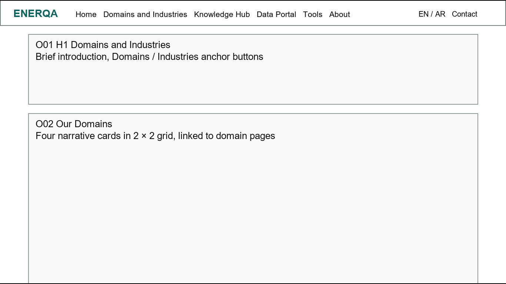

---

## Page 17

[Open PDF page 17](<Enerqa Website Developer Handoff Revised.pdf#page=17>)

Scroll view 1   \|   Top viewport fold y 698   \|   Bottom viewport fold y 1466

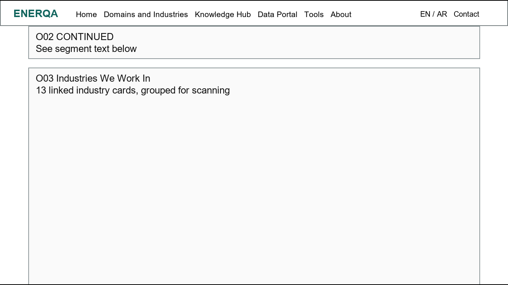

---

## Page 18

[Open PDF page 18](<Enerqa Website Developer Handoff Revised.pdf#page=18>)

#### Domains and Industries continued layout

Scroll view 2   \|   Top viewport fold y 1424   \|   Bottom viewport fold y 2192

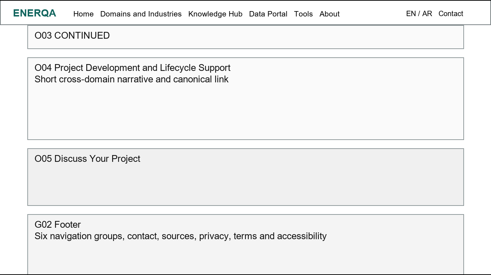

---

## Page 19

[Open PDF page 19](<Enerqa Website Developer Handoff Revised.pdf#page=19>)

#### Page text and API placement

##### O01 Domains and Industries

Website heading: Domains and Industries

Enerqa’s work is organised around four interconnected domains. Project development connects them, drawing on data, modelling, digital tools, MRV, research, institutional strengthening and capacity building wherever they add value.

Button or link: Explore Domains → #domains

Button or link: Explore Industries → #industries

##### O02 Our Domains

Website heading: Our Domains

Each domain brings together a distinct set of technical, environmental, commercial and investment questions. Select a domain to explore its full narrative, specific work areas and related knowledge, data and tools.

##### O02 1 Climate Action and Carbon Management

Website heading: Climate Action & Carbon Management

Climate change action becomes credible when commitments are translated into practical programmes, measurable results and investable projects. The starting point may be a national climate target, a corporate decarbonisation ambition, a sectoral challenge or an individual project opportunity. In every case, the pathway must be grounded in reliable emissions data and a clear understanding of climate risks and priorities.

Button or link: Explore Climate Action & Carbon Management → /domains/climate-action-carbon-management

##### O02 2 Energy Systems and Transition

Website heading: Energy Systems & Transition

The energy transition is reshaping how energy is produced, managed, financed and consumed. Governments, businesses and project developers must identify solutions that lower costs and emissions without compromising reliability, resilience or commercial performance.

Button or link: Explore Energy Systems & Transition → /domains/energy-systems-transition

##### O02 3 Environment  Nature and Circularity

Website heading: Environment, Nature & Circularity

Projects and operations depend on healthy environmental, social and natural systems. Understanding that relationship early makes it possible to manage impacts, meet regulatory and safeguard requirements, reduce liabilities and improve project design.

Button or link: Explore Environment, Nature & Circularity → /domains/environment-nature-circularity

---

## Page 20

[Open PDF page 20](<Enerqa Website Developer Handoff Revised.pdf#page=20>)

##### O02 4 Sustainable Business  ESG and Finance

Website heading: Sustainable Business, ESG & Finance

Sustainability creates lasting value when it influences strategy, governance, investment and daily operations. ESG strategy and reporting therefore begin with understanding what is material to an organisation, where climate and ESG risks arise, how responsible supply chains are managed, and whether internal systems are ready to deliver and measure improvement.

Button or link: Explore Sustainable Business, ESG & Finance → /domains/sustainable-business-esg-finance

##### O03 Industries We Work In

Website heading: Industries We Work In

The same development discipline can be applied across different sectors, with the evidence, risks and delivery requirements adapted to the industry. Select an industry to explore the relevant domains and forms of support.

All 13 names and routes are in the sitemap. Use equal-status industry links. Do not publish the internal labels evidence-led priority or capability-led expansion as claims of past work.

##### O04 Project Development and Lifecycle Support

Website heading: Project Development and Lifecycle Support

A project can begin with a need, an idea, an existing study or an operating asset. Concept development, feasibility, financing, delivery and performance measurement connect technical analysis with the decisions required at each stage.

Button or link: Explore Our Project Development Approach → /project-development

##### O05 Discuss Your Project

Website heading: Discuss Your Project

Explore how the relevant domain and industry perspective can help move your opportunity forward.

Button or link: Discuss Your Project → /contact?intent=project

No external API is necessary on the overview. Keep it a clear navigation and offering page; news and numerical data appear on the detail pages and their canonical hubs.

---

## Page 21

[Open PDF page 21](<Enerqa Website Developer Handoff Revised.pdf#page=21>)

### Four domain pages

Use one reusable domain template with distinct offering copy, capability sections and topic filters for each domain. Do not add portfolio, experience or featured-project sections. All capability narrative stays visible in the page HTML and is reachable by section anchors. News, research and numerical data use separately labelled modules.

### Climate Action and Carbon Management

#### Laptop page design

Route: /domains/climate-action-carbon-management   \|   Reference browser viewport: 1366 × 768 px

Segment IDs map to the copy below. Views advance about 698 px below the sticky header; the final view stops at the page end. Test folds with final fonts, real feeds and Arabic text.

Initial view   \|   Top viewport fold y 0   \|   Bottom viewport fold y 768

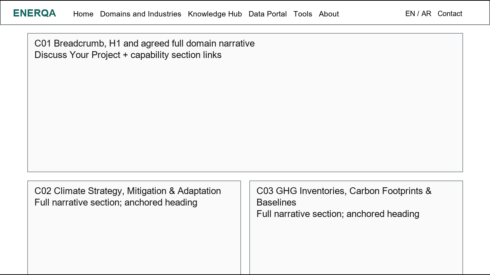

---

## Page 22

[Open PDF page 22](<Enerqa Website Developer Handoff Revised.pdf#page=22>)

Scroll view 1   \|   Top viewport fold y 698   \|   Bottom viewport fold y 1466

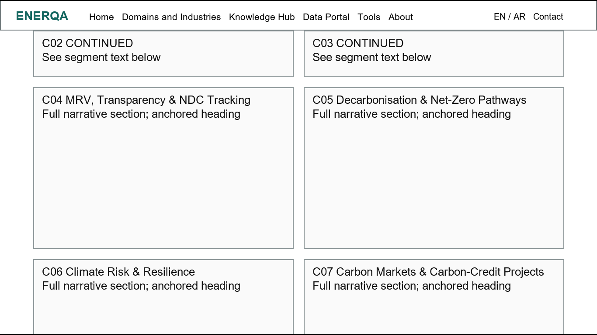

---

## Page 23

[Open PDF page 23](<Enerqa Website Developer Handoff Revised.pdf#page=23>)

#### Climate Action and Carbon Management continued layout

Scroll view 2   \|   Top viewport fold y 1396   \|   Bottom viewport fold y 2164

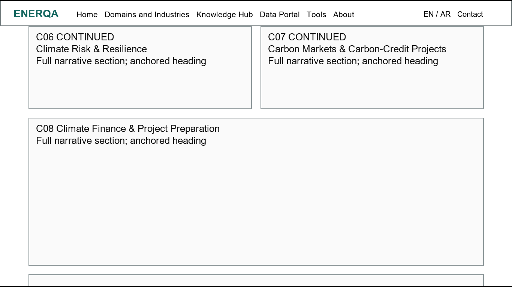

Scroll view 3   \|   Top viewport fold y 2094   \|   Bottom viewport fold y 2862

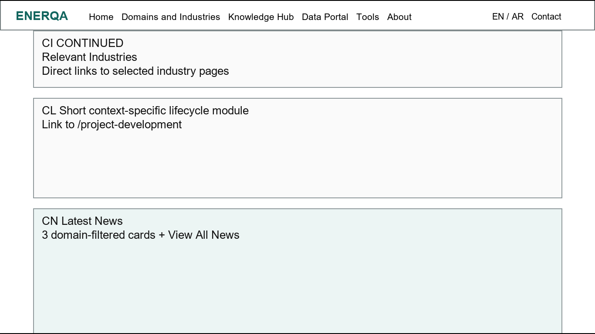

---

## Page 24

[Open PDF page 24](<Enerqa Website Developer Handoff Revised.pdf#page=24>)

#### Climate Action and Carbon Management continued layout

Scroll view 4   \|   Top viewport fold y 2792   \|   Bottom viewport fold y 3560

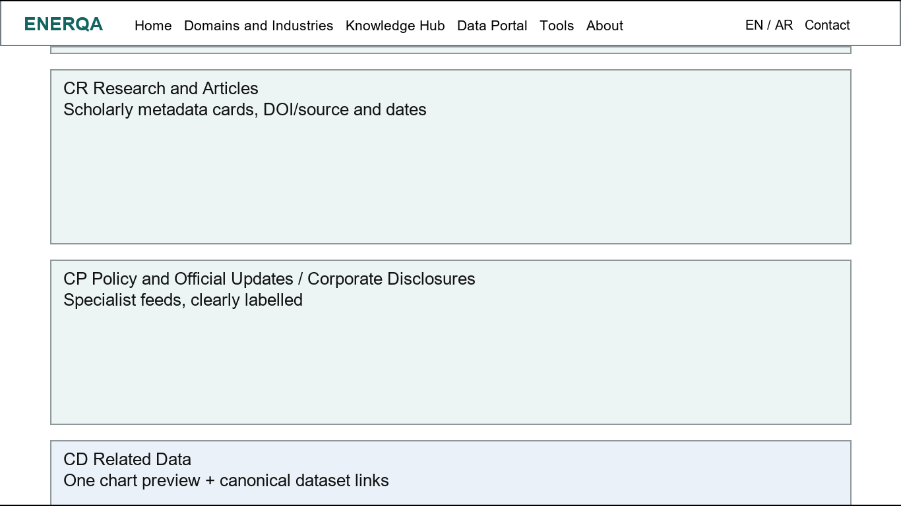

Scroll view 5   \|   Top viewport fold y 3490   \|   Bottom viewport fold y 4258

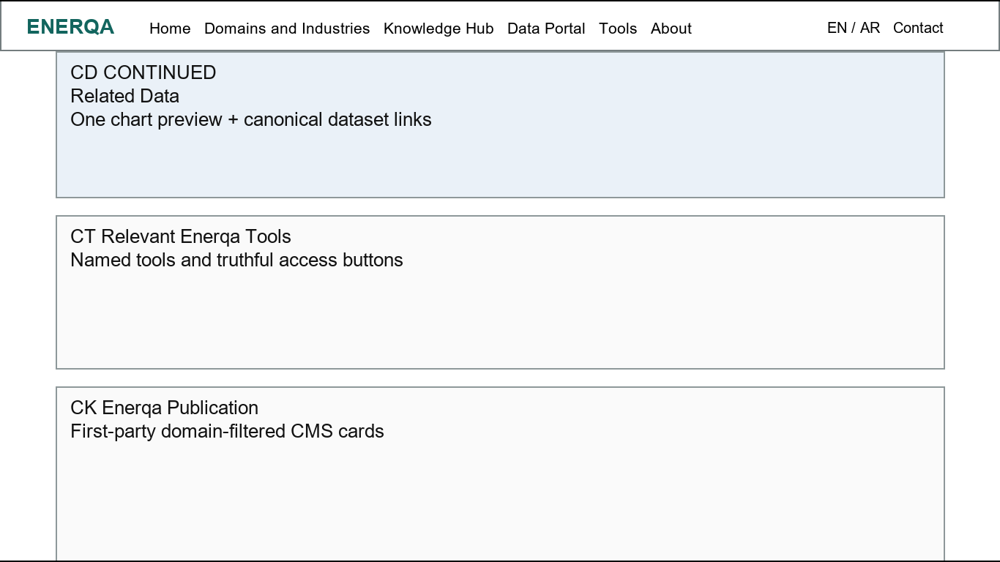

---

## Page 25

[Open PDF page 25](<Enerqa Website Developer Handoff Revised.pdf#page=25>)

#### Climate Action and Carbon Management continued layout

Scroll view 6   \|   Top viewport fold y 3888   \|   Bottom viewport fold y 4656

---

## Page 26

[Open PDF page 26](<Enerqa Website Developer Handoff Revised.pdf#page=26>)

#### Page text and API placement

##### C01 Climate Action and Carbon Management

Website heading: Climate Action & Carbon Management

Climate change action becomes credible when commitments are translated into practical programmes, measurable results and investable projects. The starting point may be a national climate target, a corporate decarbonisation ambition, a sectoral challenge or an individual project opportunity. In every case, the pathway must be grounded in reliable emissions data and a clear understanding of climate risks and priorities.

This work brings together greenhouse gas inventories, GHG emissions baselines, climate change mitigation and adaptation planning, climate resilience, decarbonisation pathways, NDC implementation, MRV and climate transparency systems.

Where carbon markets or climate finance form part of the solution, the same pathway can extend into carbon-credit project development, financing, implementation support, verification and reporting. This connects climate policy and carbon management with projects capable of delivering measurable environmental and economic value.

Button or link: Discuss Your Project → /contact?domain=climate-action-carbon-management

##### C02 Climate Strategy  Mitigation and Adaptation

Website heading: Climate Strategy, Mitigation & Adaptation

Climate ambition becomes meaningful when it is translated into priorities, investable projects and a practical route to implementation. Climate strategies can connect emissions reduction with adaptation needs, policy objectives, operational realities and development priorities. Beginning with evidence and stakeholder engagement, the work progresses through baseline assessment, scenario analysis and opportunity identification to mitigation and adaptation plans, sector roadmaps and project pipelines. The result is a coherent framework for directing resources, coordinating action and monitoring progress as climate conditions, technologies and policy requirements evolve.

##### C03 GHG Inventories  Carbon Footprints and Baselines

Website heading: GHG Inventories, Carbon Footprints & Baselines

A reliable emissions baseline provides the foundation for carbon management, climate reporting and credible reduction targets. Greenhouse gas inventories and carbon footprints bring together activity data, emission factors, organisational or project boundaries and transparent calculation methods to show where emissions arise and which sources matter most. Covering relevant Scope 1, Scope 2 and Scope 3 emissions, the process moves from data collection and quality review to hotspot analysis and baseline development, creating a defensible evidence base for decarbonisation projects, disclosures and future performance measurement.

##### C04 MRV Transparency and NDC Tracking

Website heading: MRV, Transparency & NDC Tracking

Climate commitments depend on systems that can measure results, document decisions and show whether implementation remains on course. Measurement, reporting and verification frameworks define indicators, data sources, responsibilities, calculation methods and quality controls for policies,

---

## Page 27

[Open PDF page 27](<Enerqa Website Developer Handoff Revised.pdf#page=27>)

programmes and projects. At national and sectoral levels, these systems can connect actions and outcomes with Nationally Determined Contributions, international transparency requirements and wider development objectives. Clear institutional arrangements, data flows, reporting templates and digital dashboards make progress easier to track while strengthening accountability, institutional learning and confidence in reported climate results.

##### C05 Decarbonisation and Net Zero Pathways

Website heading: Decarbonisation & Net-Zero Pathways

A net-zero commitment needs more than a distant target. It requires a sequenced pathway grounded in emissions data, technical options and investment realities. Decarbonisation planning examines how energy efficiency, renewable energy, operational changes, cleaner technologies, fuel switching and value-chain action could reduce emissions over time. Scenario modelling and feasibility assessment compare costs, benefits, dependencies and implementation risks, allowing measures to be organised into near-, medium- and long-term programmes. This turns climate ambition into a practical transition plan with defined milestones, project opportunities and a framework for monitoring progress.

##### C06 Climate Risk and Resilience

Website heading: Climate Risk & Resilience

Climate change creates physical risks for assets, infrastructure, ecosystems, communities and supply chains, while changes in policy, technology and markets introduce transition risks for organisations and investments. Climate risk assessment examines hazards, exposure, vulnerability and adaptive capacity under relevant scenarios, revealing where disruption and financial consequences may emerge. The findings inform resilient design, adaptation measures, business-continuity planning and investment priorities. Considering climate risk from early concept and feasibility through design, implementation and monitoring makes resilience part of project development rather than a response added after major decisions have already been made.

##### C07 Carbon Markets and Carbon Credit Projects

Website heading: Carbon Markets & Carbon-Credit Projects

Carbon markets can mobilise finance for measurable emissions reductions and removals, but credible projects must rest on sound methodologies, additionality, robust baselines and long-term monitoring. Carbon-credit project development begins by identifying and screening opportunities before testing technical feasibility, emissions impact, financial potential and applicable standards. The work may continue through project documentation, stakeholder and safeguard requirements, validation and registration preparation, monitoring systems and verification support. Careful development throughout the carbon-project cycle strengthens environmental integrity while giving project owners a clearer view of costs, risks, responsibilities and potential revenues.

##### C08 Climate Finance and Project Preparation

Website heading: Climate Finance & Project Preparation

Promising climate ideas often struggle to attract finance because they have not yet been developed into clearly defined, technically credible and investment-ready projects. Climate project preparation bridges that gap by shaping early concepts, assessing feasibility, estimating climate and development benefits, examining delivery models and building the financial and economic case. Technical studies, risk analysis, safeguards, implementation arrangements and monitoring frameworks can then be assembled into

---

## Page 28

[Open PDF page 28](<Enerqa Website Developer Handoff Revised.pdf#page=28>)

concept notes, funding proposals or investment documentation. This structured pathway allows climate funds, development-finance institutions, investors and project sponsors to assess opportunities and move viable projects towards financing and delivery.

##### CI Relevant Industries

Website heading: Relevant Industries

Explore how this domain applies to the operational and investment priorities of different industries.

Button or link: Explore All Industries → /domains-and-industries#industries

Select industry links through the shared domain/industry taxonomy. The full list remains accessible in the mega menu; do not use past-work logos as the industry navigation.

##### CL Project Development and Lifecycle Support

Website heading: Project Development and Lifecycle Support

Climate opportunities may begin with an emissions baseline, a policy priority or an identified climate risk. From there, concepts can be tested through feasibility studies, carbon-market assessment and climate-finance preparation before progressing towards implementation. MRV and monitoring frameworks establish how emissions reductions, resilience outcomes and progress against climate commitments will be measured.

Button or link: Explore Our Project Development Approach → /project-development

Place after the offering or capability sections. This is a short context-specific module; keep the complete lifecycle narrative on the canonical page only.

##### CN Latest News

Website heading: Latest News

Follow developments in climate policy, carbon management, adaptation, resilience and climate finance. Headlines are selected for relevance to this domain and linked to their original publishers.

Button or link: View All News → /knowledge-hub/global-intelligence?domain=climate-action-carbon-management

Placement CN: three news cards on the page, with headline, source, publication time and short permitted description. NewsData.io is primary; legacy GDELT supplies additional geographic coverage. Publish only records whose full reading is verified open access without a paywall, subscription or sign-in. Show source delays rather than calling the free feed live.

Provider specifications: [newsdata](<#page-210>) \| [gdelt](<#page-211>)

##### CR Research and Articles

Website heading: Research and Articles

Explore research and technical publications that inform decisions in climate policy, carbon management, adaptation, resilience and climate finance. Each record identifies its authors, publication source and date, with a link to the original work.

Button or link: Explore Research → /knowledge-hub/global-intelligence?type=research&domain=climate-action-carbon-management

Placement CR: OpenAlex with is\_oa:true first, DOAJ supplementary; display metadata, DOI and the verified open-access full-reading link. Use best\_oa\_location or another verified lawful open-access location instead of a paywalled DOI landing page. Deduplicate shared DOI records. Separate journal research, reports and unreviewed preprints.

Provider specifications: [openalex](<#page-212>) \| [doaj](<#page-213>)

---

## Page 29

[Open PDF page 29](<Enerqa Website Developer Handoff Revised.pdf#page=29>)

##### CP Policy and Official Updates

Website heading: Policy and Official Updates

Follow original-source reports and updates relevant to this domain, with their organisation, document type and publication date clearly identified.

Specialist sources: reliefweb. Curate verified open-access official UNFCCC NDC/BTR submissions, IPCC releases and climate-finance institutions. Preserve submission dates and source links. ReliefWeb is used only for relevant openly readable eligible reports. The World Bank Documents and Reports API is excluded from the corporate launch; the separate free Indicators API remains a numerical candidate.

Provider specifications: [reliefweb](<#page-213>)

##### CD Related Data

Website heading: Related Data

Explore open-access datasets through charts and accessible tables. Each view identifies its source, geography, observation period, units and update date. Open a dataset to review the methodology and download data free of charge.

Button or link: Explore Related Data → /data-portal?domain=climate-action-carbon-management

Placement CD: one compact chart or dataset card only; use a cached source release, visible attribution and a canonical dataset link. Do not duplicate a full dashboard here. Recommended numerical sources: climate-trace, oecd-sdmx.

Provider specifications: [climate-trace](<#page-218>) \| [oecd-sdmx](<#page-219>)

##### CT Relevant Enerqa Tools

Website heading: Relevant Enerqa Tools

Explore tools that help structure assessment and project decisions in this domain.

Button or link: ESG Readiness Tool → /tools/esg-readiness

Include other profile-listed tools only after validating the current name, file/endpoint, functionality, method and access. Do not label a tool public or online until it is tested.

##### CK Enerqa Publication

Website heading: Enerqa Publication

Read Enerqa’s analysis and practical perspectives related to climate policy, carbon management, adaptation, resilience and climate finance.

Button or link: Explore Enerqa Publication → /knowledge-hub?domain=climate-action-carbon-management

First-party CMS, not external API content. Use approved real publications with original metadata.

##### CA Discuss Your Project

Website heading: Discuss Your Project

Share your priorities, project stage and the questions that need to be resolved. The engagement can focus on a defined workstream or a broader development process.

Button or link: Discuss Your Project → /contact?domain=climate-action-carbon-management

---

## Page 30

[Open PDF page 30](<Enerqa Website Developer Handoff Revised.pdf#page=30>)

#### Contextual API and link configuration

News query baskets: "climate change" OR "climate policy" OR "NDC"; "carbon markets" OR "carbon credits" OR "decarbonisation"; "climate finance" OR "adaptation finance" OR "loss and damage"

Research themes: GHG inventories measurement reporting verification; climate adaptation resilience vulnerability; carbon markets climate finance decarbonisation

Source priorities: UNFCCC and official country submissions (curated source links; document API not yet selected); IPCC official news/reports (curated source links); UN/UNEP/WMO and national climate authorities; Reputable climate-policy, carbon-market and finance journalism

Specialist feeds for CP: reliefweb.

Provider specifications: [reliefweb](<#page-213>)

CD numerical source climate-trace: Country/sector greenhouse gas estimates; explicit inventory version, gas and CO2e horizon.

CD numerical source oecd-sdmx: Reported climate-related development finance; annual, not live/global all-finance tracker.

CD numerical source world-bank-indicators: Country vulnerability/development and relevant emissions context; licence/series validation.

CD numerical source nasa-power: Historical meteorological context where relevant; not climate projection or local survey.

CT tools: esg-readiness-tool, easysolar, greenscale-pro. Only display tools whose climate-risk, emissions or low-carbon project application is documented in their approved tool specification; avoid generic all-tools carousel.

Tool routes: /tools/esg-readiness, /tools/easysolar, /tools/greenscale-pro. Developer must use approved availability/access labels; do not assume every tool is publicly launched.

---

## Page 31

[Open PDF page 31](<Enerqa Website Developer Handoff Revised.pdf#page=31>)

### Energy Systems and Transition

#### Laptop page design

Route: /domains/energy-systems-transition   \|   Reference browser viewport: 1366 × 768 px

Segment IDs map to the copy below. Views advance about 698 px below the sticky header; the final view stops at the page end. Test folds with final fonts, real feeds and Arabic text.

Initial view   \|   Top viewport fold y 0   \|   Bottom viewport fold y 768

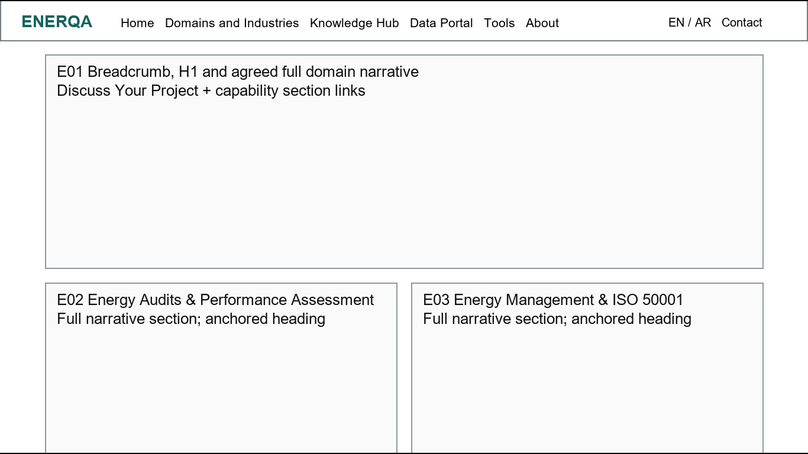

---

## Page 32

[Open PDF page 32](<Enerqa Website Developer Handoff Revised.pdf#page=32>)

Scroll view 1   \|   Top viewport fold y 698   \|   Bottom viewport fold y 1466

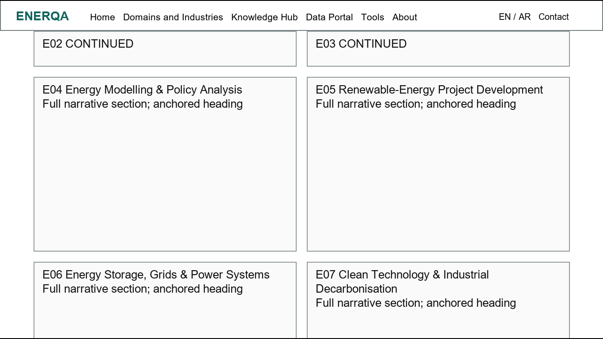

---

## Page 33

[Open PDF page 33](<Enerqa Website Developer Handoff Revised.pdf#page=33>)

#### Energy Systems and Transition continued layout

Scroll view 2   \|   Top viewport fold y 1396   \|   Bottom viewport fold y 2164

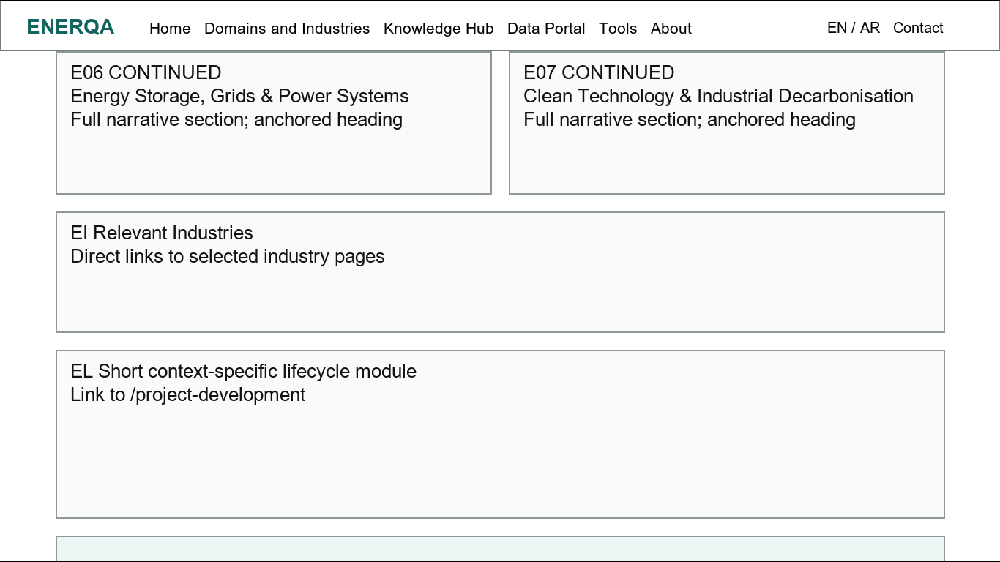

Scroll view 3   \|   Top viewport fold y 2094   \|   Bottom viewport fold y 2862

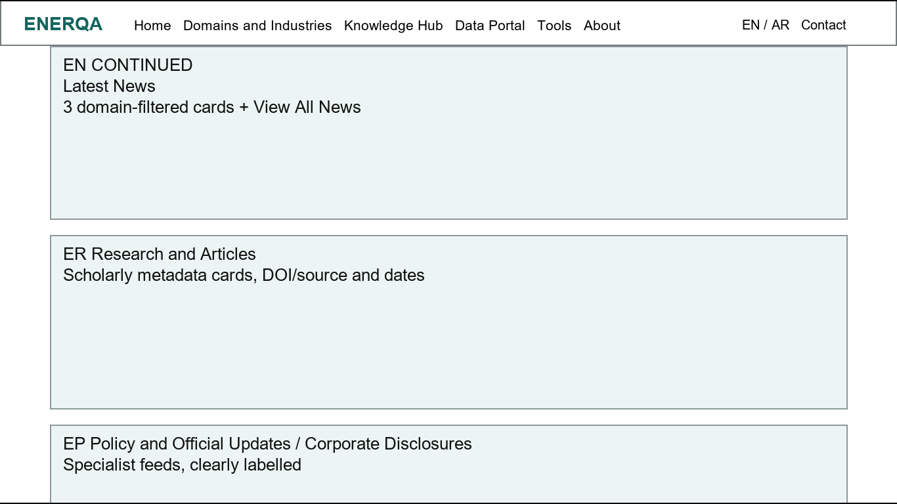

---

## Page 34

[Open PDF page 34](<Enerqa Website Developer Handoff Revised.pdf#page=34>)

#### Energy Systems and Transition continued layout

Scroll view 4   \|   Top viewport fold y 2792   \|   Bottom viewport fold y 3560

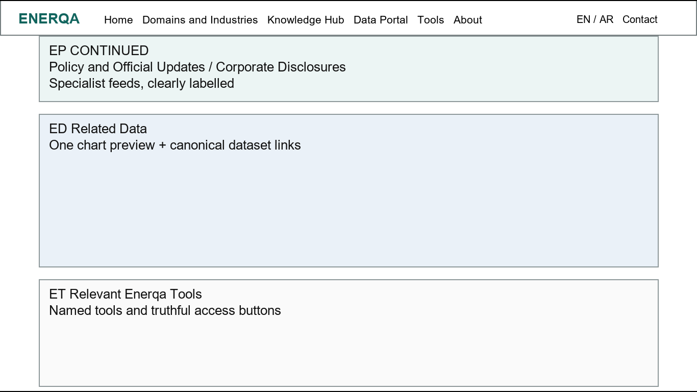

Scroll view 5   \|   Top viewport fold y 3443   \|   Bottom viewport fold y 4211

---

## Page 35

[Open PDF page 35](<Enerqa Website Developer Handoff Revised.pdf#page=35>)

#### Page text and API placement

##### E01 Energy Systems and Transition

Website heading: Energy Systems & Transition

The energy transition is reshaping how energy is produced, managed, financed and consumed. Governments, businesses and project developers must identify solutions that lower costs and emissions without compromising reliability, resilience or commercial performance.

An engagement may begin with an energy audit, an ISO 50001 energy-management system or detailed energy and emissions modelling. These foundations reveal where efficiency improvements can be made and where new energy investments may create value.

Renewable energy project development, energy storage, power systems, clean technology and the decarbonisation of facilities or energy-intensive operations can then be assessed against available resources, market conditions and investment priorities. Technical and economic feasibility studies provide the basis for sound investment cases, project financing, implementation and long-term energy-performance monitoring.

Button or link: Discuss Your Project → /contact?domain=energy-systems-transition

##### E02 Energy Audits and Performance Assessment

Website heading: Energy Audits & Performance Assessment

Reliable energy performance begins with a clear understanding of where, when and why energy is used. Energy audits examine facilities, processes and equipment to establish consumption baselines, identify losses and uncover practical energy-efficiency opportunities. The work can extend from initial scoping, data review and site assessment to technical analysis, prioritised energy-conservation measures and investment planning. Each recommendation is considered in relation to operational requirements, costs, savings, emissions reductions and implementation constraints, creating an evidence-based pathway from diagnosis and feasibility through delivery, measurement and ongoing performance improvement.

##### E03 Energy Management and ISO 50001

Website heading: Energy Management & ISO 50001

Effective energy management turns one-off savings into a system of continual improvement. An ISO 50001-aligned energy management system connects organisational priorities with energy reviews, significant energy uses, baselines, energy performance indicators, targets and action plans. Governance, operational controls, procurement, staff engagement, documentation and performance monitoring are designed to work together. From readiness assessment and system design to implementation, internal review and corrective action, the approach gives industrial facilities, commercial portfolios and public institutions a practical structure for managing energy consumption, operating costs and emissions over time.

##### E04 Energy Modelling and Policy Analysis

Website heading: Energy Modelling & Policy Analysis

Energy decisions frequently involve competing technical, economic and policy choices. Energy modelling makes those trade-offs visible by testing demand, supply, technologies, costs and emissions under different assumptions and future scenarios. Policy analysis adds the regulatory, institutional and market

---

## Page 36

[Open PDF page 36](<Enerqa Website Developer Handoff Revised.pdf#page=36>)

context needed to interpret the results, whether the question concerns national energy-transition pathways, utility planning, tariffs, incentives or investment priorities. The work moves from defining the decision and assembling credible data to scenario development, sensitivity analysis and clear recommendations, providing a defensible basis for policy formulation, project feasibility, financing and subsequent performance tracking.

##### E05 Renewable Energy Project Development

Website heading: Renewable-Energy Project Development

Renewable-energy opportunities become investable projects through disciplined development. The journey may begin with resource, market, technology and site screening, followed by concept design, pre-feasibility and detailed feasibility studies. Energy-yield assessment, grid connection, permitting, environmental and social considerations, capital and operating costs, revenue models, risks and financing requirements are brought into a coherent business case. The work can continue through procurement, partner selection, implementation planning, commissioning and performance monitoring, enabling solar, wind, hybrid and distributed-energy projects to progress from an initial idea to an operational asset.

##### E06 Energy Storage  Grids and Power Systems

Website heading: Energy Storage, Grids & Power Systems

Modern power systems need greater flexibility as electricity demand changes and variable renewable generation expands. Energy storage and grid planning bring together technical performance, system reliability and commercial value. Depending on the project, this may include battery energy storage systems, hybrid generation, microgrids, behind-the-meter solutions, grid integration and transmission or distribution requirements. Needs assessment leads into technology selection, sizing, dispatch modelling, interconnection studies and techno-economic analysis. Procurement and implementation planning can then establish a pathway towards commissioning, operational optimisation and long-term performance monitoring.

##### E07 Clean Technology and Industrial Decarbonisation

Website heading: Clean Technology & Industrial Decarbonisation

Industrial decarbonisation is rarely achieved through a single technology. It requires a practical sequence of measures matched to production processes, energy needs, asset cycles and investment capacity. Starting with energy and emissions baselines, potential pathways can combine efficiency, process optimisation, electrification, renewable energy, fuel switching, waste-heat recovery and other clean technologies. Technical and commercial screening identifies which options merit feasibility studies, pilots or full project development. Abatement potential, cost, operational risk, financing and implementation timing are assessed together, creating a phased roadmap with measurable outcomes.

##### EI Relevant Industries

Website heading: Relevant Industries

Explore how this domain applies to the operational and investment priorities of different industries.

Button or link: Explore All Industries → /domains-and-industries#industries

Select industry links through the shared domain/industry taxonomy. The full list remains accessible in the mega menu; do not use past-work logos as the industry navigation.

---

## Page 37

[Open PDF page 37](<Enerqa Website Developer Handoff Revised.pdf#page=37>)

##### EL Project Development and Lifecycle Support

Website heading: Project Development and Lifecycle Support

Energy projects begin by understanding demand, available resources and the performance required from a proposed solution. Audits, modelling and resource assessment inform concepts that can be tested through technical and financial feasibility. As an opportunity develops, the focus moves to financing, design, procurement and implementation, followed by monitoring of energy performance, costs and emissions.

Button or link: Explore Our Project Development Approach → /project-development

Place after the offering or capability sections. This is a short context-specific module; keep the complete lifecycle narrative on the canonical page only.

##### EN Latest News

Website heading: Latest News

Follow developments in energy systems, technology, energy efficiency and energy markets. Headlines are selected for relevance to this domain and linked to their original publishers.

Button or link: View All News → /knowledge-hub/global-intelligence?domain=energy-systems-transition

Placement EN: three news cards on the page, with headline, source, publication time and short permitted description. NewsData.io is primary; legacy GDELT supplies additional geographic coverage. Publish only records whose full reading is verified open access without a paywall, subscription or sign-in. Show source delays rather than calling the free feed live.

Provider specifications: [newsdata](<#page-210>) \| [gdelt](<#page-211>)

##### ER Research and Articles

Website heading: Research and Articles

Explore research and technical publications that inform decisions in energy systems, technology, energy efficiency and energy markets. Each record identifies its authors, publication source and date, with a link to the original work.

Button or link: Explore Research → /knowledge-hub/global-intelligence?type=research&domain=energy-systems-transition

Placement ER: OpenAlex with is\_oa:true first, DOAJ supplementary; display metadata, DOI and the verified open-access full-reading link. Use best\_oa\_location or another verified lawful open-access location instead of a paywalled DOI landing page. Deduplicate shared DOI records. Separate journal research, reports and unreviewed preprints.

Provider specifications: [openalex](<#page-212>) \| [doaj](<#page-213>)

##### EP Official Energy Analysis and Research

Website heading: Official Energy Analysis and Research

Follow original-source reports and updates relevant to this domain, with their organisation, document type and publication date clearly identified.

Specialist sources: eia\_rss, osti. EIA RSS supplies official energy analysis and OSTI supplies energy research metadata. Add source-filtered national energy authorities and regulators where relevant; distinguish technical reports from market news.

Provider specifications: [eia\_rss](<#page-214>) \| [osti](<#page-215>)

---

## Page 38

[Open PDF page 38](<Enerqa Website Developer Handoff Revised.pdf#page=38>)

##### ED Related Data

Website heading: Related Data

Explore open-access datasets through charts and accessible tables. Each view identifies its source, geography, observation period, units and update date. Open a dataset to review the methodology and download data free of charge.

Button or link: Explore Related Data → /data-portal?domain=energy-systems-transition

Placement ED: one compact chart or dataset card only; use a cached source release, visible attribution and a canonical dataset link. Do not duplicate a full dashboard here. Recommended numerical sources: eia-open-data, nasa-power, world-bank-indicators.

Provider specifications: [eia-open-data](<#page-220>) \| [nasa-power](<#page-221>) \| [world-bank-indicators](<#page-219>)

##### ET Relevant Enerqa Tools

Website heading: Relevant Enerqa Tools

Explore tools that help structure assessment and project decisions in this domain.

Button or link: easySOLAR → /tools/easysolar

Button or link: GreenScale Pro → /tools/greenscale-pro

Include other profile-listed tools only after validating the current name, file/endpoint, functionality, method and access. Do not label a tool public or online until it is tested.

##### EK Enerqa Publication

Website heading: Enerqa Publication

Read Enerqa’s analysis and practical perspectives related to energy systems, technology, energy efficiency and energy markets.

Button or link: Explore Enerqa Publication → /knowledge-hub?domain=energy-systems-transition

First-party CMS, not external API content. Use approved real publications with original metadata.

##### EA Discuss Your Project

Website heading: Discuss Your Project

Share your priorities, project stage and the questions that need to be resolved. The engagement can focus on a defined workstream or a broader development process.

Button or link: Discuss Your Project → /contact?domain=energy-systems-transition

#### Contextual API and link configuration

News query baskets: "renewable energy" OR "energy storage" OR "power grid"; "energy efficiency" OR "clean technology" OR "industrial decarbonisation"; "energy markets" OR "oil market" OR "electricity prices"

Research themes: renewable energy storage grids feasibility; energy efficiency energy management industrial decarbonisation; energy modelling electricity markets transition

Source priorities: EIA official energy analysis; DOE OSTI technical research; Official energy ministries, regulators and grid/system operators; Reputable global energy-market and technology journalism

Specialist feeds for EP: eia\_rss, osti.

Provider specifications: [eia\_rss](<#page-214>) \| [osti](<#page-215>)

---

## Page 39

[Open PDF page 39](<Enerqa Website Developer Handoff Revised.pdf#page=39>)

ED numerical source eia-open-data: Generation mix, demand and selected energy-price series with geography/frequency labels.

ED numerical source nasa-power: Location-based solar resource and meteorology for early feasibility.

ED numerical source world-bank-indicators: Electricity access and country energy indicators.

ED numerical source climate-trace: Energy-sector greenhouse gas estimates as context; not facility audit/MRV.

ET tools: easysolar, greenscale-pro. easySOLAR for PV/storage feasibility; GreenScale Pro for relevant building/infrastructure sustainability and resilience assessments.

Tool routes: /tools/easysolar, /tools/greenscale-pro. Developer must use approved availability/access labels; do not assume every tool is publicly launched.

---

## Page 40

[Open PDF page 40](<Enerqa Website Developer Handoff Revised.pdf#page=40>)

### Environment  Nature and Circularity

#### Laptop page design

Route: /domains/environment-nature-circularity   \|   Reference browser viewport: 1366 × 768 px

Segment IDs map to the copy below. Views advance about 698 px below the sticky header; the final view stops at the page end. Test folds with final fonts, real feeds and Arabic text.

Initial view   \|   Top viewport fold y 0   \|   Bottom viewport fold y 768

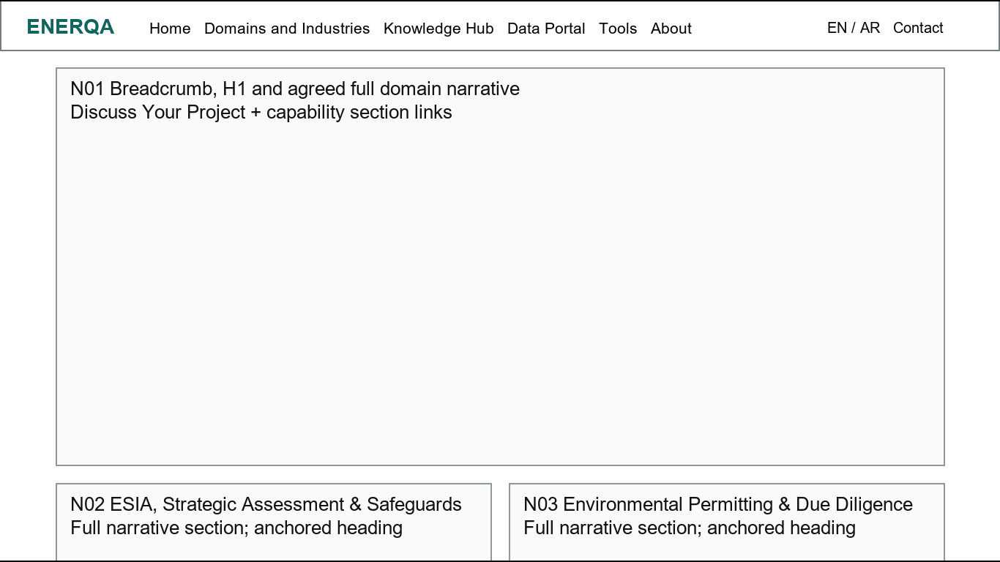

---

## Page 41

[Open PDF page 41](<Enerqa Website Developer Handoff Revised.pdf#page=41>)

Scroll view 1   \|   Top viewport fold y 698   \|   Bottom viewport fold y 1466

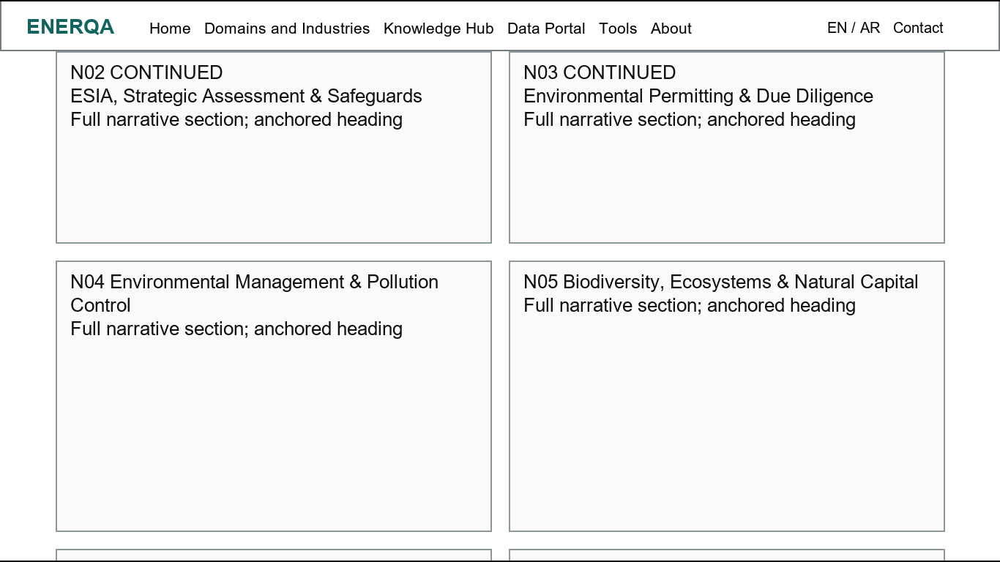

---

## Page 42

[Open PDF page 42](<Enerqa Website Developer Handoff Revised.pdf#page=42>)

#### Environment  Nature and Circularity continued layout

Scroll view 2   \|   Top viewport fold y 1396   \|   Bottom viewport fold y 2164

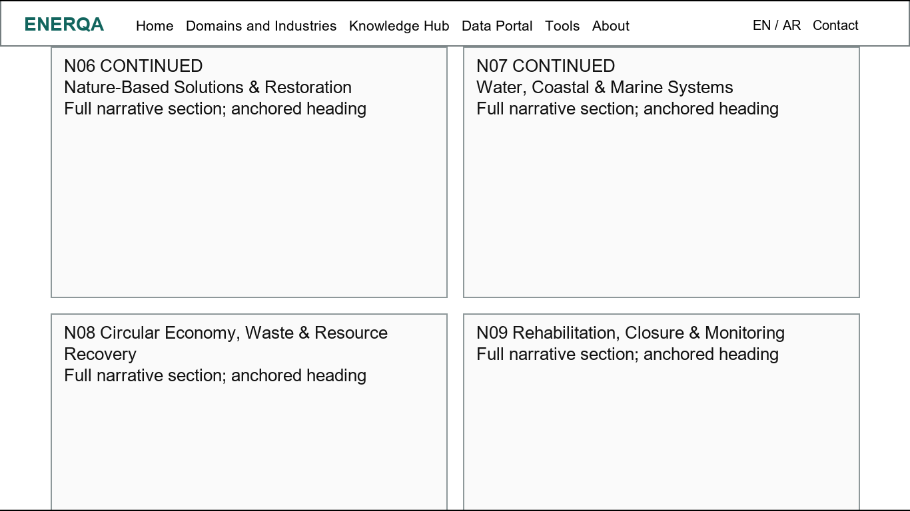

Scroll view 3   \|   Top viewport fold y 2094   \|   Bottom viewport fold y 2862

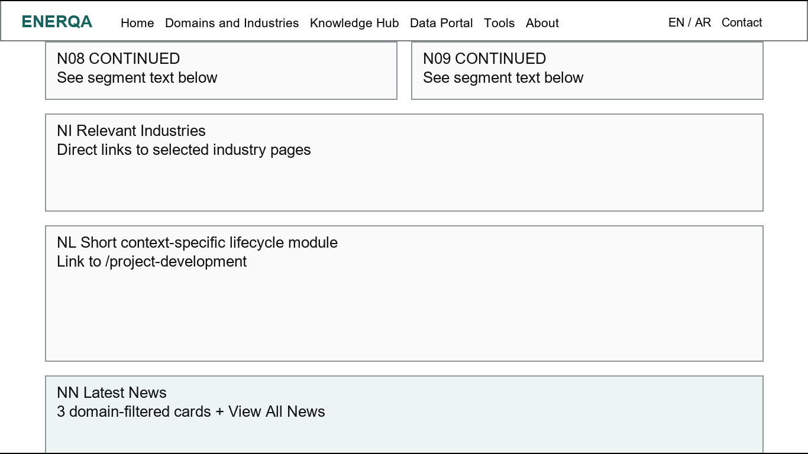

---

## Page 43

[Open PDF page 43](<Enerqa Website Developer Handoff Revised.pdf#page=43>)

#### Environment  Nature and Circularity continued layout

Scroll view 4   \|   Top viewport fold y 2792   \|   Bottom viewport fold y 3560

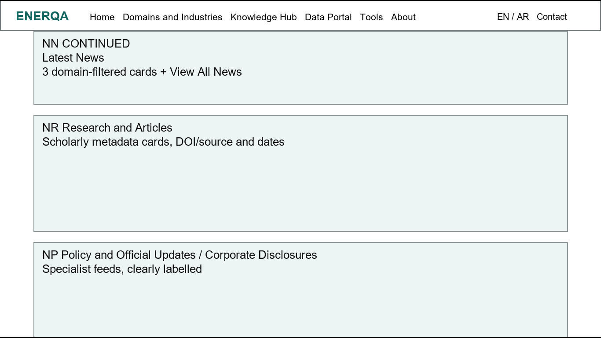

Scroll view 5   \|   Top viewport fold y 3490   \|   Bottom viewport fold y 4258

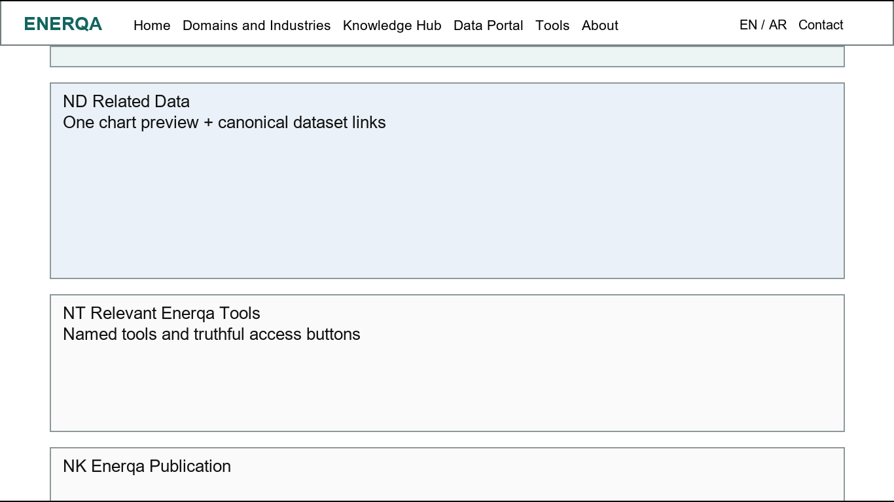

---

## Page 44

[Open PDF page 44](<Enerqa Website Developer Handoff Revised.pdf#page=44>)

#### Environment  Nature and Circularity continued layout

Scroll view 6   \|   Top viewport fold y 4044   \|   Bottom viewport fold y 4812

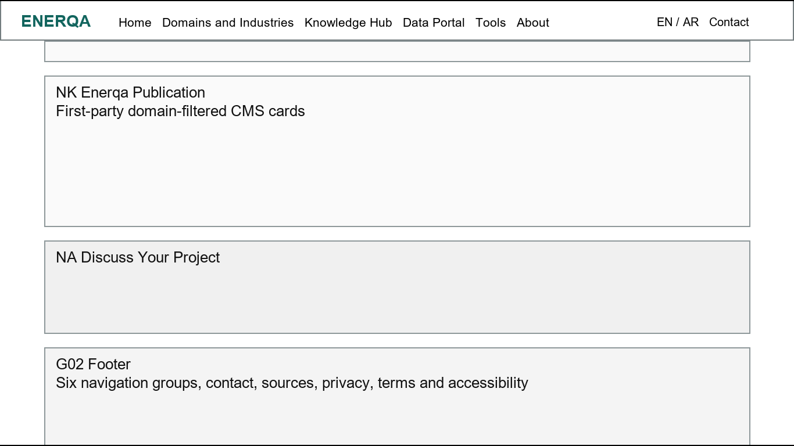

---

## Page 45

[Open PDF page 45](<Enerqa Website Developer Handoff Revised.pdf#page=45>)

#### Page text and API placement

##### N01 Environment  Nature and Circularity

Website heading: Environment, Nature & Circularity

Projects and operations depend on healthy environmental, social and natural systems. Understanding that relationship early makes it possible to manage impacts, meet regulatory and safeguard requirements, reduce liabilities and improve project design.

Environmental and social impact assessment, strategic environmental assessment, permitting, due diligence and environmental management planning provide the evidence needed to identify risks. That evidence can then be translated into practical design requirements, compliance measures, monitoring systems and operational improvements.

Nature forms part of this project context rather than sitting outside it. Biodiversity, ecosystems, habitats, land, freshwater, coastal and marine systems can determine where and how projects should proceed. Biodiversity assessment and ecosystem analysis help identify dependencies, risks and opportunities, while nature-based solutions can strengthen climate resilience, restore degraded environments and create benefits for communities.

Integrating habitat protection, rehabilitation, ecological restoration and closure planning into project decisions helps avoid or minimise environmental harm. It can also reveal opportunities for nature-positive development and projects that combine environmental restoration with social and economic value.

Circularity extends the same thinking to the movement of materials, water, waste and other resources through an operation or economy. Circular economy strategies look beyond disposal towards waste prevention, resource efficiency, reuse, recycling, resource recovery and energy recovery.

Technology assessment, feasibility studies, circular business models and investment planning can turn waste and resource constraints into viable circular-economy projects. The result is a more efficient use of materials, lower pollution, reduced pressure on natural resources and new opportunities to retain economic value.

Button or link: Discuss Your Project → /contact?domain=environment-nature-circularity

##### N02 ESIA  Strategic Assessment and Safeguards

Website heading: ESIA, Strategic Assessment & Safeguards

Strong projects consider their environmental and social consequences before major decisions are fixed. Environmental and Social Impact Assessment, Strategic Environmental Assessment and safeguards provide the evidence required to compare alternatives, select suitable sites and design proportionate mitigation measures. The process brings together screening, scoping, baseline studies, stakeholder engagement, impact assessment, environmental and social management plans, and monitoring frameworks. Applied from early concept and feasibility through approval, financing, construction and operation, these tools help projects meet regulatory and lender expectations while protecting communities, ecosystems and long-term project value.

---

## Page 46

[Open PDF page 46](<Enerqa Website Developer Handoff Revised.pdf#page=46>)

##### N03 Environmental Permitting and Due Diligence

Website heading: Environmental Permitting & Due Diligence

Environmental approvals are most effective when they shape a project rather than delay it near the end of development. Permitting work begins by mapping applicable environmental requirements, approval pathways and evidence needs, then incorporating them into a realistic project programme. Environmental due diligence examines compliance status, historical impacts, site constraints, liabilities and material risks before an acquisition, investment or development decision. Permit applications, regulator engagement, compliance reviews, gap assessments and corrective-action planning contribute to clearer decisions, fewer unexpected liabilities and projects that remain compliant throughout their lifecycle.

##### N04 Environmental Management and Pollution Control

Website heading: Environmental Management & Pollution Control

Environmental commitments only have value when they become part of everyday operating practice. Environmental management systems translate approval conditions, assessment findings and corporate policies into responsibilities, procedures, performance indicators and auditable controls. Pollution prevention forms part of the same framework, addressing air emissions, wastewater, noise, soil contamination, hazardous materials and waste at their source wherever practical. Environmental management plans, monitoring programmes, compliance audits and corrective action create a practical system for controlling risk, demonstrating regulatory compliance and improving environmental performance throughout construction, operation and eventual closure.

##### N05 Biodiversity  Ecosystems and Natural Capital

Website heading: Biodiversity, Ecosystems & Natural Capital

Biodiversity forms part of the natural infrastructure on which economies, communities and projects depend. Understanding species, habitats, ecological connectivity and ecosystem services early can reveal constraints and opportunities before a site or design is fixed. Biodiversity assessment and natural-capital analysis inform critical-habitat screening, the mitigation hierarchy, biodiversity action plans, nature-related risk assessment and long-term monitoring. This evidence connects project development with conservation priorities and emerging nature-positive ambitions, guiding decisions from feasibility and investment appraisal through construction and operation while accounting for dependencies and impacts on ecosystems.

##### N06 Nature Based Solutions and Restoration

Website heading: Nature-Based Solutions & Restoration

Nature-based solutions use the functions of ecosystems to address practical challenges such as flooding, coastal erosion, extreme heat, declining water quality and climate vulnerability. When restoration is treated as a developed project rather than an isolated planting exercise, ecological objectives can be connected to technical feasibility, community needs, finance and measurable outcomes. Opportunities may include restoring wetlands, mangroves, watersheds, degraded land or urban green systems. Work can progress from site screening and baseline assessment to concept design, feasibility, implementation planning and monitoring, creating solutions that strengthen biodiversity, climate resilience and ecosystem services.

---

## Page 47

[Open PDF page 47](<Enerqa Website Developer Handoff Revised.pdf#page=47>)

##### N07 Water  Coastal and Marine Systems

Website heading: Water, Coastal & Marine Systems

Water connects landscapes, communities, industry and ecosystems, so project decisions rarely stop at a site boundary. Freshwater, coastal and marine assessments consider water availability, quality, catchment pressures, wastewater discharges, sensitive habitats and the cumulative effects of development. These considerations inform water balances, resource-efficiency measures, coastal and marine impact assessments, pollution controls and climate-resilient infrastructure. Bringing them into site selection, feasibility studies, design, permitting and operational monitoring encourages responsible water use while reducing risks to communities, aquatic ecosystems and long-term project performance.

##### N08 Circular Economy  Waste and Resource Recovery

Website heading: Circular Economy, Waste & Resource Recovery

The circular economy begins by treating materials, products and waste as resources with continuing value. Mapping material flows and waste streams can reveal opportunities to prevent waste, reduce demand for virgin resources and create value through reuse, repair, remanufacturing, recycling and recovery. These opportunities can then be tested as practical projects through technical feasibility, market assessment, business modelling, partner identification and investment planning. Whether applied to an industrial facility, city, supply chain or product system, circular economy strategies connect resource efficiency and waste management with lower environmental impacts, stronger resilience and new commercial possibilities.

##### N09 Rehabilitation  Closure and Monitoring

Website heading: Rehabilitation, Closure & Monitoring

Responsible closure is planned long before the final day of operation. Early preparation allows rehabilitation requirements, decommissioning options, environmental liabilities, costs and future land uses to influence project design and financial decisions. As a facility, mine, industrial site or infrastructure asset approaches closure, the plan can be refined through contamination assessment, remediation studies, stakeholder engagement and implementation scheduling. Clear completion criteria, biodiversity or land-restoration measures, post-closure monitoring and adaptive management create a defensible path towards a safe, stable and productive site legacy while reducing long-term risk and uncertainty.

##### NI Relevant Industries

Website heading: Relevant Industries

Explore how this domain applies to the operational and investment priorities of different industries.

Button or link: Explore All Industries → /domains-and-industries#industries

Select industry links through the shared domain/industry taxonomy. The full list remains accessible in the mega menu; do not use past-work logos as the industry navigation.

##### NL Project Development and Lifecycle Support

Website heading: Project Development and Lifecycle Support

Environmental, nature and circular-economy opportunities develop from an understanding of ecological conditions, resource flows and regulatory requirements. Baseline assessment and feasibility studies help shape practical solutions for restoration, pollution prevention, water management and resource

---

## Page 48

[Open PDF page 48](<Enerqa Website Developer Handoff Revised.pdf#page=48>)

recovery. Permitting, safeguards and delivery arrangements carry those solutions into implementation, while monitoring, rehabilitation and closure planning address their longer-term responsibilities.

Button or link: Explore Our Project Development Approach → /project-development

Place after the offering or capability sections. This is a short context-specific module; keep the complete lifecycle narrative on the canonical page only.

##### NN Latest News

Website heading: Latest News

Follow developments in environmental assessment, biodiversity, ecosystems, pollution and circular economy. Headlines are selected for relevance to this domain and linked to their original publishers.

Button or link: View All News → /knowledge-hub/global-intelligence?domain=environment-nature-circularity

Placement NN: three news cards on the page, with headline, source, publication time and short permitted description. NewsData.io is primary; legacy GDELT supplies additional geographic coverage. Publish only records whose full reading is verified open access without a paywall, subscription or sign-in. Show source delays rather than calling the free feed live.

Provider specifications: [newsdata](<#page-210>) \| [gdelt](<#page-211>)

##### NR Research and Articles

Website heading: Research and Articles

Explore research and technical publications that inform decisions in environmental assessment, biodiversity, ecosystems, pollution and circular economy. Each record identifies its authors, publication source and date, with a link to the original work.

Button or link: Explore Research → /knowledge-hub/global-intelligence?type=research&domain=environment-nature-circularity

Placement NR: OpenAlex with is\_oa:true first, DOAJ supplementary; display metadata, DOI and the verified open-access full-reading link. Use best\_oa\_location or another verified lawful open-access location instead of a paywalled DOI landing page. Deduplicate shared DOI records. Separate journal research, reports and unreviewed preprints.

Provider specifications: [openalex](<#page-212>) \| [doaj](<#page-213>)

##### NP Environment and Nature Updates

Website heading: Environment and Nature Updates

Follow original-source reports and updates relevant to this domain, with their organisation, document type and publication date clearly identified.

Specialist sources: gbif\_literature, eea\_rss. EEA RSS covers environment, nature, pollution and circularity; GBIF literature adds biodiversity research. Curate CBD, UNEP and national environment-authority links where relevant. ReliefWeb is supplementary for disaster, water and food impacts.

Provider specifications: [gbif\_literature](<#page-216>) \| [eea\_rss](<#page-215>)

##### ND Related Data

Website heading: Related Data

Explore open-access datasets through charts and accessible tables. Each view identifies its source, geography, observation period, units and update date. Open a dataset to review the methodology and download data free of charge.

Button or link: Explore Related Data → /data-portal?domain=environment-nature-circularity

---

## Page 49

[Open PDF page 49](<Enerqa Website Developer Handoff Revised.pdf#page=49>)

Placement ND: one compact chart or dataset card only; use a cached source release, visible attribution and a canonical dataset link. Do not duplicate a full dashboard here. Recommended numerical sources: gbif-occurrence, openaq-v3, oecd-sdmx.

Provider specifications: [gbif-occurrence](<#page-222>) \| [openaq-v3](<#page-223>) \| [oecd-sdmx](<#page-219>)

##### NT Relevant Enerqa Tools

Website heading: Relevant Enerqa Tools

Explore tools that help structure assessment and project decisions in this domain.

Button or link: GreenScale Pro → /tools/greenscale-pro

Button or link: ESG Readiness Tool → /tools/esg-readiness

Include other profile-listed tools only after validating the current name, file/endpoint, functionality, method and access. Do not label a tool public or online until it is tested.

##### NK Enerqa Publication

Website heading: Enerqa Publication

Read Enerqa’s analysis and practical perspectives related to environmental assessment, biodiversity, ecosystems, pollution and circular economy.

Button or link: Explore Enerqa Publication → /knowledge-hub?domain=environment-nature-circularity

First-party CMS, not external API content. Use approved real publications with original metadata.

##### NA Discuss Your Project

Website heading: Discuss Your Project

Share your priorities, project stage and the questions that need to be resolved. The engagement can focus on a defined workstream or a broader development process.

Button or link: Discuss Your Project → /contact?domain=environment-nature-circularity

#### Contextual API and link configuration

News query baskets: "biodiversity" OR "ecosystem restoration" OR "nature-based solutions"; "circular economy" OR "resource recovery" OR "waste recycling"; "environmental pollution" OR "water management" OR "marine environment"

Research themes: biodiversity ecosystems restoration natural capital; circular economy waste recovery material flows; environmental impact assessment pollution water coastal marine

Source priorities: EEA environment/nature/circular economy updates; GBIF-indexed biodiversity literature; UNEP, Convention on Biological Diversity and national environment authorities (curated/source-filtered); Reputable environment, biodiversity, water and waste journalism

Specialist feeds for NP: eea\_rss, gbif\_literature, reliefweb.

Provider specifications: [eea\_rss](<#page-215>) \| [gbif\_literature](<#page-216>) \| [reliefweb](<#page-213>)

ND numerical source gbif-occurrence: Licence-compatible biodiversity occurrence maps/tables with sampling uncertainty.

ND numerical source openaq-v3: Available station pollutant measurements, observed-at date and per-source rights.

ND numerical source oecd-sdmx: Municipal waste generation/treatment country comparisons.

ND numerical source world-bank-indicators: Country water-stress and environmental context.

NT tools: greenscale-pro, esg-readiness-tool. GreenScale Pro for built/infrastructure sustainability; ESG Readiness Tool only where environment/nature/circularity priorities are part of assessment. Do not claim a biodiversity/circularity calculator exists.

---

## Page 50

[Open PDF page 50](<Enerqa Website Developer Handoff Revised.pdf#page=50>)

Tool routes: /tools/greenscale-pro, /tools/esg-readiness. Developer must use approved availability/access labels; do not assume every tool is publicly launched.

---

## Page 51

[Open PDF page 51](<Enerqa Website Developer Handoff Revised.pdf#page=51>)

### Sustainable Business  ESG and Finance

#### Laptop page design

Route: /domains/sustainable-business-esg-finance   \|   Reference browser viewport: 1366 × 768 px

Segment IDs map to the copy below. Views advance about 698 px below the sticky header; the final view stops at the page end. Test folds with final fonts, real feeds and Arabic text.

Initial view   \|   Top viewport fold y 0   \|   Bottom viewport fold y 768

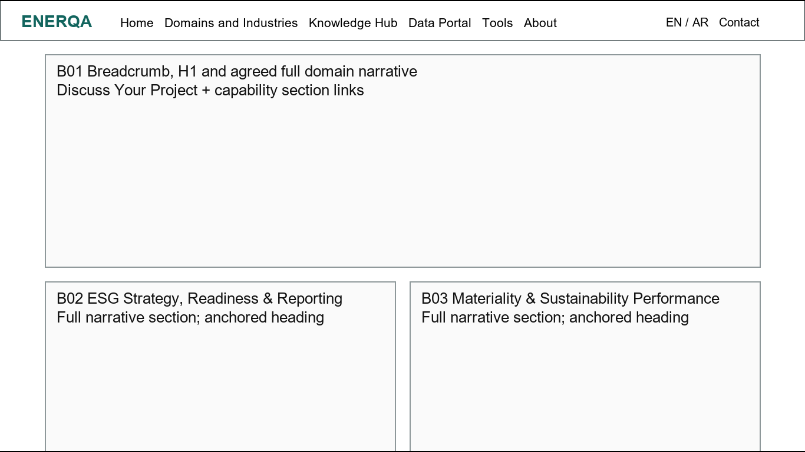

---

## Page 52

[Open PDF page 52](<Enerqa Website Developer Handoff Revised.pdf#page=52>)

Scroll view 1   \|   Top viewport fold y 698   \|   Bottom viewport fold y 1466

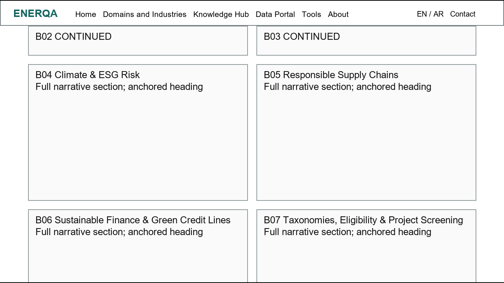

---

## Page 53

[Open PDF page 53](<Enerqa Website Developer Handoff Revised.pdf#page=53>)

#### Sustainable Business  ESG and Finance continued layout

Scroll view 2   \|   Top viewport fold y 1396   \|   Bottom viewport fold y 2164

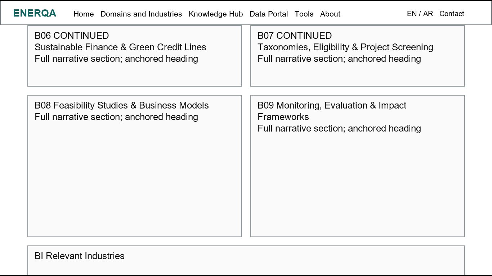

Scroll view 3   \|   Top viewport fold y 2094   \|   Bottom viewport fold y 2862

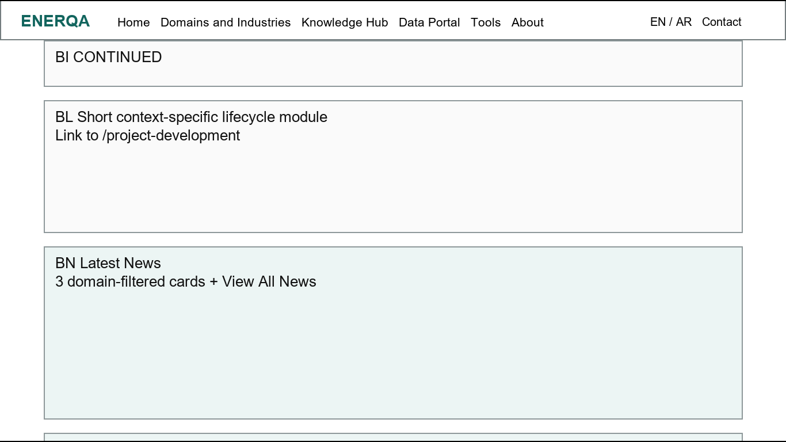

---

## Page 54

[Open PDF page 54](<Enerqa Website Developer Handoff Revised.pdf#page=54>)

#### Sustainable Business  ESG and Finance continued layout

Scroll view 4   \|   Top viewport fold y 2792   \|   Bottom viewport fold y 3560

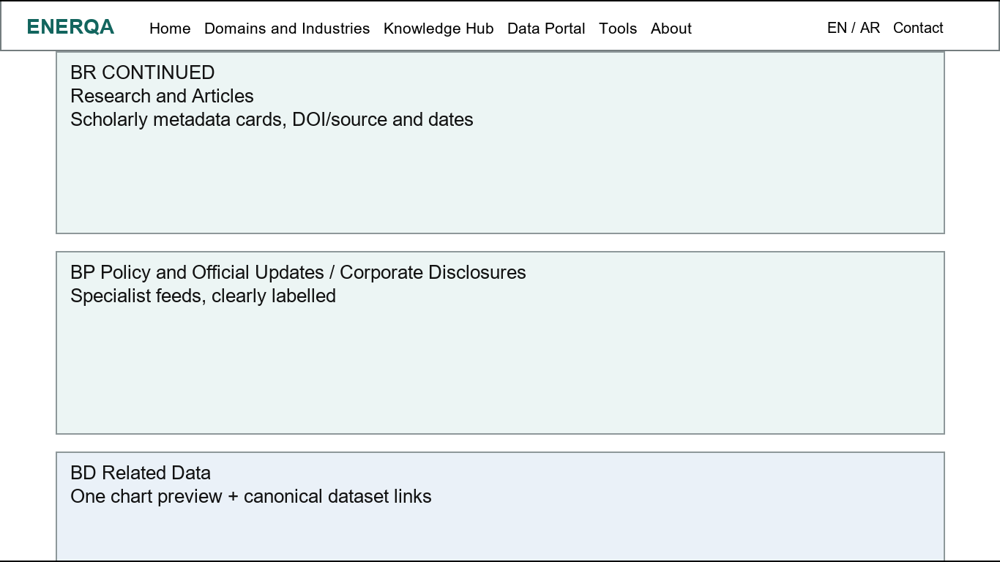

Scroll view 5   \|   Top viewport fold y 3490   \|   Bottom viewport fold y 4258

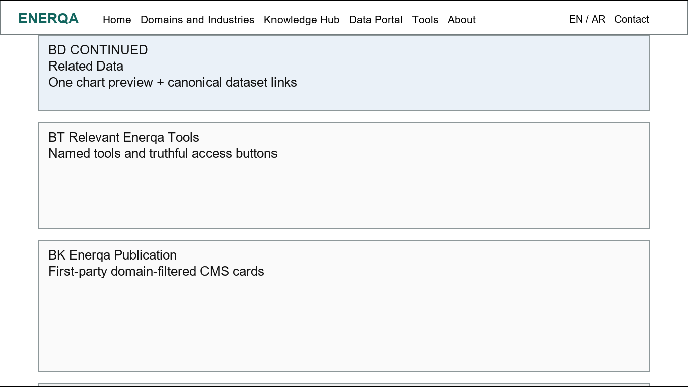

---

## Page 55

[Open PDF page 55](<Enerqa Website Developer Handoff Revised.pdf#page=55>)

#### Sustainable Business  ESG and Finance continued layout

Scroll view 6   \|   Top viewport fold y 3837   \|   Bottom viewport fold y 4605

---

## Page 56

[Open PDF page 56](<Enerqa Website Developer Handoff Revised.pdf#page=56>)

#### Page text and API placement

##### B01 Sustainable Business  ESG and Finance

Website heading: Sustainable Business, ESG & Finance

Sustainability creates lasting value when it influences strategy, governance, investment and daily operations. ESG strategy and reporting therefore begin with understanding what is material to an organisation, where climate and ESG risks arise, how responsible supply chains are managed, and whether internal systems are ready to deliver and measure improvement.

Once those priorities are clear, they can be connected to capital. Green credit lines, sustainable-finance mechanisms, taxonomies and project-eligibility criteria help financial institutions, businesses and project sponsors direct funding towards credible opportunities.

Project screening, feasibility studies, business models, financial analysis and investment cases bridge the gap between sustainability ambitions and projects that can be financed, implemented and monitored. This creates a direct connection between ESG performance, sustainable business strategy and investment decisions.

Button or link: Discuss Your Project → /contact?domain=sustainable-business-esg-finance

##### B02 ESG Strategy  Readiness and Reporting

Website heading: ESG Strategy, Readiness & Reporting

ESG becomes useful when it influences decisions, responsibilities and operating practices rather than existing only as a reporting exercise. The process begins by understanding an organisation’s activities, governance, stakeholder expectations and regulatory exposure. ESG readiness and gap assessments identify existing evidence, capabilities and data gaps before material priorities are translated into policies, targets, performance indicators and reporting arrangements. This foundation can guide implementation, internal controls and sustainability reporting while allowing the organisation to align with the frameworks most relevant to its sector, markets and stakeholders.

##### B03 Materiality and Sustainability Performance

Website heading: Materiality & Sustainability Performance

Sustainability priorities differ between industries, organisations and locations. A materiality assessment identifies the environmental, social and governance issues that matter most to business performance and affected stakeholders, creating a focused basis for strategy and reporting. The work may combine stakeholder engagement, peer and regulatory review, value-chain analysis and an assessment of impacts, risks and opportunities. Material topics can then be connected to indicators, responsibilities, targets and data requirements. This allows sustainability performance to be measured consistently and directs management attention towards issues with the greatest strategic and practical significance.

##### B04 Climate and ESG Risk

Website heading: Climate & ESG Risk

Climate and ESG risks become actionable when they are connected to assets, operations, investments and strategic decisions. Assessment may consider physical climate hazards, policy and market transition, environmental liabilities, social impacts, governance weaknesses and emerging disclosure requirements. Scenarios and risk analysis help determine exposure, potential consequences and the

---

## Page 57

[Open PDF page 57](<Enerqa Website Developer Handoff Revised.pdf#page=57>)

effectiveness of existing controls. The findings can strengthen risk registers, due diligence, resilience planning, investment appraisal and public disclosure, while identifying practical measures that reduce vulnerability and improve preparedness across the organisation or project lifecycle.

##### B05 Responsible Supply Chains

Website heading: Responsible Supply Chains

A large share of an organisation’s environmental and social impact may sit outside its direct operations. Responsible supply-chain work maps suppliers, materials, logistics and business relationships to identify emissions hotspots, environmental pressures, labour concerns, climate exposure and continuity risks. These findings can inform supplier requirements, sustainable-procurement policies, due-diligence procedures and Scope 3 emissions programmes. Engagement and performance monitoring then provide a practical route for working with suppliers on improvement, helping organisations strengthen resilience, respond to stakeholder expectations and reduce risk throughout their value chains.

##### B06 Sustainable Finance and Green Credit Lines

Website heading: Sustainable Finance & Green Credit Lines

Sustainable finance requires a credible connection between capital and measurable environmental or social outcomes. Green credit lines and other sustainable-finance mechanisms begin with a clear market need, defined objectives and an understanding of the institutions and projects involved. Eligibility rules, financial-product structures, environmental and social safeguards, pipeline development and impact-reporting requirements can then be designed as one coherent system. This enables banks, investors and development-finance institutions to identify suitable projects, manage risk and direct funding towards renewable energy, efficiency, climate resilience, circularity and other eligible investments.

##### B07 Taxonomies  Eligibility and Project Screening

Website heading: Taxonomies, Eligibility & Project Screening

Investors and financial institutions need consistent methods for distinguishing genuinely sustainable projects from unsupported environmental claims. Taxonomies and eligibility frameworks translate broad sustainability objectives into defined sectors, technologies, thresholds, exclusions and evidence requirements. Project-screening and scoring tools apply these rules to individual proposals or investment pipelines, considering technical merit, environmental benefits, social safeguards and implementation readiness. Used early in project development, the framework reveals information gaps and improvement needs before financing decisions are made, while creating a transparent basis for portfolio classification, approval and impact reporting.

##### B08 Feasibility Studies and Business Models

Website heading: Feasibility Studies & Business Models

A promising sustainability idea needs a credible technical, commercial and financial foundation before it can attract investment or move into implementation. Feasibility studies examine market demand, technology options, operational requirements, environmental and social considerations, capital and operating costs, revenues, risks and delivery arrangements. Business-model development determines how value will be created, delivered and sustained among the parties involved. By combining scenario analysis with financial modelling and implementation planning, the process turns an early concept into a

---

## Page 58

[Open PDF page 58](<Enerqa Website Developer Handoff Revised.pdf#page=58>)

structured investment case and clarifies whether the project should proceed, change direction or be developed further.

##### B09 Monitoring  Evaluation and Impact Frameworks

Website heading: Monitoring, Evaluation & Impact Frameworks

Projects demonstrate their value through credible evidence of what changed, why it changed and whether the benefits can be sustained. Monitoring and evaluation frameworks connect objectives with baselines, indicators, data sources, responsibilities, reporting schedules and evaluation questions. A costed M&E plan ensures that the system is practical and properly resourced, while dashboards and reporting tools make results easier to interpret. For emissions-related activities, the framework can connect with MRV requirements. Regular evaluation and learning then allow project teams and funders to improve delivery, respond to emerging risks and communicate impact with greater confidence.

##### BI Relevant Industries

Website heading: Relevant Industries

Explore how this domain applies to the operational and investment priorities of different industries.

Button or link: Explore All Industries → /domains-and-industries#industries

Select industry links through the shared domain/industry taxonomy. The full list remains accessible in the mega menu; do not use past-work logos as the industry navigation.

##### BL Project Development and Lifecycle Support

Website heading: Project Development and Lifecycle Support

ESG and sustainable-finance initiatives begin by identifying material priorities, organisational readiness and investment requirements. These findings can develop into strategies, green-finance mechanisms or individual project opportunities supported by feasibility studies and business and financial models. Implementation arrangements, reporting systems and impact frameworks then connect sustainability objectives with accountable delivery and measurable performance.

Button or link: Explore Our Project Development Approach → /project-development

Place after the offering or capability sections. This is a short context-specific module; keep the complete lifecycle narrative on the canonical page only.

##### BN Latest News

Website heading: Latest News

Follow developments in ESG, sustainable business, sustainable finance and responsible investment. Headlines are selected for relevance to this domain and linked to their original publishers.

Button or link: View All News → /knowledge-hub/global-intelligence?domain=sustainable-business-esg-finance

Placement BN: three news cards on the page, with headline, source, publication time and short permitted description. NewsData.io is primary; legacy GDELT supplies additional geographic coverage. Publish only records whose full reading is verified open access without a paywall, subscription or sign-in. Show source delays rather than calling the free feed live.

Provider specifications: [newsdata](<#page-210>) \| [gdelt](<#page-211>)

---

## Page 59

[Open PDF page 59](<Enerqa Website Developer Handoff Revised.pdf#page=59>)

##### BR Research and Articles

Website heading: Research and Articles

Explore research and technical publications that inform decisions in ESG, sustainable business, sustainable finance and responsible investment. Each record identifies its authors, publication source and date, with a link to the original work.

Button or link: Explore Research → /knowledge-hub/global-intelligence?type=research&domain=sustainable-business-esg-finance

Placement BR: OpenAlex with is\_oa:true first, DOAJ supplementary; display metadata, DOI and the verified open-access full-reading link. Use best\_oa\_location or another verified lawful open-access location instead of a paywalled DOI landing page. Deduplicate shared DOI records. Separate journal research, reports and unreviewed preprints.

Provider specifications: [openalex](<#page-212>) \| [doaj](<#page-213>)

##### BP Corporate Disclosures and Finance Updates

Website heading: Corporate Disclosures and Finance Updates

Follow original-source reports and updates relevant to this domain, with their organisation, document type and publication date clearly identified.

Specialist sources: sec\_edgar. SEC EDGAR is a selected-issuer disclosure feed, not a global ESG news search. Identify issuer, form and filing date and link to the publicly readable filing. Curate verified open-access finance-regulator and taxonomy sources. The World Bank Documents and Reports API is excluded from the corporate launch.

Provider specifications: [sec\_edgar](<#page-217>)

##### BD Related Data

Website heading: Related Data

Explore open-access datasets through charts and accessible tables. Each view identifies its source, geography, observation period, units and update date. Open a dataset to review the methodology and download data free of charge.

Button or link: Explore Related Data → /data-portal?domain=sustainable-business-esg-finance

Placement BD: one compact chart or dataset card only; use a cached source release, visible attribution and a canonical dataset link. Do not duplicate a full dashboard here. Recommended numerical sources: oecd-sdmx, world-bank-indicators.

Provider specifications: [oecd-sdmx](<#page-219>) \| [world-bank-indicators](<#page-219>)

##### BT Relevant Enerqa Tools

Website heading: Relevant Enerqa Tools

Explore tools that help structure assessment and project decisions in this domain.

Button or link: ESG Readiness Tool → /tools/esg-readiness

Button or link: GreenScale Pro → /tools/greenscale-pro

Include other profile-listed tools only after validating the current name, file/endpoint, functionality, method and access. Do not label a tool public or online until it is tested.

---

## Page 60

[Open PDF page 60](<Enerqa Website Developer Handoff Revised.pdf#page=60>)

##### BK Enerqa Publication

Website heading: Enerqa Publication

Read Enerqa’s analysis and practical perspectives related to ESG, sustainable business, sustainable finance and responsible investment.

Button or link: Explore Enerqa Publication → /knowledge-hub?domain=sustainable-business-esg-finance

First-party CMS, not external API content. Use approved real publications with original metadata.

##### BA Discuss Your Project

Website heading: Discuss Your Project

Share your priorities, project stage and the questions that need to be resolved. The engagement can focus on a defined workstream or a broader development process.

Button or link: Discuss Your Project → /contact?domain=sustainable-business-esg-finance

#### Contextual API and link configuration

News query baskets: "ESG" OR "sustainability reporting" OR "sustainable business"; "sustainable finance" OR "green credit" OR "green taxonomy"; "climate risk" OR "responsible supply chains" OR "impact investing"

Research themes: ESG materiality sustainability reporting climate risk; sustainable finance green credit taxonomy project screening; business models feasibility impact monitoring evaluation

Source priorities: SEC EDGAR selected-issuer corporate disclosures (separate tab); Official finance regulators, central banks and standards bodies (curated/source-filtered); Licence-cleared World Bank/development-finance reports only; Reputable business, finance, ESG and investment journalism

Specialist feeds for BP: sec\_edgar.

Provider specifications: [sec\_edgar](<#page-217>)

BD numerical source world-bank-indicators: Country economic, investment and business context; not issuer ratings or market quotes.

BD numerical source oecd-sdmx: Reported climate-related development finance; defined accounting basis.

BT tools: esg-readiness-tool. ESG Readiness Tool is primary. Other scoring/finance tools may be added only after approved product specification and availability verification.

Tool routes: /tools/esg-readiness. Developer must use approved availability/access labels; do not assume every tool is publicly launched.

---

## Page 61

[Open PDF page 61](<Enerqa Website Developer Handoff Revised.pdf#page=61>)

### Thirteen industry pages

Industry pages adapt the narrative to sector conditions and connect visitors to relevant domain sections. They do not duplicate every capability paragraph or imply completed assignments. Display the agreed industry narrative first, then relevant offering links and the shorter lifecycle module. All industry pages follow the layout below with their own topic, data and tool mapping.

### Government  Regulators and Public Institutions

#### Laptop page design

Route: /industries/government-regulators-public-institutions   \|   Reference browser viewport: 1366 × 768 px

Segment IDs map to the copy below. Views advance about 698 px below the sticky header; the final view stops at the page end. Test folds with final fonts, real feeds and Arabic text.

Initial view   \|   Top viewport fold y 0   \|   Bottom viewport fold y 768

---

## Page 62

[Open PDF page 62](<Enerqa Website Developer Handoff Revised.pdf#page=62>)

Scroll view 1   \|   Top viewport fold y 698   \|   Bottom viewport fold y 1466

---

## Page 63

[Open PDF page 63](<Enerqa Website Developer Handoff Revised.pdf#page=63>)

#### Government  Regulators and Public Institutions continued layout

Scroll view 2   \|   Top viewport fold y 1396   \|   Bottom viewport fold y 2164

Scroll view 3   \|   Top viewport fold y 1726   \|   Bottom viewport fold y 2494

---

## Page 64

[Open PDF page 64](<Enerqa Website Developer Handoff Revised.pdf#page=64>)

#### Page text and API placement

##### I0101 Government  Regulators and Public Institutions

Website heading: Government, Regulators & Public Institutions

Public climate action begins with credible data and becomes durable when institutions are equipped to act on it. For ministries, regulators, municipalities, public authorities and state-owned entities, climate and energy policy, GHG inventories, NDC implementation and MRV systems are connected with environmental governance, data platforms and investable project pipelines.

Institutional arrangements, capacity building, climate-finance mobilisation and programme evaluation help carry these ambitions into sustained delivery.

Button or link: Discuss Your Project → /contact?industry=government-regulators-public-institutions

##### I0102 Relevant Domains and Work Areas

Website heading: Relevant Domains and Work Areas

Explore the technical, environmental, climate and business work areas relevant to this industry. Each link explains the scope within its parent domain rather than repeating it here.

Industry-specific link, feed, dataset and tool configuration is specified in the mapping following the industry chapters. Domain anchor destinations use the exact capability heading slug.

##### I01L Project Development and Lifecycle Support

Website heading: Project Development and Lifecycle Support

Public projects develop from a clearly defined policy or service need, supported by data and stakeholder engagement. Concept development and feasibility studies establish the appropriate scope, funding requirements and institutional arrangements. Procurement and implementation planning then provide a route to delivery, while monitoring and evaluation track public-investment outcomes and inform future programmes.

Button or link: Explore Our Project Development Approach → /project-development

Place after the offering or capability sections. This is a short context-specific module; keep the complete lifecycle narrative on the canonical page only.

##### I01N Industry News

Website heading: Industry News

Follow relevant developments in government, regulators & public institutions, including the climate, energy, environmental and investment issues affecting the sector.

Button or link: View All Industry News → /knowledge-hub/global-intelligence?industry=government-regulators-public-institutions

I01N: NewsData.io primary, legacy GDELT supplementary. Filter by the industry and related sustainability themes together, then enforce verified open-access full reading. Generic sector news is not sufficient without topical relevance.

Provider specifications: [newsdata](<#page-210>) \| [gdelt](<#page-211>)

---

## Page 65

[Open PDF page 65](<Enerqa Website Developer Handoff Revised.pdf#page=65>)

##### I01R Research and Official Updates

Website heading: Research and Official Updates

Explore research, policy and technical publications relevant to this industry. Sources, authors, dates and document types make the evidence easier to assess.

Button or link: Explore Related Research → /knowledge-hub/global-intelligence?industry=government-regulators-public-institutions&type=research

I01R: OpenAlex/DOAJ shared scholarly sources plus the specialist sources identified in the industry mapping. Official reports and corporate disclosures remain separate labels, not Enerqa-authored articles.

Provider specifications: [openalex](<#page-212>) \| [doaj](<#page-213>)

##### I01D Related Data

Website heading: Related Data

Explore open-access datasets through charts and accessible tables. Each view identifies its source, geography, observation period, units and update date. Open a dataset to review the methodology and download data free of charge.

Button or link: Explore Related Data → /data-portal?industry=government-regulators-public-institutions

Placement I01D: one compact chart or dataset card only; use a cached source release, visible attribution and a canonical dataset link. Do not duplicate a full dashboard here. Recommended numerical sources: world-bank-indicators, oecd-sdmx.

Provider specifications: [world-bank-indicators](<#page-219>) \| [oecd-sdmx](<#page-219>)

Use the industry-specific mapping as the primary choice of source/preview. If no geographically relevant licensed dataset is available, replace the preview with relevant canonical catalogue links, not a sample statistic.

##### I01T Relevant Enerqa Tools

Website heading: Relevant Enerqa Tools

Explore assessment and modelling tools relevant to this industry.

Button or link: Explore All Tools → /tools?industry=government-regulators-public-institutions

##### I01K Enerqa Publication

Website heading: Enerqa Publication

Read Enerqa’s perspectives on the sustainability and project-development questions relevant to this industry.

Button or link: Explore Related Publications → /knowledge-hub?industry=government-regulators-public-institutions

##### I01A Discuss Your Project

Website heading: Discuss Your Project

Share the industry context, location, current stage and the decisions ahead. Support can be scoped around the questions that matter to your opportunity.

Button or link: Discuss Your Project → /contact?industry=government-regulators-public-institutions

---

## Page 66

[Open PDF page 66](<Enerqa Website Developer Handoff Revised.pdf#page=66>)

#### Contextual API and link configuration

I0102 offering links

MRV, Transparency & NDC Tracking → /domains/climate-action-carbon-management#mrv-transparency-ndc-tracking

Climate Strategy, Mitigation & Adaptation → /domains/climate-action-carbon-management#climate-strategy-mitigation-adaptation

Energy Modelling & Policy Analysis → /domains/energy-systems-transition#energy-modelling-policy-analysis

ESIA, Strategic Assessment & Safeguards → /domains/environment-nature-circularity#esia-strategic-assessment-safeguards

News query baskets: "climate policy" OR "national climate plan" OR "NDC"; "public investment" OR "environmental regulation" OR "energy policy"

Research themes: national climate policy MRV public institutions; public investment sustainable development institutional capacity

Source priorities: Official ministries, regulators, UNFCCC country submissions and public statistical offices; UN/IPCC/EEA publications and licence-cleared development reports

Specialist feeds for I01R: reliefweb.

Provider specifications: [reliefweb](<#page-213>)

I01D numerical source world-bank-indicators: National development/energy/environment comparisons for policy context.

I01D numerical source oecd-sdmx: Reported climate-related development finance by provider/recipient/objective.

I01T tools: esg-readiness-tool. Institutional readiness application only where tool scope fits; do not represent an institutional MRV platform as the ESG tool.

Tool routes: /tools/esg-readiness. Developer must use approved availability/access labels; do not assume every tool is publicly launched.

---

## Page 67

[Open PDF page 67](<Enerqa Website Developer Handoff Revised.pdf#page=67>)

### Financial Institutions  Investors and Development Finance

#### Laptop page design

Route: /industries/financial-institutions-investors-development-finance   \|   Reference browser viewport: 1366 × 768 px

Segment IDs map to the copy below. Views advance about 698 px below the sticky header; the final view stops at the page end. Test folds with final fonts, real feeds and Arabic text.

Initial view   \|   Top viewport fold y 0   \|   Bottom viewport fold y 768

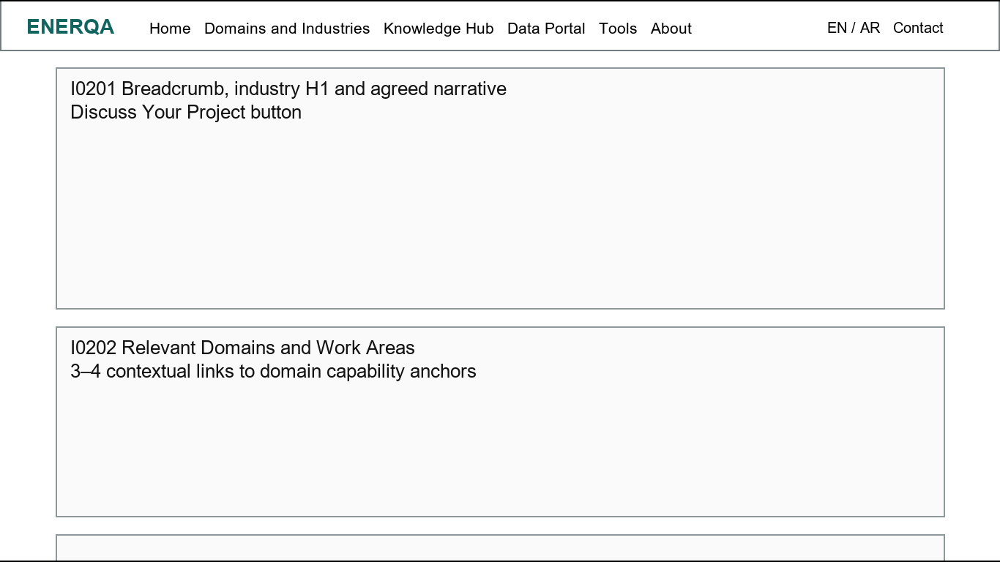

---

## Page 68

[Open PDF page 68](<Enerqa Website Developer Handoff Revised.pdf#page=68>)

Scroll view 1   \|   Top viewport fold y 698   \|   Bottom viewport fold y 1466

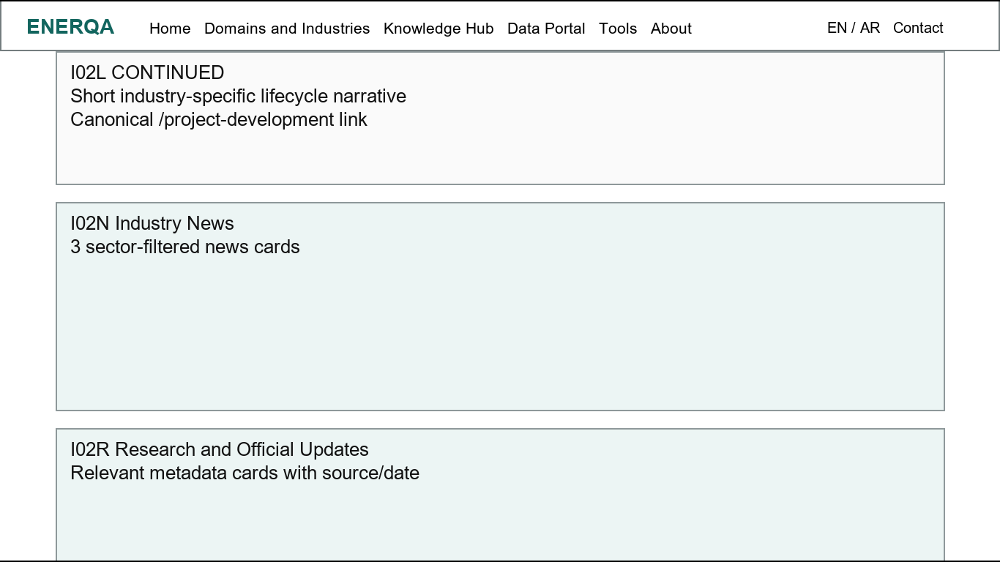

---

## Page 69

[Open PDF page 69](<Enerqa Website Developer Handoff Revised.pdf#page=69>)

#### Financial Institutions  Investors and Development Finance continued layout

Scroll view 2   \|   Top viewport fold y 1396   \|   Bottom viewport fold y 2164

Scroll view 3   \|   Top viewport fold y 1726   \|   Bottom viewport fold y 2494

---

## Page 70

[Open PDF page 70](<Enerqa Website Developer Handoff Revised.pdf#page=70>)

#### Page text and API placement

##### I0201 Financial Institutions  Investors and Development Finance

Website heading: Financial Institutions, Investors & Development Finance

Green finance succeeds when sustainability ambitions are translated into clear investment rules and credible project opportunities. For banks, investors, climate funds and development-finance institutions, this means shaping green credit lines and sustainable-finance products around robust taxonomy and eligibility criteria, environmental and social risk assessment, and well-screened project pipelines.

Bankable investments can then be paired with impact-monitoring frameworks that demonstrate where capital is going and what it achieves.

Button or link: Discuss Your Project → /contact?industry=financial-institutions-investors-development-finance

##### I0202 Relevant Domains and Work Areas

Website heading: Relevant Domains and Work Areas

Explore the technical, environmental, climate and business work areas relevant to this industry. Each link explains the scope within its parent domain rather than repeating it here.

Industry-specific link, feed, dataset and tool configuration is specified in the mapping following the industry chapters. Domain anchor destinations use the exact capability heading slug.

##### I02L Project Development and Lifecycle Support

Website heading: Project Development and Lifecycle Support

Investment opportunities need to be tested against technical, commercial, financial, environmental and social requirements before capital is committed. Project screening, feasibility assessment and financial modelling clarify viability and risk, while financing and partnership arrangements define a route to delivery. Monitoring, valuation and impact assessment can continue through operation, refinancing, transition or exit.

Button or link: Explore Our Project Development Approach → /project-development

Place after the offering or capability sections. This is a short context-specific module; keep the complete lifecycle narrative on the canonical page only.

##### I02N Industry News

Website heading: Industry News

Follow relevant developments in financial institutions, investors & development finance, including the climate, energy, environmental and investment issues affecting the sector.

Button or link: View All Industry News → /knowledge-hub/global-intelligence?industry=financial-institutions-investors-development-finance

I02N: NewsData.io primary, legacy GDELT supplementary. Filter by the industry and related sustainability themes together, then enforce verified open-access full reading. Generic sector news is not sufficient without topical relevance.

Provider specifications: [newsdata](<#page-210>) \| [gdelt](<#page-211>)

---

## Page 71

[Open PDF page 71](<Enerqa Website Developer Handoff Revised.pdf#page=71>)

##### I02R Research and Official Updates

Website heading: Research and Official Updates

Explore research, policy and technical publications relevant to this industry. Sources, authors, dates and document types make the evidence easier to assess.

Button or link: Explore Related Research → /knowledge-hub/global-intelligence?industry=financial-institutions-investors-development-finance&type=research

I02R: OpenAlex/DOAJ shared scholarly sources plus the specialist sources identified in the industry mapping. Official reports and corporate disclosures remain separate labels, not Enerqa-authored articles.

Provider specifications: [openalex](<#page-212>) \| [doaj](<#page-213>)

##### I02D Related Data

Website heading: Related Data

Explore open-access datasets through charts and accessible tables. Each view identifies its source, geography, observation period, units and update date. Open a dataset to review the methodology and download data free of charge.

Button or link: Explore Related Data → /data-portal?industry=financial-institutions-investors-development-finance

Placement I02D: one compact chart or dataset card only; use a cached source release, visible attribution and a canonical dataset link. Do not duplicate a full dashboard here. Recommended numerical sources: oecd-sdmx, world-bank-indicators.

Provider specifications: [oecd-sdmx](<#page-219>) \| [world-bank-indicators](<#page-219>)

Use the industry-specific mapping as the primary choice of source/preview. If no geographically relevant licensed dataset is available, replace the preview with relevant canonical catalogue links, not a sample statistic.

##### I02T Relevant Enerqa Tools

Website heading: Relevant Enerqa Tools

Explore assessment and modelling tools relevant to this industry.

Button or link: Explore All Tools → /tools?industry=financial-institutions-investors-development-finance

##### I02K Enerqa Publication

Website heading: Enerqa Publication

Read Enerqa’s perspectives on the sustainability and project-development questions relevant to this industry.

Button or link: Explore Related Publications → /knowledge-hub?industry=financial-institutions-investors-development-finance

##### I02A Discuss Your Project

Website heading: Discuss Your Project

Share the industry context, location, current stage and the decisions ahead. Support can be scoped around the questions that matter to your opportunity.

Button or link: Discuss Your Project → /contact?industry=financial-institutions-investors-development-finance

---

## Page 72

[Open PDF page 72](<Enerqa Website Developer Handoff Revised.pdf#page=72>)

#### Contextual API and link configuration

I0202 offering links

Sustainable Finance & Green Credit Lines → /domains/sustainable-business-esg-finance#sustainable-finance-green-credit-lines

Taxonomies, Eligibility & Project Screening → /domains/sustainable-business-esg-finance#taxonomies-eligibility-project-screening

Climate & ESG Risk → /domains/sustainable-business-esg-finance#climate-esg-risk

Monitoring, Evaluation & Impact Frameworks → /domains/sustainable-business-esg-finance#monitoring-evaluation-impact-frameworks

News query baskets: "green finance" OR "climate finance" OR "development finance"; "green credit" OR "sustainable investment" OR "ESG risk"

Research themes: sustainable finance green credit taxonomy bankability; climate finance environmental social investment risk

Source priorities: Finance regulators, central banks and development-finance institutions; Selected-issuer disclosures; licence-cleared Bank reports; reputable finance journalism

Specialist feeds for I02R: sec\_edgar.

Provider specifications: [sec\_edgar](<#page-217>)

I02D numerical source oecd-sdmx: Reported climate-related development-finance flows, not all private climate finance.

I02D numerical source world-bank-indicators: Country investment and macroeconomic context; not live quotes.

I02T tools: esg-readiness-tool. Borrower/organisation ESG readiness context; not a credit rating, valuation or investment recommendation.

Tool routes: /tools/esg-readiness. Developer must use approved availability/access labels; do not assume every tool is publicly launched.

---

## Page 73

[Open PDF page 73](<Enerqa Website Developer Handoff Revised.pdf#page=73>)

### Energy and Utilities

#### Laptop page design

Route: /industries/energy-utilities   \|   Reference browser viewport: 1366 × 768 px

Segment IDs map to the copy below. Views advance about 698 px below the sticky header; the final view stops at the page end. Test folds with final fonts, real feeds and Arabic text.

Initial view   \|   Top viewport fold y 0   \|   Bottom viewport fold y 768

---

## Page 74

[Open PDF page 74](<Enerqa Website Developer Handoff Revised.pdf#page=74>)

Scroll view 1   \|   Top viewport fold y 698   \|   Bottom viewport fold y 1466

---

## Page 75

[Open PDF page 75](<Enerqa Website Developer Handoff Revised.pdf#page=75>)

#### Energy and Utilities continued layout

Scroll view 2   \|   Top viewport fold y 1396   \|   Bottom viewport fold y 2164

Scroll view 3   \|   Top viewport fold y 1726   \|   Bottom viewport fold y 2494

---

## Page 76

[Open PDF page 76](<Enerqa Website Developer Handoff Revised.pdf#page=76>)

#### Page text and API placement

##### I0301 Energy and Utilities

Website heading: Energy & Utilities

The energy transition is transforming how power is generated, distributed, stored and consumed. Across electricity generation, renewable energy, grids, energy storage, distributed energy and end-use efficiency, energy-system modelling and market analysis reveal where change is technically possible and commercially sound.

Those insights can guide project feasibility, energy management, investment planning, renewable energy project development and long-term performance monitoring.

Button or link: Discuss Your Project → /contact?industry=energy-utilities

##### I0302 Relevant Domains and Work Areas

Website heading: Relevant Domains and Work Areas

Explore the technical, environmental, climate and business work areas relevant to this industry. Each link explains the scope within its parent domain rather than repeating it here.

Industry-specific link, feed, dataset and tool configuration is specified in the mapping following the industry chapters. Domain anchor destinations use the exact capability heading slug.

##### I03L Project Development and Lifecycle Support

Website heading: Project Development and Lifecycle Support

Energy investments develop around demand, reliability, resource availability and affordability. Resource assessment, system modelling and feasibility studies help compare generation, grid, storage and efficiency options before financing and procurement decisions. Implementation support and performance monitoring then connect the investment case with operational results and future upgrades.

Button or link: Explore Our Project Development Approach → /project-development

Place after the offering or capability sections. This is a short context-specific module; keep the complete lifecycle narrative on the canonical page only.

##### I03N Industry News

Website heading: Industry News

Follow relevant developments in energy & utilities, including the climate, energy, environmental and investment issues affecting the sector.

Button or link: View All Industry News → /knowledge-hub/global-intelligence?industry=energy-utilities

I03N: NewsData.io primary, legacy GDELT supplementary. Filter by the industry and related sustainability themes together, then enforce verified open-access full reading. Generic sector news is not sufficient without topical relevance.

Provider specifications: [newsdata](<#page-210>) \| [gdelt](<#page-211>)

---

## Page 77

[Open PDF page 77](<Enerqa Website Developer Handoff Revised.pdf#page=77>)

##### I03R Research and Official Updates

Website heading: Research and Official Updates

Explore research, policy and technical publications relevant to this industry. Sources, authors, dates and document types make the evidence easier to assess.

Button or link: Explore Related Research → /knowledge-hub/global-intelligence?industry=energy-utilities&type=research

I03R: OpenAlex/DOAJ shared scholarly sources plus the specialist sources identified in the industry mapping. Official reports and corporate disclosures remain separate labels, not Enerqa-authored articles.

Provider specifications: [openalex](<#page-212>) \| [doaj](<#page-213>)

##### I03D Related Data

Website heading: Related Data

Explore open-access datasets through charts and accessible tables. Each view identifies its source, geography, observation period, units and update date. Open a dataset to review the methodology and download data free of charge.

Button or link: Explore Related Data → /data-portal?industry=energy-utilities

Placement I03D: one compact chart or dataset card only; use a cached source release, visible attribution and a canonical dataset link. Do not duplicate a full dashboard here. Recommended numerical sources: eia-open-data, nasa-power.

Provider specifications: [eia-open-data](<#page-220>) \| [nasa-power](<#page-221>)

Use the industry-specific mapping as the primary choice of source/preview. If no geographically relevant licensed dataset is available, replace the preview with relevant canonical catalogue links, not a sample statistic.

##### I03T Relevant Enerqa Tools

Website heading: Relevant Enerqa Tools

Explore assessment and modelling tools relevant to this industry.

Button or link: Explore All Tools → /tools?industry=energy-utilities

##### I03K Enerqa Publication

Website heading: Enerqa Publication

Read Enerqa’s perspectives on the sustainability and project-development questions relevant to this industry.

Button or link: Explore Related Publications → /knowledge-hub?industry=energy-utilities

##### I03A Discuss Your Project

Website heading: Discuss Your Project

Share the industry context, location, current stage and the decisions ahead. Support can be scoped around the questions that matter to your opportunity.

Button or link: Discuss Your Project → /contact?industry=energy-utilities

#### Contextual API and link configuration

I0302 offering links

Renewable-Energy Project Development → /domains/energy-systems-transition#renewable-energy-project-development

---

## Page 78

[Open PDF page 78](<Enerqa Website Developer Handoff Revised.pdf#page=78>)

Energy Storage, Grids & Power Systems → /domains/energy-systems-transition#energy-storage-grids-power-systems

Energy Modelling & Policy Analysis → /domains/energy-systems-transition#energy-modelling-policy-analysis

Energy Audits & Performance Assessment → /domains/energy-systems-transition#energy-audits-performance-assessment

News query baskets: "electricity generation" OR "renewable energy" OR "power grid"; "battery storage" OR "energy utilities" OR "energy efficiency"

Research themes: electricity systems renewable energy storage grids; energy utilities demand modelling efficiency feasibility

Source priorities: EIA, energy regulators and system operators; DOE OSTI and reputable energy technology/market journalism

Specialist feeds for I03R: eia\_rss, osti.

Provider specifications: [eia\_rss](<#page-214>) \| [osti](<#page-215>)

I03D numerical source eia-open-data: Generation/consumption/selected prices with country and frequency labels.

I03D numerical source nasa-power: Solar resource for location-based early feasibility.

I03T tools: easysolar, greenscale-pro. easySOLAR primary for PV/storage; GreenScale Pro only for relevant utility infrastructure/built assets.

Tool routes: /tools/easysolar, /tools/greenscale-pro. Developer must use approved availability/access labels; do not assume every tool is publicly launched.

---

## Page 79

[Open PDF page 79](<Enerqa Website Developer Handoff Revised.pdf#page=79>)

### Oil  Gas and Petrochemicals

#### Laptop page design

Route: /industries/oil-gas-petrochemicals   \|   Reference browser viewport: 1366 × 768 px

Segment IDs map to the copy below. Views advance about 698 px below the sticky header; the final view stops at the page end. Test folds with final fonts, real feeds and Arabic text.

Initial view   \|   Top viewport fold y 0   \|   Bottom viewport fold y 768

---

## Page 80

[Open PDF page 80](<Enerqa Website Developer Handoff Revised.pdf#page=80>)

Scroll view 1   \|   Top viewport fold y 698   \|   Bottom viewport fold y 1466

---

## Page 81

[Open PDF page 81](<Enerqa Website Developer Handoff Revised.pdf#page=81>)

#### Oil  Gas and Petrochemicals continued layout

Scroll view 2   \|   Top viewport fold y 1396   \|   Bottom viewport fold y 2164

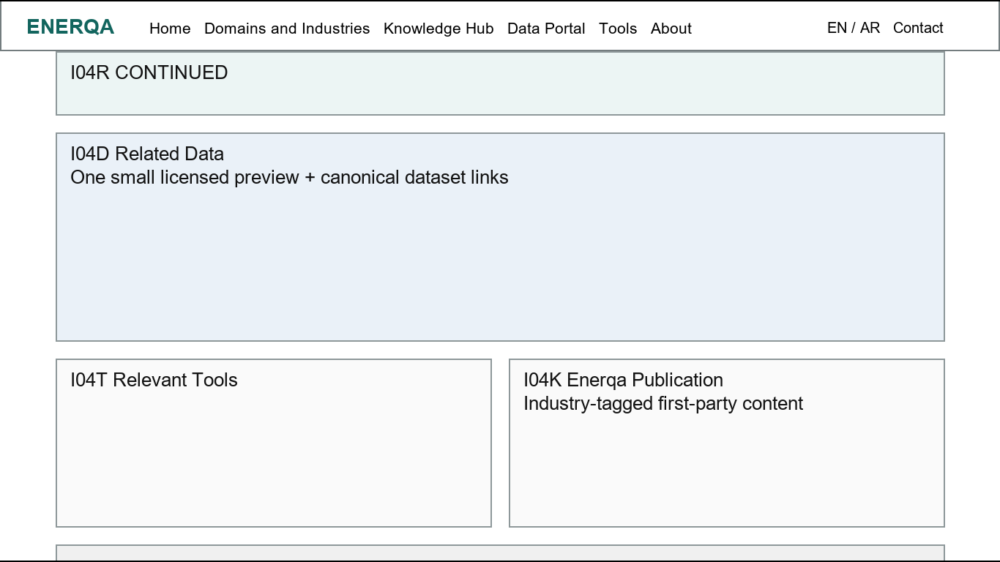

Scroll view 3   \|   Top viewport fold y 1726   \|   Bottom viewport fold y 2494

---

## Page 82

[Open PDF page 82](<Enerqa Website Developer Handoff Revised.pdf#page=82>)

#### Page text and API placement

##### I0401 Oil  Gas and Petrochemicals

Website heading: Oil, Gas & Petrochemicals

Upstream, midstream, LNG, refining and petrochemical operations face the dual challenge of managing current environmental impacts while preparing for a lower-carbon future.

Methane and flaring assessments, GHG inventories and energy-efficiency analysis establish a credible foundation for decarbonisation pathways. Environmental studies, asset evaluation, clean-technology feasibility and transition-finance planning then translate those pathways into practical operational and investment decisions.

Button or link: Discuss Your Project → /contact?industry=oil-gas-petrochemicals

##### I0402 Relevant Domains and Work Areas

Website heading: Relevant Domains and Work Areas

Explore the technical, environmental, climate and business work areas relevant to this industry. Each link explains the scope within its parent domain rather than repeating it here.

Industry-specific link, feed, dataset and tool configuration is specified in the mapping following the industry chapters. Domain anchor destinations use the exact capability heading slug.

##### I04L Project Development and Lifecycle Support

Website heading: Project Development and Lifecycle Support

Operational constraints, emissions sources and environmental obligations help define opportunities for efficiency, methane reduction, flaring management and cleaner technology. Feasibility and financial analysis test how proposed improvements can integrate with existing assets. Delivery planning and monitoring address operational performance, while valuation, transition and decommissioning considerations become relevant as assets enter a new phase.

Button or link: Explore Our Project Development Approach → /project-development

Place after the offering or capability sections. This is a short context-specific module; keep the complete lifecycle narrative on the canonical page only.

##### I04N Industry News

Website heading: Industry News

Follow relevant developments in oil, gas & petrochemicals, including the climate, energy, environmental and investment issues affecting the sector.

Button or link: View All Industry News → /knowledge-hub/global-intelligence?industry=oil-gas-petrochemicals

I04N: NewsData.io primary, legacy GDELT supplementary. Filter by the industry and related sustainability themes together, then enforce verified open-access full reading. Generic sector news is not sufficient without topical relevance.

Provider specifications: [newsdata](<#page-210>) \| [gdelt](<#page-211>)

---

## Page 83

[Open PDF page 83](<Enerqa Website Developer Handoff Revised.pdf#page=83>)

##### I04R Research and Official Updates

Website heading: Research and Official Updates

Explore research, policy and technical publications relevant to this industry. Sources, authors, dates and document types make the evidence easier to assess.

Button or link: Explore Related Research → /knowledge-hub/global-intelligence?industry=oil-gas-petrochemicals&type=research

I04R: OpenAlex/DOAJ shared scholarly sources plus the specialist sources identified in the industry mapping. Official reports and corporate disclosures remain separate labels, not Enerqa-authored articles.

Provider specifications: [openalex](<#page-212>) \| [doaj](<#page-213>)

##### I04D Related Data

Website heading: Related Data

Explore open-access datasets through charts and accessible tables. Each view identifies its source, geography, observation period, units and update date. Open a dataset to review the methodology and download data free of charge.

Button or link: Explore Related Data → /data-portal?industry=oil-gas-petrochemicals

Placement I04D: one compact chart or dataset card only; use a cached source release, visible attribution and a canonical dataset link. Do not duplicate a full dashboard here. Recommended numerical sources: climate-trace, eia-open-data.

Provider specifications: [climate-trace](<#page-218>) \| [eia-open-data](<#page-220>)

Use the industry-specific mapping as the primary choice of source/preview. If no geographically relevant licensed dataset is available, replace the preview with relevant canonical catalogue links, not a sample statistic.

##### I04T Relevant Enerqa Tools

Website heading: Relevant Enerqa Tools

Explore assessment and modelling tools relevant to this industry.

Button or link: Explore All Tools → /tools?industry=oil-gas-petrochemicals

##### I04K Enerqa Publication

Website heading: Enerqa Publication

Read Enerqa’s perspectives on the sustainability and project-development questions relevant to this industry.

Button or link: Explore Related Publications → /knowledge-hub?industry=oil-gas-petrochemicals

##### I04A Discuss Your Project

Website heading: Discuss Your Project

Share the industry context, location, current stage and the decisions ahead. Support can be scoped around the questions that matter to your opportunity.

Button or link: Discuss Your Project → /contact?industry=oil-gas-petrochemicals

---

## Page 84

[Open PDF page 84](<Enerqa Website Developer Handoff Revised.pdf#page=84>)

#### Contextual API and link configuration

I0402 offering links

Clean Technology & Industrial Decarbonisation → /domains/energy-systems-transition#clean-technology-industrial-decarbonisation

GHG Inventories, Carbon Footprints & Baselines → /domains/climate-action-carbon-management#ghg-inventories-carbon-footprints-baselines

Decarbonisation & Net-Zero Pathways → /domains/climate-action-carbon-management#decarbonisation-net-zero-pathways

Environmental Management & Pollution Control → /domains/environment-nature-circularity#environmental-management-pollution-control

News query baskets: "methane emissions" OR "gas flaring" OR "oil decarbonisation"; "oil market" OR "LNG" OR "petrochemical energy efficiency"

Research themes: oil gas methane flaring industrial decarbonisation; petrochemical energy efficiency environmental assessment transition

Source priorities: EIA energy-market analysis, official petroleum/energy regulators; Selected corporate disclosures and reputable oil/gas/clean-technology reporting

Specialist feeds for I04R: eia\_rss, osti, sec\_edgar.

Provider specifications: [eia\_rss](<#page-214>) \| [osti](<#page-215>) \| [sec\_edgar](<#page-217>)

I04D numerical source climate-trace: O&G/refining sector/source emissions estimates, not verified corporate inventories.

I04D numerical source eia-open-data: Selected production/consumption/fuel-price context, coverage labelled.

I04T tools: esg-readiness-tool, easysolar. ESG readiness for operations/governance; easySOLAR only for proposed site PV/storage applications, not methane quantification.

Tool routes: /tools/esg-readiness, /tools/easysolar. Developer must use approved availability/access labels; do not assume every tool is publicly launched.

---

## Page 85

[Open PDF page 85](<Enerqa Website Developer Handoff Revised.pdf#page=85>)

### Industry  Manufacturing and Materials

#### Laptop page design

Route: /industries/industry-manufacturing-materials   \|   Reference browser viewport: 1366 × 768 px

Segment IDs map to the copy below. Views advance about 698 px below the sticky header; the final view stops at the page end. Test folds with final fonts, real feeds and Arabic text.

Initial view   \|   Top viewport fold y 0   \|   Bottom viewport fold y 768

---

## Page 86

[Open PDF page 86](<Enerqa Website Developer Handoff Revised.pdf#page=86>)

Scroll view 1   \|   Top viewport fold y 698   \|   Bottom viewport fold y 1466

---

## Page 87

[Open PDF page 87](<Enerqa Website Developer Handoff Revised.pdf#page=87>)

#### Industry  Manufacturing and Materials continued layout

Scroll view 2   \|   Top viewport fold y 1396   \|   Bottom viewport fold y 2164

Scroll view 3   \|   Top viewport fold y 1726   \|   Bottom viewport fold y 2494

---

## Page 88

[Open PDF page 88](<Enerqa Website Developer Handoff Revised.pdf#page=88>)

#### Page text and API placement

##### I0501 Industry  Manufacturing and Materials

Website heading: Industry, Manufacturing & Materials

Industrial decarbonisation must work on the factory floor as well as on the balance sheet. In cement, metals, chemicals, industrial gases, recycling, food processing and other manufacturing activities, energy use, resource efficiency, process emissions and cleaner production are closely connected.

Circular-economy assessments, feasibility studies, environmental reviews, ESG performance and investment planning bring these elements together in practical industrial improvement and project-development programmes.

Button or link: Discuss Your Project → /contact?industry=industry-manufacturing-materials

##### I0502 Relevant Domains and Work Areas

Website heading: Relevant Domains and Work Areas

Explore the technical, environmental, climate and business work areas relevant to this industry. Each link explains the scope within its parent domain rather than repeating it here.

Industry-specific link, feed, dataset and tool configuration is specified in the mapping following the industry chapters. Domain anchor destinations use the exact capability heading slug.

##### I05L Project Development and Lifecycle Support

Website heading: Project Development and Lifecycle Support

Industrial opportunities emerge from understanding production processes, energy demand, material flows and commercial constraints. Cleaner-production and circular-economy concepts can then be tested through feasibility studies and investment models. Procurement, implementation and monitoring connect those decisions with changes in operating costs, resource use, emissions and manufacturing performance.

Button or link: Explore Our Project Development Approach → /project-development

Place after the offering or capability sections. This is a short context-specific module; keep the complete lifecycle narrative on the canonical page only.

##### I05N Industry News

Website heading: Industry News

Follow relevant developments in industry, manufacturing & materials, including the climate, energy, environmental and investment issues affecting the sector.

Button or link: View All Industry News → /knowledge-hub/global-intelligence?industry=industry-manufacturing-materials

I05N: NewsData.io primary, legacy GDELT supplementary. Filter by the industry and related sustainability themes together, then enforce verified open-access full reading. Generic sector news is not sufficient without topical relevance.

Provider specifications: [newsdata](<#page-210>) \| [gdelt](<#page-211>)

---

## Page 89

[Open PDF page 89](<Enerqa Website Developer Handoff Revised.pdf#page=89>)

##### I05R Research and Official Updates

Website heading: Research and Official Updates

Explore research, policy and technical publications relevant to this industry. Sources, authors, dates and document types make the evidence easier to assess.

Button or link: Explore Related Research → /knowledge-hub/global-intelligence?industry=industry-manufacturing-materials&type=research

I05R: OpenAlex/DOAJ shared scholarly sources plus the specialist sources identified in the industry mapping. Official reports and corporate disclosures remain separate labels, not Enerqa-authored articles.

Provider specifications: [openalex](<#page-212>) \| [doaj](<#page-213>)

##### I05D Related Data

Website heading: Related Data

Explore open-access datasets through charts and accessible tables. Each view identifies its source, geography, observation period, units and update date. Open a dataset to review the methodology and download data free of charge.

Button or link: Explore Related Data → /data-portal?industry=industry-manufacturing-materials

Placement I05D: one compact chart or dataset card only; use a cached source release, visible attribution and a canonical dataset link. Do not duplicate a full dashboard here. Recommended numerical sources: climate-trace, eia-open-data.

Provider specifications: [climate-trace](<#page-218>) \| [eia-open-data](<#page-220>)

Use the industry-specific mapping as the primary choice of source/preview. If no geographically relevant licensed dataset is available, replace the preview with relevant canonical catalogue links, not a sample statistic.

##### I05T Relevant Enerqa Tools

Website heading: Relevant Enerqa Tools

Explore assessment and modelling tools relevant to this industry.

Button or link: Explore All Tools → /tools?industry=industry-manufacturing-materials

##### I05K Enerqa Publication

Website heading: Enerqa Publication

Read Enerqa’s perspectives on the sustainability and project-development questions relevant to this industry.

Button or link: Explore Related Publications → /knowledge-hub?industry=industry-manufacturing-materials

##### I05A Discuss Your Project

Website heading: Discuss Your Project

Share the industry context, location, current stage and the decisions ahead. Support can be scoped around the questions that matter to your opportunity.

Button or link: Discuss Your Project → /contact?industry=industry-manufacturing-materials

---

## Page 90

[Open PDF page 90](<Enerqa Website Developer Handoff Revised.pdf#page=90>)

#### Contextual API and link configuration

I0502 offering links

Clean Technology & Industrial Decarbonisation → /domains/energy-systems-transition#clean-technology-industrial-decarbonisation

Energy Audits & Performance Assessment → /domains/energy-systems-transition#energy-audits-performance-assessment

Circular Economy, Waste & Resource Recovery → /domains/environment-nature-circularity#circular-economy-waste-resource-recovery

Feasibility Studies & Business Models → /domains/sustainable-business-esg-finance#feasibility-studies-business-models

News query baskets: "industrial decarbonisation" OR "manufacturing energy efficiency"; "circular manufacturing" OR "cement emissions" OR "cleaner production"

Research themes: manufacturing process emissions energy resource efficiency; industrial circular economy cleaner production feasibility

Source priorities: Official industry/environment authorities and EEA; DOE OSTI clean-technology research; reputable industrial/materials reporting

Specialist feeds for I05R: osti, eea\_rss.

Provider specifications: [osti](<#page-215>) \| [eea\_rss](<#page-215>)

I05D numerical source climate-trace: Relevant industrial sector/source emissions estimates.

I05D numerical source eia-open-data: Energy production/price/consumption context for feasibility, not plant audit data.

I05T tools: esg-readiness-tool, easysolar, greenscale-pro. Respectively organisational readiness, facility PV/storage and relevant industrial built assets; no claim of process-design automation.

Tool routes: /tools/esg-readiness, /tools/easysolar, /tools/greenscale-pro. Developer must use approved availability/access labels; do not assume every tool is publicly launched.

---

## Page 91

[Open PDF page 91](<Enerqa Website Developer Handoff Revised.pdf#page=91>)

### Infrastructure  Real Estate and Industrial Zones

#### Laptop page design

Route: /industries/infrastructure-real-estate-industrial-zones   \|   Reference browser viewport: 1366 × 768 px

Segment IDs map to the copy below. Views advance about 698 px below the sticky header; the final view stops at the page end. Test folds with final fonts, real feeds and Arabic text.

Initial view   \|   Top viewport fold y 0   \|   Bottom viewport fold y 768

---

## Page 92

[Open PDF page 92](<Enerqa Website Developer Handoff Revised.pdf#page=92>)

Scroll view 1   \|   Top viewport fold y 698   \|   Bottom viewport fold y 1466

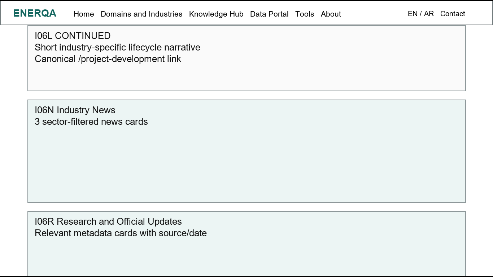

---

## Page 93

[Open PDF page 93](<Enerqa Website Developer Handoff Revised.pdf#page=93>)

#### Infrastructure  Real Estate and Industrial Zones continued layout

Scroll view 2   \|   Top viewport fold y 1396   \|   Bottom viewport fold y 2164

Scroll view 3   \|   Top viewport fold y 1726   \|   Bottom viewport fold y 2494

---

## Page 94

[Open PDF page 94](<Enerqa Website Developer Handoff Revised.pdf#page=94>)

#### Page text and API placement

##### I0601 Infrastructure  Real Estate and Industrial Zones

Website heading: Infrastructure, Real Estate & Industrial Zones

Buildings and infrastructure designed today will shape energy demand, emissions and climate resilience for decades. For real estate, industrial parks, free zones, roads and other infrastructure assets, low-carbon and climate-resilient design can be informed by energy and water efficiency, environmental and social assessment, lifecycle emissions and sustainability scoring.

Due diligence and implementation monitoring help ensure these priorities remain embedded as projects move from concept and design to construction and operation.

Button or link: Discuss Your Project → /contact?industry=infrastructure-real-estate-industrial-zones

##### I0602 Relevant Domains and Work Areas

Website heading: Relevant Domains and Work Areas

Explore the technical, environmental, climate and business work areas relevant to this industry. Each link explains the scope within its parent domain rather than repeating it here.

Industry-specific link, feed, dataset and tool configuration is specified in the mapping following the industry chapters. Domain anchor destinations use the exact capability heading slug.

##### I06L Project Development and Lifecycle Support

Website heading: Project Development and Lifecycle Support

Infrastructure development begins with the site, intended use, market requirements and environmental context. Concept options and feasibility studies establish capacity, phasing and investment requirements before design and procurement. Implementation monitoring and operational assessment help retain energy, water, climate-resilience and sustainability priorities throughout the asset lifecycle, including future renewal or redevelopment.

Button or link: Explore Our Project Development Approach → /project-development

Place after the offering or capability sections. This is a short context-specific module; keep the complete lifecycle narrative on the canonical page only.

##### I06N Industry News

Website heading: Industry News

Follow relevant developments in infrastructure, real estate & industrial zones, including the climate, energy, environmental and investment issues affecting the sector.

Button or link: View All Industry News → /knowledge-hub/global-intelligence?industry=infrastructure-real-estate-industrial-zones

I06N: NewsData.io primary, legacy GDELT supplementary. Filter by the industry and related sustainability themes together, then enforce verified open-access full reading. Generic sector news is not sufficient without topical relevance.

Provider specifications: [newsdata](<#page-210>) \| [gdelt](<#page-211>)

---

## Page 95

[Open PDF page 95](<Enerqa Website Developer Handoff Revised.pdf#page=95>)

##### I06R Research and Official Updates

Website heading: Research and Official Updates

Explore research, policy and technical publications relevant to this industry. Sources, authors, dates and document types make the evidence easier to assess.

Button or link: Explore Related Research → /knowledge-hub/global-intelligence?industry=infrastructure-real-estate-industrial-zones&type=research

I06R: OpenAlex/DOAJ shared scholarly sources plus the specialist sources identified in the industry mapping. Official reports and corporate disclosures remain separate labels, not Enerqa-authored articles.

Provider specifications: [openalex](<#page-212>) \| [doaj](<#page-213>)

##### I06D Related Data

Website heading: Related Data

Explore open-access datasets through charts and accessible tables. Each view identifies its source, geography, observation period, units and update date. Open a dataset to review the methodology and download data free of charge.

Button or link: Explore Related Data → /data-portal?industry=infrastructure-real-estate-industrial-zones

Placement I06D: one compact chart or dataset card only; use a cached source release, visible attribution and a canonical dataset link. Do not duplicate a full dashboard here. Recommended numerical sources: nasa-power, world-bank-indicators.

Provider specifications: [nasa-power](<#page-221>) \| [world-bank-indicators](<#page-219>)

Use the industry-specific mapping as the primary choice of source/preview. If no geographically relevant licensed dataset is available, replace the preview with relevant canonical catalogue links, not a sample statistic.

##### I06T Relevant Enerqa Tools

Website heading: Relevant Enerqa Tools

Explore assessment and modelling tools relevant to this industry.

Button or link: Explore All Tools → /tools?industry=infrastructure-real-estate-industrial-zones

##### I06K Enerqa Publication

Website heading: Enerqa Publication

Read Enerqa’s perspectives on the sustainability and project-development questions relevant to this industry.

Button or link: Explore Related Publications → /knowledge-hub?industry=infrastructure-real-estate-industrial-zones

##### I06A Discuss Your Project

Website heading: Discuss Your Project

Share the industry context, location, current stage and the decisions ahead. Support can be scoped around the questions that matter to your opportunity.

Button or link: Discuss Your Project → /contact?industry=infrastructure-real-estate-industrial-zones

---

## Page 96

[Open PDF page 96](<Enerqa Website Developer Handoff Revised.pdf#page=96>)

#### Contextual API and link configuration

I0602 offering links

Climate Risk & Resilience → /domains/climate-action-carbon-management#climate-risk-resilience

Energy Audits & Performance Assessment → /domains/energy-systems-transition#energy-audits-performance-assessment

ESIA, Strategic Assessment & Safeguards → /domains/environment-nature-circularity#esia-strategic-assessment-safeguards

Environmental Permitting & Due Diligence → /domains/environment-nature-circularity#environmental-permitting-due-diligence

News query baskets: "sustainable infrastructure" OR "green buildings" OR "industrial zones"; "climate resilient infrastructure" OR "building energy efficiency"

Research themes: green buildings infrastructure sustainability resilience lifecycle emissions; industrial zones water energy environmental social assessment

Source priorities: Official planning/building/environment authorities; Energy/building research and licence-cleared infrastructure reports

Specialist feeds for I06R: eea\_rss, osti.

Provider specifications: [eea\_rss](<#page-215>) \| [osti](<#page-215>)

I06D numerical source nasa-power: Historical solar/meteorological context for early site assessment.

I06D numerical source world-bank-indicators: Country infrastructure/development/water context, not site-level design.

I06T tools: greenscale-pro, easysolar, esg-readiness-tool. GreenScale Pro primary built/infrastructure tool; easySOLAR rooftop/site PV/storage; ESG readiness for owner/operator.

Tool routes: /tools/greenscale-pro, /tools/easysolar, /tools/esg-readiness. Developer must use approved availability/access labels; do not assume every tool is publicly launched.

---

## Page 97

[Open PDF page 97](<Enerqa Website Developer Handoff Revised.pdf#page=97>)

### Transport  Logistics and Mobility

#### Laptop page design

Route: /industries/transport-logistics-mobility   \|   Reference browser viewport: 1366 × 768 px

Segment IDs map to the copy below. Views advance about 698 px below the sticky header; the final view stops at the page end. Test folds with final fonts, real feeds and Arabic text.

Initial view   \|   Top viewport fold y 0   \|   Bottom viewport fold y 768

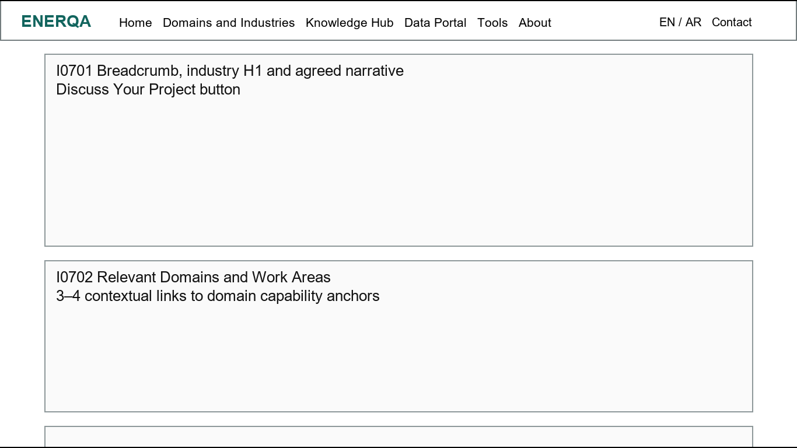

---

## Page 98

[Open PDF page 98](<Enerqa Website Developer Handoff Revised.pdf#page=98>)

Scroll view 1   \|   Top viewport fold y 698   \|   Bottom viewport fold y 1466

---

## Page 99

[Open PDF page 99](<Enerqa Website Developer Handoff Revised.pdf#page=99>)

#### Transport  Logistics and Mobility continued layout

Scroll view 2   \|   Top viewport fold y 1396   \|   Bottom viewport fold y 2164

Scroll view 3   \|   Top viewport fold y 1726   \|   Bottom viewport fold y 2494

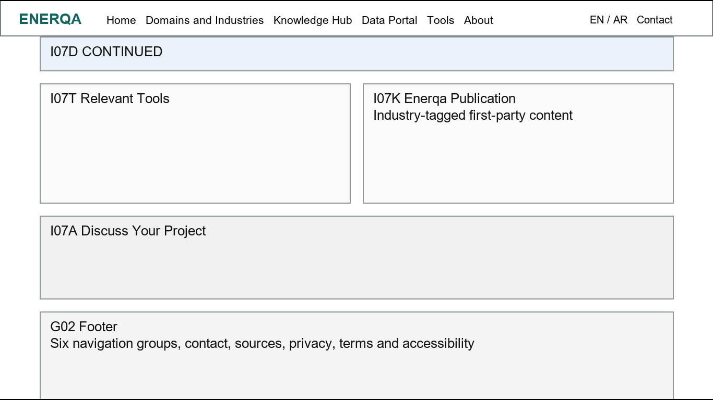

---

## Page 100

[Open PDF page 100](<Enerqa Website Developer Handoff Revised.pdf#page=100>)

#### Page text and API placement

##### I0701 Transport  Logistics and Mobility

Website heading: Transport, Logistics & Mobility

Every movement of people and goods generates data that can inform a more efficient, lower-carbon transport system. Across road transport, aviation, maritime operations, ports, rail and logistics networks, emissions accounting, activity-data analysis and MRV create a reliable picture of performance.

That evidence can guide fuel and technology assessments, fleet efficiency, low-carbon transport infrastructure, climate-resilience planning and more sustainable supply chains.

Button or link: Discuss Your Project → /contact?industry=transport-logistics-mobility

##### I0702 Relevant Domains and Work Areas

Website heading: Relevant Domains and Work Areas

Explore the technical, environmental, climate and business work areas relevant to this industry. Each link explains the scope within its parent domain rather than repeating it here.

Industry-specific link, feed, dataset and tool configuration is specified in the mapping following the industry chapters. Domain anchor destinations use the exact capability heading slug.

##### I07L Project Development and Lifecycle Support

Website heading: Project Development and Lifecycle Support

Transport projects need to connect service requirements with assets, technology, energy supply and viable business models. Activity and emissions data inform concepts that can be assessed through feasibility and financial analysis before procurement and deployment. Monitoring then examines fleet, infrastructure and service performance, providing evidence for operational improvement and subsequent investment.

Button or link: Explore Our Project Development Approach → /project-development

Place after the offering or capability sections. This is a short context-specific module; keep the complete lifecycle narrative on the canonical page only.

##### I07N Industry News

Website heading: Industry News

Follow relevant developments in transport, logistics & mobility, including the climate, energy, environmental and investment issues affecting the sector.

Button or link: View All Industry News → /knowledge-hub/global-intelligence?industry=transport-logistics-mobility

I07N: NewsData.io primary, legacy GDELT supplementary. Filter by the industry and related sustainability themes together, then enforce verified open-access full reading. Generic sector news is not sufficient without topical relevance.

Provider specifications: [newsdata](<#page-210>) \| [gdelt](<#page-211>)

---

## Page 101

[Open PDF page 101](<Enerqa Website Developer Handoff Revised.pdf#page=101>)

##### I07R Research and Official Updates

Website heading: Research and Official Updates

Explore research, policy and technical publications relevant to this industry. Sources, authors, dates and document types make the evidence easier to assess.

Button or link: Explore Related Research → /knowledge-hub/global-intelligence?industry=transport-logistics-mobility&type=research

I07R: OpenAlex/DOAJ shared scholarly sources plus the specialist sources identified in the industry mapping. Official reports and corporate disclosures remain separate labels, not Enerqa-authored articles.

Provider specifications: [openalex](<#page-212>) \| [doaj](<#page-213>)

##### I07D Related Data

Website heading: Related Data

Explore open-access datasets through charts and accessible tables. Each view identifies its source, geography, observation period, units and update date. Open a dataset to review the methodology and download data free of charge.

Button or link: Explore Related Data → /data-portal?industry=transport-logistics-mobility

Placement I07D: one compact chart or dataset card only; use a cached source release, visible attribution and a canonical dataset link. Do not duplicate a full dashboard here. Recommended numerical sources: climate-trace, eia-open-data.

Provider specifications: [climate-trace](<#page-218>) \| [eia-open-data](<#page-220>)

Use the industry-specific mapping as the primary choice of source/preview. If no geographically relevant licensed dataset is available, replace the preview with relevant canonical catalogue links, not a sample statistic.

##### I07T Relevant Enerqa Tools

Website heading: Relevant Enerqa Tools

Explore assessment and modelling tools relevant to this industry.

Button or link: Explore All Tools → /tools?industry=transport-logistics-mobility

##### I07K Enerqa Publication

Website heading: Enerqa Publication

Read Enerqa’s perspectives on the sustainability and project-development questions relevant to this industry.

Button or link: Explore Related Publications → /knowledge-hub?industry=transport-logistics-mobility

##### I07A Discuss Your Project

Website heading: Discuss Your Project

Share the industry context, location, current stage and the decisions ahead. Support can be scoped around the questions that matter to your opportunity.

Button or link: Discuss Your Project → /contact?industry=transport-logistics-mobility

---

## Page 102

[Open PDF page 102](<Enerqa Website Developer Handoff Revised.pdf#page=102>)

#### Contextual API and link configuration

I0702 offering links

GHG Inventories, Carbon Footprints & Baselines → /domains/climate-action-carbon-management#ghg-inventories-carbon-footprints-baselines

MRV, Transparency & NDC Tracking → /domains/climate-action-carbon-management#mrv-transparency-ndc-tracking

Clean Technology & Industrial Decarbonisation → /domains/energy-systems-transition#clean-technology-industrial-decarbonisation

Responsible Supply Chains → /domains/sustainable-business-esg-finance#responsible-supply-chains

News query baskets: "transport decarbonisation" OR "low carbon mobility"; "sustainable logistics" OR "shipping emissions" OR "electric fleets"

Research themes: transport emissions activity data MRV low carbon mobility; logistics maritime aviation fuels fleet climate resilience

Source priorities: Transport regulators, official statistical agencies and international transport bodies; Energy/transport technical research and reputable mobility/logistics reporting

Specialist feeds for I07R: eia\_rss, osti.

Provider specifications: [eia\_rss](<#page-214>) \| [osti](<#page-215>)

I07D numerical source climate-trace: Transport-sector/source emissions estimates, not local fleet data.

I07D numerical source eia-open-data: Selected transport-fuel supply/price context, coverage labelled.

I07T tools: esg-readiness-tool, easysolar. ESG readiness for operators; easySOLAR only for depots/ports/logistics-estate PV/storage, not vehicle routing/fleet modelling.

Tool routes: /tools/esg-readiness, /tools/easysolar. Developer must use approved availability/access labels; do not assume every tool is publicly launched.

---

## Page 103

[Open PDF page 103](<Enerqa Website Developer Handoff Revised.pdf#page=103>)

### Water  Waste and Circular Economy

#### Laptop page design

Route: /industries/water-waste-circular-economy   \|   Reference browser viewport: 1366 × 768 px

Segment IDs map to the copy below. Views advance about 698 px below the sticky header; the final view stops at the page end. Test folds with final fonts, real feeds and Arabic text.

Initial view   \|   Top viewport fold y 0   \|   Bottom viewport fold y 768

---

## Page 104

[Open PDF page 104](<Enerqa Website Developer Handoff Revised.pdf#page=104>)

Scroll view 1   \|   Top viewport fold y 698   \|   Bottom viewport fold y 1466

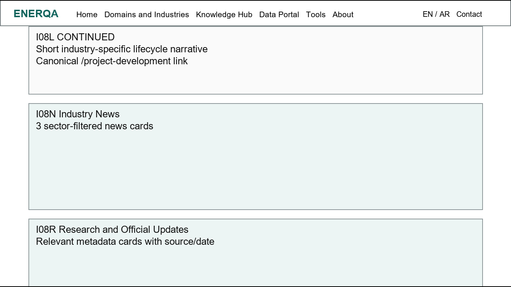

---

## Page 105

[Open PDF page 105](<Enerqa Website Developer Handoff Revised.pdf#page=105>)

#### Water  Waste and Circular Economy continued layout

Scroll view 2   \|   Top viewport fold y 1396   \|   Bottom viewport fold y 2164

Scroll view 3   \|   Top viewport fold y 1726   \|   Bottom viewport fold y 2494

---

## Page 106

[Open PDF page 106](<Enerqa Website Developer Handoff Revised.pdf#page=106>)

#### Page text and API placement

##### I0801 Water  Waste and Circular Economy

Website heading: Water, Waste & Circular Economy

Water scarcity, growing waste streams and rising resource costs are making circular solutions increasingly important. Across water, wastewater and municipal, industrial, hazardous and medical waste, technology assessment and project feasibility can identify opportunities for treatment, reuse, resource recovery and energy recovery.

Circular business models, environmental compliance, finance structuring and operational monitoring help turn those opportunities into viable water, waste and circular-economy projects.

Button or link: Discuss Your Project → /contact?industry=water-waste-circular-economy

##### I0802 Relevant Domains and Work Areas

Website heading: Relevant Domains and Work Areas

Explore the technical, environmental, climate and business work areas relevant to this industry. Each link explains the scope within its parent domain rather than repeating it here.

Industry-specific link, feed, dataset and tool configuration is specified in the mapping following the industry chapters. Domain anchor destinations use the exact capability heading slug.

##### I08L Project Development and Lifecycle Support

Website heading: Project Development and Lifecycle Support

Water and waste projects begin with resource characteristics, service needs and potential markets for recovered products. Technology assessment and feasibility studies test treatment, reuse and recovery options alongside circular business models. Financing and implementation arrangements provide a route to operation, while monitoring examines service quality, environmental compliance and opportunities for renewal or improvement.

Button or link: Explore Our Project Development Approach → /project-development

Place after the offering or capability sections. This is a short context-specific module; keep the complete lifecycle narrative on the canonical page only.

##### I08N Industry News

Website heading: Industry News

Follow relevant developments in water, waste & circular economy, including the climate, energy, environmental and investment issues affecting the sector.

Button or link: View All Industry News → /knowledge-hub/global-intelligence?industry=water-waste-circular-economy

I08N: NewsData.io primary, legacy GDELT supplementary. Filter by the industry and related sustainability themes together, then enforce verified open-access full reading. Generic sector news is not sufficient without topical relevance.

Provider specifications: [newsdata](<#page-210>) \| [gdelt](<#page-211>)

---

## Page 107

[Open PDF page 107](<Enerqa Website Developer Handoff Revised.pdf#page=107>)

##### I08R Research and Official Updates

Website heading: Research and Official Updates

Explore research, policy and technical publications relevant to this industry. Sources, authors, dates and document types make the evidence easier to assess.

Button or link: Explore Related Research → /knowledge-hub/global-intelligence?industry=water-waste-circular-economy&type=research

I08R: OpenAlex/DOAJ shared scholarly sources plus the specialist sources identified in the industry mapping. Official reports and corporate disclosures remain separate labels, not Enerqa-authored articles.

Provider specifications: [openalex](<#page-212>) \| [doaj](<#page-213>)

##### I08D Related Data

Website heading: Related Data

Explore open-access datasets through charts and accessible tables. Each view identifies its source, geography, observation period, units and update date. Open a dataset to review the methodology and download data free of charge.

Button or link: Explore Related Data → /data-portal?industry=water-waste-circular-economy

Placement I08D: one compact chart or dataset card only; use a cached source release, visible attribution and a canonical dataset link. Do not duplicate a full dashboard here. Recommended numerical sources: oecd-sdmx, world-bank-indicators.

Provider specifications: [oecd-sdmx](<#page-219>) \| [world-bank-indicators](<#page-219>)

Use the industry-specific mapping as the primary choice of source/preview. If no geographically relevant licensed dataset is available, replace the preview with relevant canonical catalogue links, not a sample statistic.

##### I08T Relevant Enerqa Tools

Website heading: Relevant Enerqa Tools

Explore assessment and modelling tools relevant to this industry.

Button or link: Explore All Tools → /tools?industry=water-waste-circular-economy

##### I08K Enerqa Publication

Website heading: Enerqa Publication

Read Enerqa’s perspectives on the sustainability and project-development questions relevant to this industry.

Button or link: Explore Related Publications → /knowledge-hub?industry=water-waste-circular-economy

##### I08A Discuss Your Project

Website heading: Discuss Your Project

Share the industry context, location, current stage and the decisions ahead. Support can be scoped around the questions that matter to your opportunity.

Button or link: Discuss Your Project → /contact?industry=water-waste-circular-economy

---

## Page 108

[Open PDF page 108](<Enerqa Website Developer Handoff Revised.pdf#page=108>)

#### Contextual API and link configuration

I0802 offering links

Circular Economy, Waste & Resource Recovery → /domains/environment-nature-circularity#circular-economy-waste-resource-recovery

Water, Coastal & Marine Systems → /domains/environment-nature-circularity#water-coastal-marine-systems

Environmental Management & Pollution Control → /domains/environment-nature-circularity#environmental-management-pollution-control

Feasibility Studies & Business Models → /domains/sustainable-business-esg-finance#feasibility-studies-business-models

News query baskets: "water reuse" OR "wastewater treatment" OR "water scarcity"; "circular economy" OR "waste recycling" OR "resource recovery"

Research themes: water wastewater reuse circular economy resource recovery; waste treatment recovery business models environmental compliance

Source priorities: Water/environment regulators, official utilities and EEA; Reputable waste/water/circular-economy research and reporting

Specialist feeds for I08R: eea\_rss, reliefweb.

Provider specifications: [eea\_rss](<#page-215>) \| [reliefweb](<#page-213>)

I08D numerical source oecd-sdmx: Municipal waste generation/treatment country comparisons.

I08D numerical source world-bank-indicators: Country water-stress indicators; not local supply forecast.

I08T tools: esg-readiness-tool, easysolar. Organisational readiness; PV/storage for pumping/treatment facilities where relevant. No public waste-design/water-balance tool claimed.

Tool routes: /tools/esg-readiness, /tools/easysolar. Developer must use approved availability/access labels; do not assume every tool is publicly launched.

---

## Page 109

[Open PDF page 109](<Enerqa Website Developer Handoff Revised.pdf#page=109>)

### Agriculture  Food and Aquaculture

#### Laptop page design

Route: /industries/agriculture-food-aquaculture   \|   Reference browser viewport: 1366 × 768 px

Segment IDs map to the copy below. Views advance about 698 px below the sticky header; the final view stops at the page end. Test folds with final fonts, real feeds and Arabic text.

Initial view   \|   Top viewport fold y 0   \|   Bottom viewport fold y 768

---

## Page 110

[Open PDF page 110](<Enerqa Website Developer Handoff Revised.pdf#page=110>)

Scroll view 1   \|   Top viewport fold y 698   \|   Bottom viewport fold y 1466

---

## Page 111

[Open PDF page 111](<Enerqa Website Developer Handoff Revised.pdf#page=111>)

#### Agriculture  Food and Aquaculture continued layout

Scroll view 2   \|   Top viewport fold y 1396   \|   Bottom viewport fold y 2164

Scroll view 3   \|   Top viewport fold y 1726   \|   Bottom viewport fold y 2494

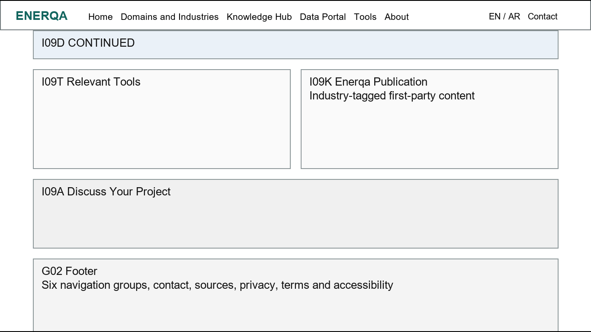

---

## Page 112

[Open PDF page 112](<Enerqa Website Developer Handoff Revised.pdf#page=112>)

#### Page text and API placement

##### I0901 Agriculture  Food and Aquaculture

Website heading: Agriculture, Food & Aquaculture

Food systems sit at the intersection of climate, energy, water, land and biodiversity. Farms, irrigation systems, food processors, fisheries and aquaculture projects can become more resilient through renewable-energy applications, carbon-footprint and lifecycle assessment, sustainable production practices and better management of natural resources.

Climate finance, ESG frameworks and MRV systems can provide the structure needed to fund improvements and demonstrate their environmental, social and commercial results.

Button or link: Discuss Your Project → /contact?industry=agriculture-food-aquaculture

##### I0902 Relevant Domains and Work Areas

Website heading: Relevant Domains and Work Areas

Explore the technical, environmental, climate and business work areas relevant to this industry. Each link explains the scope within its parent domain rather than repeating it here.

Industry-specific link, feed, dataset and tool configuration is specified in the mapping following the industry chapters. Domain anchor destinations use the exact capability heading slug.

##### I09L Project Development and Lifecycle Support

Website heading: Project Development and Lifecycle Support

Agricultural and food-system investments need to reflect production requirements, market conditions and the availability of water, energy and natural resources. Climate and environmental assessment inform concepts that can be tested through feasibility and financial modelling. Implementation and monitoring then connect investment decisions with productivity, resource efficiency, resilience and environmental performance.

Button or link: Explore Our Project Development Approach → /project-development

Place after the offering or capability sections. This is a short context-specific module; keep the complete lifecycle narrative on the canonical page only.

##### I09N Industry News

Website heading: Industry News

Follow relevant developments in agriculture, food & aquaculture, including the climate, energy, environmental and investment issues affecting the sector.

Button or link: View All Industry News → /knowledge-hub/global-intelligence?industry=agriculture-food-aquaculture

I09N: NewsData.io primary, legacy GDELT supplementary. Filter by the industry and related sustainability themes together, then enforce verified open-access full reading. Generic sector news is not sufficient without topical relevance.

Provider specifications: [newsdata](<#page-210>) \| [gdelt](<#page-211>)

---

## Page 113

[Open PDF page 113](<Enerqa Website Developer Handoff Revised.pdf#page=113>)

##### I09R Research and Official Updates

Website heading: Research and Official Updates

Explore research, policy and technical publications relevant to this industry. Sources, authors, dates and document types make the evidence easier to assess.

Button or link: Explore Related Research → /knowledge-hub/global-intelligence?industry=agriculture-food-aquaculture&type=research

I09R: OpenAlex/DOAJ shared scholarly sources plus the specialist sources identified in the industry mapping. Official reports and corporate disclosures remain separate labels, not Enerqa-authored articles.

Provider specifications: [openalex](<#page-212>) \| [doaj](<#page-213>)

##### I09D Related Data

Website heading: Related Data

Explore open-access datasets through charts and accessible tables. Each view identifies its source, geography, observation period, units and update date. Open a dataset to review the methodology and download data free of charge.

Button or link: Explore Related Data → /data-portal?industry=agriculture-food-aquaculture

Placement I09D: one compact chart or dataset card only; use a cached source release, visible attribution and a canonical dataset link. Do not duplicate a full dashboard here. Recommended numerical sources: nasa-power, world-bank-indicators.

Provider specifications: [nasa-power](<#page-221>) \| [world-bank-indicators](<#page-219>)

Use the industry-specific mapping as the primary choice of source/preview. If no geographically relevant licensed dataset is available, replace the preview with relevant canonical catalogue links, not a sample statistic.

##### I09T Relevant Enerqa Tools

Website heading: Relevant Enerqa Tools

Explore assessment and modelling tools relevant to this industry.

Button or link: Explore All Tools → /tools?industry=agriculture-food-aquaculture

##### I09K Enerqa Publication

Website heading: Enerqa Publication

Read Enerqa’s perspectives on the sustainability and project-development questions relevant to this industry.

Button or link: Explore Related Publications → /knowledge-hub?industry=agriculture-food-aquaculture

##### I09A Discuss Your Project

Website heading: Discuss Your Project

Share the industry context, location, current stage and the decisions ahead. Support can be scoped around the questions that matter to your opportunity.

Button or link: Discuss Your Project → /contact?industry=agriculture-food-aquaculture

---

## Page 114

[Open PDF page 114](<Enerqa Website Developer Handoff Revised.pdf#page=114>)

#### Contextual API and link configuration

I0902 offering links

Climate Risk & Resilience → /domains/climate-action-carbon-management#climate-risk-resilience

Renewable-Energy Project Development → /domains/energy-systems-transition#renewable-energy-project-development

Biodiversity, Ecosystems & Natural Capital → /domains/environment-nature-circularity#biodiversity-ecosystems-natural-capital

Water, Coastal & Marine Systems → /domains/environment-nature-circularity#water-coastal-marine-systems

News query baskets: "climate smart agriculture" OR "sustainable food systems"; "solar irrigation" OR "sustainable aquaculture" OR "food carbon footprint"

Research themes: agriculture aquaculture climate resilience water energy biodiversity; solar irrigation food carbon footprint lifecycle assessment

Source priorities: Agriculture/water/fisheries authorities and relevant UN publications; GBIF literature, humanitarian food-security reports and reputable food/agriculture reporting

Specialist feeds for I09R: reliefweb, gbif\_literature.

Provider specifications: [reliefweb](<#page-213>) \| [gbif\_literature](<#page-216>)

I09D numerical source nasa-power: Historical solar/meteorological context for farming/irrigation feasibility.

I09D numerical source world-bank-indicators: National agriculture/water/development context after series selection.

I09T tools: easysolar, esg-readiness-tool. easySOLAR for irrigation/food/aquaculture PV/storage; ESG readiness for businesses, not agronomic forecasting.

Tool routes: /tools/easysolar, /tools/esg-readiness. Developer must use approved availability/access labels; do not assume every tool is publicly launched.

---

## Page 115

[Open PDF page 115](<Enerqa Website Developer Handoff Revised.pdf#page=115>)

### Mining and Natural Resources

#### Laptop page design

Route: /industries/mining-natural-resources   \|   Reference browser viewport: 1366 × 768 px

Segment IDs map to the copy below. Views advance about 698 px below the sticky header; the final view stops at the page end. Test folds with final fonts, real feeds and Arabic text.

Initial view   \|   Top viewport fold y 0   \|   Bottom viewport fold y 768

---

## Page 116

[Open PDF page 116](<Enerqa Website Developer Handoff Revised.pdf#page=116>)

Scroll view 1   \|   Top viewport fold y 698   \|   Bottom viewport fold y 1466

---

## Page 117

[Open PDF page 117](<Enerqa Website Developer Handoff Revised.pdf#page=117>)

#### Mining and Natural Resources continued layout

Scroll view 2   \|   Top viewport fold y 1396   \|   Bottom viewport fold y 2164

Scroll view 3   \|   Top viewport fold y 1726   \|   Bottom viewport fold y 2494

---

## Page 118

[Open PDF page 118](<Enerqa Website Developer Handoff Revised.pdf#page=118>)

#### Page text and API placement

##### I1001 Mining and Natural Resources

Website heading: Mining & Natural Resources

Responsible resource development requires environmental and social considerations to remain visible throughout the asset lifecycle. For mining, quarrying and other natural-resource activities, this includes environmental and social assessment, pollution management, energy and emissions reduction, water stewardship, and land and biodiversity management.

Rehabilitation and closure liabilities, responsible sourcing and community impacts complete the picture, helping decision-makers understand both immediate operational priorities and long-term obligations.

Button or link: Discuss Your Project → /contact?industry=mining-natural-resources

##### I1002 Relevant Domains and Work Areas

Website heading: Relevant Domains and Work Areas

Explore the technical, environmental, climate and business work areas relevant to this industry. Each link explains the scope within its parent domain rather than repeating it here.

Industry-specific link, feed, dataset and tool configuration is specified in the mapping following the industry chapters. Domain anchor destinations use the exact capability heading slug.

##### I10L Project Development and Lifecycle Support

Website heading: Project Development and Lifecycle Support

Resource projects need to account for environmental and community responsibilities as well as operational requirements. Water, energy, pollution-control and rehabilitation opportunities can be developed through assessment, feasibility studies and investment planning. Monitoring, valuation and closure planning help keep remaining liabilities and future land use visible throughout operation and transition.

Button or link: Explore Our Project Development Approach → /project-development

Place after the offering or capability sections. This is a short context-specific module; keep the complete lifecycle narrative on the canonical page only.

##### I10N Industry News

Website heading: Industry News

Follow relevant developments in mining & natural resources, including the climate, energy, environmental and investment issues affecting the sector.

Button or link: View All Industry News → /knowledge-hub/global-intelligence?industry=mining-natural-resources

I10N: NewsData.io primary, legacy GDELT supplementary. Filter by the industry and related sustainability themes together, then enforce verified open-access full reading. Generic sector news is not sufficient without topical relevance.

Provider specifications: [newsdata](<#page-210>) \| [gdelt](<#page-211>)

---

## Page 119

[Open PDF page 119](<Enerqa Website Developer Handoff Revised.pdf#page=119>)

##### I10R Research and Official Updates

Website heading: Research and Official Updates

Explore research, policy and technical publications relevant to this industry. Sources, authors, dates and document types make the evidence easier to assess.

Button or link: Explore Related Research → /knowledge-hub/global-intelligence?industry=mining-natural-resources&type=research

I10R: OpenAlex/DOAJ shared scholarly sources plus the specialist sources identified in the industry mapping. Official reports and corporate disclosures remain separate labels, not Enerqa-authored articles.

Provider specifications: [openalex](<#page-212>) \| [doaj](<#page-213>)

##### I10D Related Data

Website heading: Related Data

Explore open-access datasets through charts and accessible tables. Each view identifies its source, geography, observation period, units and update date. Open a dataset to review the methodology and download data free of charge.

Button or link: Explore Related Data → /data-portal?industry=mining-natural-resources

Placement I10D: one compact chart or dataset card only; use a cached source release, visible attribution and a canonical dataset link. Do not duplicate a full dashboard here. Recommended numerical sources: gbif-occurrence, climate-trace.

Provider specifications: [gbif-occurrence](<#page-222>) \| [climate-trace](<#page-218>)

Use the industry-specific mapping as the primary choice of source/preview. If no geographically relevant licensed dataset is available, replace the preview with relevant canonical catalogue links, not a sample statistic.

##### I10T Relevant Enerqa Tools

Website heading: Relevant Enerqa Tools

Explore assessment and modelling tools relevant to this industry.

Button or link: Explore All Tools → /tools?industry=mining-natural-resources

##### I10K Enerqa Publication

Website heading: Enerqa Publication

Read Enerqa’s perspectives on the sustainability and project-development questions relevant to this industry.

Button or link: Explore Related Publications → /knowledge-hub?industry=mining-natural-resources

##### I10A Discuss Your Project

Website heading: Discuss Your Project

Share the industry context, location, current stage and the decisions ahead. Support can be scoped around the questions that matter to your opportunity.

Button or link: Discuss Your Project → /contact?industry=mining-natural-resources

---

## Page 120

[Open PDF page 120](<Enerqa Website Developer Handoff Revised.pdf#page=120>)

#### Contextual API and link configuration

I1002 offering links

ESIA, Strategic Assessment & Safeguards → /domains/environment-nature-circularity#esia-strategic-assessment-safeguards

Biodiversity, Ecosystems & Natural Capital → /domains/environment-nature-circularity#biodiversity-ecosystems-natural-capital

Rehabilitation, Closure & Monitoring → /domains/environment-nature-circularity#rehabilitation-closure-monitoring

Responsible Supply Chains → /domains/sustainable-business-esg-finance#responsible-supply-chains

News query baskets: "sustainable mining" OR "mine rehabilitation" OR "mining biodiversity"; "mining emissions" OR "responsible minerals" OR "mine water"

Research themes: mining environmental social impacts biodiversity rehabilitation closure; mine water pollution energy emissions responsible sourcing

Source priorities: Mining/environment regulators and official geological/environment institutions; Biodiversity research and reputable resource/mining sustainability reporting

Specialist feeds for I10R: gbif\_literature, eea\_rss.

Provider specifications: [gbif\_literature](<#page-216>) \| [eea\_rss](<#page-215>)

I10D numerical source gbif-occurrence: Licence-compatible occurrence context; requires surveys, not evidence of no impact.

I10D numerical source climate-trace: Relevant extraction/source greenhouse gas estimates if coverage exists.

I10T tools: esg-readiness-tool, easysolar. Readiness and site-energy feasibility; no mine design, closure-cost or biodiversity valuation tool claimed.

Tool routes: /tools/esg-readiness, /tools/easysolar. Developer must use approved availability/access labels; do not assume every tool is publicly launched.

---

## Page 121

[Open PDF page 121](<Enerqa Website Developer Handoff Revised.pdf#page=121>)

### Tourism  Hospitality and Destinations

#### Laptop page design

Route: /industries/tourism-hospitality-destinations   \|   Reference browser viewport: 1366 × 768 px

Segment IDs map to the copy below. Views advance about 698 px below the sticky header; the final view stops at the page end. Test folds with final fonts, real feeds and Arabic text.

Initial view   \|   Top viewport fold y 0   \|   Bottom viewport fold y 768

---

## Page 122

[Open PDF page 122](<Enerqa Website Developer Handoff Revised.pdf#page=122>)

Scroll view 1   \|   Top viewport fold y 698   \|   Bottom viewport fold y 1466

---

## Page 123

[Open PDF page 123](<Enerqa Website Developer Handoff Revised.pdf#page=123>)

#### Tourism  Hospitality and Destinations continued layout

Scroll view 2   \|   Top viewport fold y 1396   \|   Bottom viewport fold y 2164

Scroll view 3   \|   Top viewport fold y 1726   \|   Bottom viewport fold y 2494

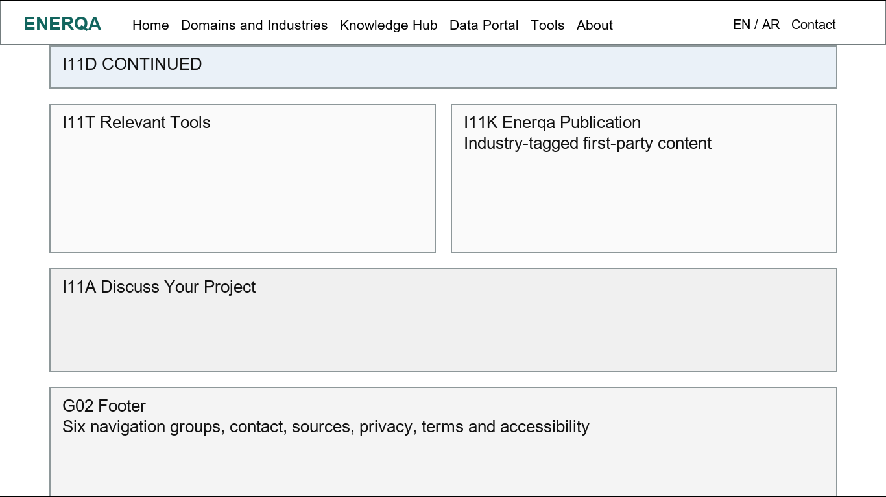

---

## Page 124

[Open PDF page 124](<Enerqa Website Developer Handoff Revised.pdf#page=124>)

#### Page text and API placement

##### I1101 Tourism  Hospitality and Destinations

Website heading: Tourism, Hospitality & Destinations

Hotels, resorts, destinations and major events increasingly compete on how efficiently and responsibly they operate. Energy, water, waste and carbon baselines provide a clear picture of environmental performance, while climate-resilience assessments reveal how changing conditions may affect assets, operations and visitor destinations.

Biodiversity, community impacts, ESG reporting, certification readiness and sustainable investment planning can then become part of a wider strategy for responsible tourism and hospitality.

Button or link: Discuss Your Project → /contact?industry=tourism-hospitality-destinations

##### I1102 Relevant Domains and Work Areas

Website heading: Relevant Domains and Work Areas

Explore the technical, environmental, climate and business work areas relevant to this industry. Each link explains the scope within its parent domain rather than repeating it here.

Industry-specific link, feed, dataset and tool configuration is specified in the mapping following the industry chapters. Domain anchor destinations use the exact capability heading slug.

##### I11L Project Development and Lifecycle Support

Website heading: Project Development and Lifecycle Support

Tourism investments can begin with an assessment of energy, water, waste, carbon and climate exposure across an asset or destination. Renewable-energy, efficiency and resilience concepts can then be tested against technical requirements and the business case. Implementation and performance monitoring connect improvements with operating costs, environmental outcomes and the long-term quality of the destination.

Button or link: Explore Our Project Development Approach → /project-development

Place after the offering or capability sections. This is a short context-specific module; keep the complete lifecycle narrative on the canonical page only.

##### I11N Industry News

Website heading: Industry News

Follow relevant developments in tourism, hospitality & destinations, including the climate, energy, environmental and investment issues affecting the sector.

Button or link: View All Industry News → /knowledge-hub/global-intelligence?industry=tourism-hospitality-destinations

I11N: NewsData.io primary, legacy GDELT supplementary. Filter by the industry and related sustainability themes together, then enforce verified open-access full reading. Generic sector news is not sufficient without topical relevance.

Provider specifications: [newsdata](<#page-210>) \| [gdelt](<#page-211>)

---

## Page 125

[Open PDF page 125](<Enerqa Website Developer Handoff Revised.pdf#page=125>)

##### I11R Research and Official Updates

Website heading: Research and Official Updates

Explore research, policy and technical publications relevant to this industry. Sources, authors, dates and document types make the evidence easier to assess.

Button or link: Explore Related Research → /knowledge-hub/global-intelligence?industry=tourism-hospitality-destinations&type=research

I11R: OpenAlex/DOAJ shared scholarly sources plus the specialist sources identified in the industry mapping. Official reports and corporate disclosures remain separate labels, not Enerqa-authored articles.

Provider specifications: [openalex](<#page-212>) \| [doaj](<#page-213>)

##### I11D Related Data

Website heading: Related Data

Explore open-access datasets through charts and accessible tables. Each view identifies its source, geography, observation period, units and update date. Open a dataset to review the methodology and download data free of charge.

Button or link: Explore Related Data → /data-portal?industry=tourism-hospitality-destinations

Placement I11D: one compact chart or dataset card only; use a cached source release, visible attribution and a canonical dataset link. Do not duplicate a full dashboard here. Recommended numerical sources: nasa-power, gbif-occurrence.

Provider specifications: [nasa-power](<#page-221>) \| [gbif-occurrence](<#page-222>)

Use the industry-specific mapping as the primary choice of source/preview. If no geographically relevant licensed dataset is available, replace the preview with relevant canonical catalogue links, not a sample statistic.

##### I11T Relevant Enerqa Tools

Website heading: Relevant Enerqa Tools

Explore assessment and modelling tools relevant to this industry.

Button or link: Explore All Tools → /tools?industry=tourism-hospitality-destinations

##### I11K Enerqa Publication

Website heading: Enerqa Publication

Read Enerqa’s perspectives on the sustainability and project-development questions relevant to this industry.

Button or link: Explore Related Publications → /knowledge-hub?industry=tourism-hospitality-destinations

##### I11A Discuss Your Project

Website heading: Discuss Your Project

Share the industry context, location, current stage and the decisions ahead. Support can be scoped around the questions that matter to your opportunity.

Button or link: Discuss Your Project → /contact?industry=tourism-hospitality-destinations

---

## Page 126

[Open PDF page 126](<Enerqa Website Developer Handoff Revised.pdf#page=126>)

#### Contextual API and link configuration

I1102 offering links

Energy Audits & Performance Assessment → /domains/energy-systems-transition#energy-audits-performance-assessment

Climate Risk & Resilience → /domains/climate-action-carbon-management#climate-risk-resilience

Biodiversity, Ecosystems & Natural Capital → /domains/environment-nature-circularity#biodiversity-ecosystems-natural-capital

ESG Strategy, Readiness & Reporting → /domains/sustainable-business-esg-finance#esg-strategy-readiness-reporting

News query baskets: "sustainable tourism" OR "green hotels" OR "responsible destinations"; "tourism climate resilience" OR "hotel energy efficiency"

Research themes: tourism hospitality sustainability energy water waste carbon; destination climate resilience biodiversity community impacts

Source priorities: Tourism/environment authorities and destination sustainability institutions; Biodiversity/building research and reputable tourism/hospitality reporting

Specialist feeds for I11R: eea\_rss, gbif\_literature.

Provider specifications: [eea\_rss](<#page-215>) \| [gbif\_literature](<#page-216>)

I11D numerical source nasa-power: Historical solar/meteorological context for destinations/hotel feasibility.

I11D numerical source gbif-occurrence: Licence-compatible biodiversity occurrence context for nature-linked destinations.

I11T tools: greenscale-pro, easysolar, esg-readiness-tool. Built-estate sustainability, PV/storage and organisational readiness; do not claim tourism certification or biodiversity assessment delivered by tools.

Tool routes: /tools/greenscale-pro, /tools/easysolar, /tools/esg-readiness. Developer must use approved availability/access labels; do not assume every tool is publicly launched.

---

## Page 127

[Open PDF page 127](<Enerqa Website Developer Handoff Revised.pdf#page=127>)

### Technology  Telecoms and Data Infrastructure

#### Laptop page design

Route: /industries/technology-telecoms-data-infrastructure   \|   Reference browser viewport: 1366 × 768 px

Segment IDs map to the copy below. Views advance about 698 px below the sticky header; the final view stops at the page end. Test folds with final fonts, real feeds and Arabic text.

Initial view   \|   Top viewport fold y 0   \|   Bottom viewport fold y 768

---

## Page 128

[Open PDF page 128](<Enerqa Website Developer Handoff Revised.pdf#page=128>)

Scroll view 1   \|   Top viewport fold y 698   \|   Bottom viewport fold y 1466

---

## Page 129

[Open PDF page 129](<Enerqa Website Developer Handoff Revised.pdf#page=129>)

#### Technology  Telecoms and Data Infrastructure continued layout

Scroll view 2   \|   Top viewport fold y 1396   \|   Bottom viewport fold y 2164

Scroll view 3   \|   Top viewport fold y 1726   \|   Bottom viewport fold y 2494

---

## Page 130

[Open PDF page 130](<Enerqa Website Developer Handoff Revised.pdf#page=130>)

#### Page text and API placement

##### I1201 Technology  Telecoms and Data Infrastructure

Website heading: Technology, Telecoms & Data Infrastructure

The growth of data centres, telecommunications networks and digital infrastructure is bringing energy consumption, water demand and climate exposure into sharper focus.

Energy efficiency, renewable-energy and storage feasibility, climate-risk assessment, supply-chain emissions, ESG data systems and digital MRV can help digital infrastructure expand with a clearer understanding of its environmental footprint and long-term resource requirements.

Button or link: Discuss Your Project → /contact?industry=technology-telecoms-data-infrastructure

##### I1202 Relevant Domains and Work Areas

Website heading: Relevant Domains and Work Areas

Explore the technical, environmental, climate and business work areas relevant to this industry. Each link explains the scope within its parent domain rather than repeating it here.

Industry-specific link, feed, dataset and tool configuration is specified in the mapping following the industry chapters. Domain anchor destinations use the exact capability heading slug.

##### I12L Project Development and Lifecycle Support

Website heading: Project Development and Lifecycle Support

Digital-infrastructure projects develop around energy demand, cooling, water use and service reliability. Renewable-energy, storage and resource-efficiency options can be examined through feasibility studies, financial models and risk assessment. Phased delivery and performance monitoring then help manage costs, emissions and capacity as infrastructure expands.

Button or link: Explore Our Project Development Approach → /project-development

Place after the offering or capability sections. This is a short context-specific module; keep the complete lifecycle narrative on the canonical page only.

##### I12N Industry News

Website heading: Industry News

Follow relevant developments in technology, telecoms & data infrastructure, including the climate, energy, environmental and investment issues affecting the sector.

Button or link: View All Industry News → /knowledge-hub/global-intelligence?industry=technology-telecoms-data-infrastructure

I12N: NewsData.io primary, legacy GDELT supplementary. Filter by the industry and related sustainability themes together, then enforce verified open-access full reading. Generic sector news is not sufficient without topical relevance.

Provider specifications: [newsdata](<#page-210>) \| [gdelt](<#page-211>)

---

## Page 131

[Open PDF page 131](<Enerqa Website Developer Handoff Revised.pdf#page=131>)

##### I12R Research and Official Updates

Website heading: Research and Official Updates

Explore research, policy and technical publications relevant to this industry. Sources, authors, dates and document types make the evidence easier to assess.

Button or link: Explore Related Research → /knowledge-hub/global-intelligence?industry=technology-telecoms-data-infrastructure&type=research

I12R: OpenAlex/DOAJ shared scholarly sources plus the specialist sources identified in the industry mapping. Official reports and corporate disclosures remain separate labels, not Enerqa-authored articles.

Provider specifications: [openalex](<#page-212>) \| [doaj](<#page-213>)

##### I12D Related Data

Website heading: Related Data

Explore open-access datasets through charts and accessible tables. Each view identifies its source, geography, observation period, units and update date. Open a dataset to review the methodology and download data free of charge.

Button or link: Explore Related Data → /data-portal?industry=technology-telecoms-data-infrastructure

Placement I12D: one compact chart or dataset card only; use a cached source release, visible attribution and a canonical dataset link. Do not duplicate a full dashboard here. Recommended numerical sources: eia-open-data, nasa-power.

Provider specifications: [eia-open-data](<#page-220>) \| [nasa-power](<#page-221>)

Use the industry-specific mapping as the primary choice of source/preview. If no geographically relevant licensed dataset is available, replace the preview with relevant canonical catalogue links, not a sample statistic.

##### I12T Relevant Enerqa Tools

Website heading: Relevant Enerqa Tools

Explore assessment and modelling tools relevant to this industry.

Button or link: Explore All Tools → /tools?industry=technology-telecoms-data-infrastructure

##### I12K Enerqa Publication

Website heading: Enerqa Publication

Read Enerqa’s perspectives on the sustainability and project-development questions relevant to this industry.

Button or link: Explore Related Publications → /knowledge-hub?industry=technology-telecoms-data-infrastructure

##### I12A Discuss Your Project

Website heading: Discuss Your Project

Share the industry context, location, current stage and the decisions ahead. Support can be scoped around the questions that matter to your opportunity.

Button or link: Discuss Your Project → /contact?industry=technology-telecoms-data-infrastructure

---

## Page 132

[Open PDF page 132](<Enerqa Website Developer Handoff Revised.pdf#page=132>)

#### Contextual API and link configuration

I1202 offering links

Energy Audits & Performance Assessment → /domains/energy-systems-transition#energy-audits-performance-assessment

Renewable-Energy Project Development → /domains/energy-systems-transition#renewable-energy-project-development

Energy Storage, Grids & Power Systems → /domains/energy-systems-transition#energy-storage-grids-power-systems

Climate & ESG Risk → /domains/sustainable-business-esg-finance#climate-esg-risk

News query baskets: "data centre energy" OR "sustainable telecoms" OR "green data centres"; "data centre water" OR "digital infrastructure climate risk"

Research themes: data centres energy efficiency cooling water renewable storage; telecommunications ESG supply chain emissions digital MRV

Source priorities: Energy/telecom/environment regulators; selected corporate disclosures; DOE technical research and reputable data-infrastructure/technology reporting

Specialist feeds for I12R: osti, eia\_rss, sec\_edgar.

Provider specifications: [osti](<#page-215>) \| [eia\_rss](<#page-214>) \| [sec\_edgar](<#page-217>)

I12D numerical source eia-open-data: Power-market/generation/selected-price context, geographic coverage labelled.

I12D numerical source nasa-power: Solar and historical meteorological context for early site-energy assessment.

I12T tools: greenscale-pro, easysolar, esg-readiness-tool. Built infrastructure sustainability, PV/storage and organisational readiness; no telecom design or data-centre cooling simulator claimed.

Tool routes: /tools/greenscale-pro, /tools/easysolar, /tools/esg-readiness. Developer must use approved availability/access labels; do not assume every tool is publicly launched.

---

## Page 133

[Open PDF page 133](<Enerqa Website Developer Handoff Revised.pdf#page=133>)

### Healthcare  Education and Institutional Estates

#### Laptop page design

Route: /industries/healthcare-education-institutional-estates   \|   Reference browser viewport: 1366 × 768 px

Segment IDs map to the copy below. Views advance about 698 px below the sticky header; the final view stops at the page end. Test folds with final fonts, real feeds and Arabic text.

Initial view   \|   Top viewport fold y 0   \|   Bottom viewport fold y 768

---

## Page 134

[Open PDF page 134](<Enerqa Website Developer Handoff Revised.pdf#page=134>)

Scroll view 1   \|   Top viewport fold y 698   \|   Bottom viewport fold y 1466

---

## Page 135

[Open PDF page 135](<Enerqa Website Developer Handoff Revised.pdf#page=135>)

#### Healthcare  Education and Institutional Estates continued layout

Scroll view 2   \|   Top viewport fold y 1396   \|   Bottom viewport fold y 2164

Scroll view 3   \|   Top viewport fold y 1726   \|   Bottom viewport fold y 2494

---

## Page 136

[Open PDF page 136](<Enerqa Website Developer Handoff Revised.pdf#page=136>)

#### Page text and API placement

##### I1301 Healthcare  Education and Institutional Estates

Website heading: Healthcare, Education & Institutional Estates

Hospitals, universities, schools and other institutional campuses operate complex estates with significant energy, water, waste and climate-resilience needs.

Energy auditing, decarbonisation planning, renewable-energy feasibility, water and waste management, climate resilience and ESG reporting can provide a pathway from initial assessment and feasibility through financing, implementation support and long-term performance improvement.

Button or link: Discuss Your Project → /contact?industry=healthcare-education-institutional-estates

##### I1302 Relevant Domains and Work Areas

Website heading: Relevant Domains and Work Areas

Explore the technical, environmental, climate and business work areas relevant to this industry. Each link explains the scope within its parent domain rather than repeating it here.

Industry-specific link, feed, dataset and tool configuration is specified in the mapping following the industry chapters. Domain anchor destinations use the exact capability heading slug.

##### I13L Project Development and Lifecycle Support

Website heading: Project Development and Lifecycle Support

Institutional projects must improve environmental performance while maintaining essential services. Energy audits and water, waste and carbon assessments identify opportunities that can be developed through feasibility and investment planning. Phased procurement, implementation and monitoring help coordinate improvements with operational continuity, estate renewal and long-term performance.

Button or link: Explore Our Project Development Approach → /project-development

Place after the offering or capability sections. This is a short context-specific module; keep the complete lifecycle narrative on the canonical page only.

##### I13N Industry News

Website heading: Industry News

Follow relevant developments in healthcare, education & institutional estates, including the climate, energy, environmental and investment issues affecting the sector.

Button or link: View All Industry News → /knowledge-hub/global-intelligence?industry=healthcare-education-institutional-estates

I13N: NewsData.io primary, legacy GDELT supplementary. Filter by the industry and related sustainability themes together, then enforce verified open-access full reading. Generic sector news is not sufficient without topical relevance.

Provider specifications: [newsdata](<#page-210>) \| [gdelt](<#page-211>)

---

## Page 137

[Open PDF page 137](<Enerqa Website Developer Handoff Revised.pdf#page=137>)

##### I13R Research and Official Updates

Website heading: Research and Official Updates

Explore research, policy and technical publications relevant to this industry. Sources, authors, dates and document types make the evidence easier to assess.

Button or link: Explore Related Research → /knowledge-hub/global-intelligence?industry=healthcare-education-institutional-estates&type=research

I13R: OpenAlex/DOAJ shared scholarly sources plus the specialist sources identified in the industry mapping. Official reports and corporate disclosures remain separate labels, not Enerqa-authored articles.

Provider specifications: [openalex](<#page-212>) \| [doaj](<#page-213>)

##### I13D Related Data

Website heading: Related Data

Explore open-access datasets through charts and accessible tables. Each view identifies its source, geography, observation period, units and update date. Open a dataset to review the methodology and download data free of charge.

Button or link: Explore Related Data → /data-portal?industry=healthcare-education-institutional-estates

Placement I13D: one compact chart or dataset card only; use a cached source release, visible attribution and a canonical dataset link. Do not duplicate a full dashboard here. Recommended numerical sources: nasa-power, world-bank-indicators.

Provider specifications: [nasa-power](<#page-221>) \| [world-bank-indicators](<#page-219>)

Use the industry-specific mapping as the primary choice of source/preview. If no geographically relevant licensed dataset is available, replace the preview with relevant canonical catalogue links, not a sample statistic.

##### I13T Relevant Enerqa Tools

Website heading: Relevant Enerqa Tools

Explore assessment and modelling tools relevant to this industry.

Button or link: Explore All Tools → /tools?industry=healthcare-education-institutional-estates

##### I13K Enerqa Publication

Website heading: Enerqa Publication

Read Enerqa’s perspectives on the sustainability and project-development questions relevant to this industry.

Button or link: Explore Related Publications → /knowledge-hub?industry=healthcare-education-institutional-estates

##### I13A Discuss Your Project

Website heading: Discuss Your Project

Share the industry context, location, current stage and the decisions ahead. Support can be scoped around the questions that matter to your opportunity.

Button or link: Discuss Your Project → /contact?industry=healthcare-education-institutional-estates

---

## Page 138

[Open PDF page 138](<Enerqa Website Developer Handoff Revised.pdf#page=138>)

#### Contextual API and link configuration

I1302 offering links

Energy Audits & Performance Assessment → /domains/energy-systems-transition#energy-audits-performance-assessment

Decarbonisation & Net-Zero Pathways → /domains/climate-action-carbon-management#decarbonisation-net-zero-pathways

Circular Economy, Waste & Resource Recovery → /domains/environment-nature-circularity#circular-economy-waste-resource-recovery

ESG Strategy, Readiness & Reporting → /domains/sustainable-business-esg-finance#esg-strategy-readiness-reporting

News query baskets: "sustainable hospitals" OR "green campuses" OR "institutional energy efficiency"; "healthcare decarbonisation" OR "campus climate resilience"

Research themes: hospital campus estate energy water waste decarbonisation; healthcare education institutional climate resilience ESG reporting

Source priorities: Health/education/energy/environment authorities; Building/energy technical research and reputable institutional-estate sustainability reporting

Specialist feeds for I13R: osti, eea\_rss.

Provider specifications: [osti](<#page-215>) \| [eea\_rss](<#page-215>)

I13D numerical source nasa-power: Historical solar/meteorological context for campus/hospital energy feasibility.

I13D numerical source world-bank-indicators: National development/energy/water context, not estate performance data.

I13T tools: greenscale-pro, easysolar, esg-readiness-tool. Built-estate sustainability, PV/storage and readiness. Preserve essential-service continuity; tool outputs do not replace clinical/institutional operating requirements.

Tool routes: /tools/greenscale-pro, /tools/easysolar, /tools/esg-readiness. Developer must use approved availability/access labels; do not assume every tool is publicly launched.

---

## Page 139

[Open PDF page 139](<Enerqa Website Developer Handoff Revised.pdf#page=139>)

### Project Development and Lifecycle Support

#### Laptop page design

Route: /project-development   \|   Reference browser viewport: 1366 × 768 px

Segment IDs map to the copy below. Views advance about 698 px below the sticky header; the final view stops at the page end. Test folds with final fonts, real feeds and Arabic text.

Initial view   \|   Top viewport fold y 0   \|   Bottom viewport fold y 768

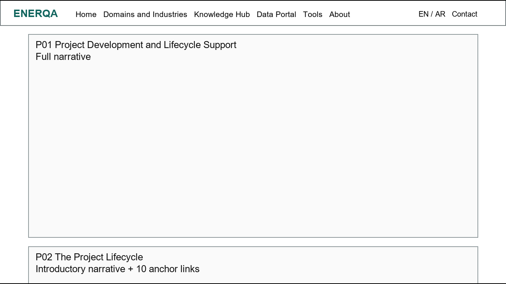

---

## Page 140

[Open PDF page 140](<Enerqa Website Developer Handoff Revised.pdf#page=140>)

Scroll view 1   \|   Top viewport fold y 698   \|   Bottom viewport fold y 1466

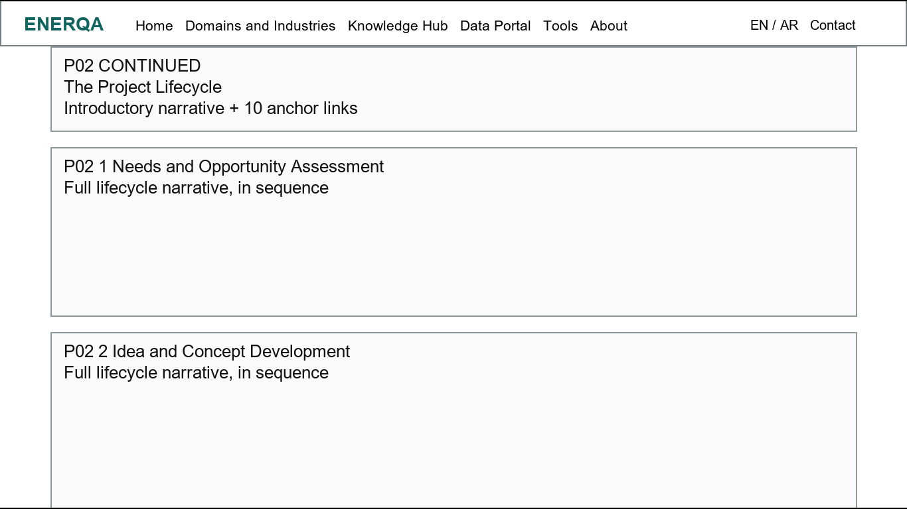

---

## Page 141

[Open PDF page 141](<Enerqa Website Developer Handoff Revised.pdf#page=141>)

#### Project Development and Lifecycle Support continued layout

Scroll view 2   \|   Top viewport fold y 1396   \|   Bottom viewport fold y 2164

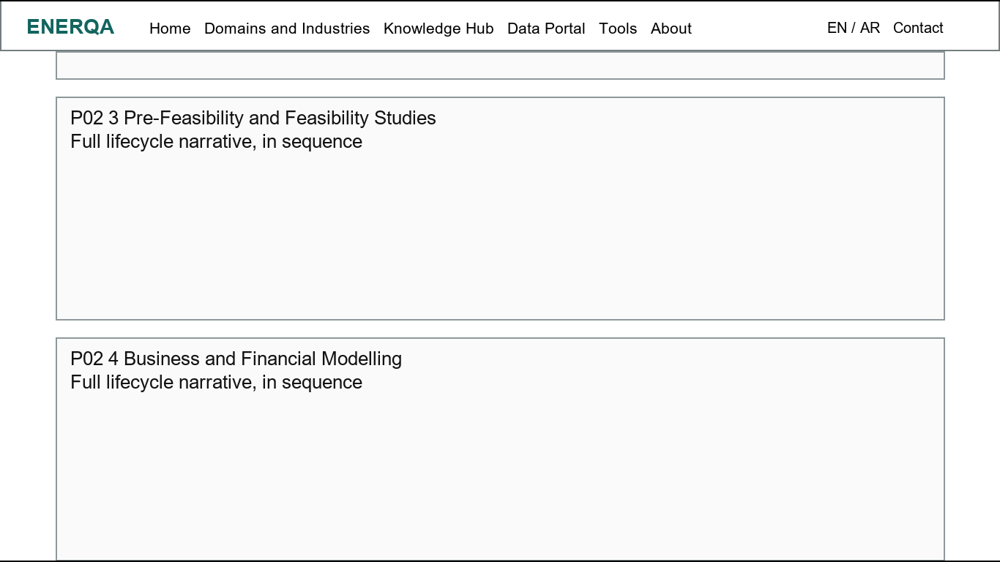

Scroll view 3   \|   Top viewport fold y 2094   \|   Bottom viewport fold y 2862

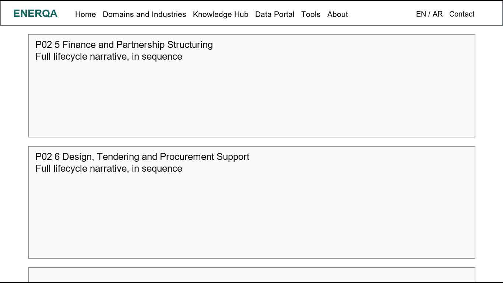

---

## Page 142

[Open PDF page 142](<Enerqa Website Developer Handoff Revised.pdf#page=142>)

#### Project Development and Lifecycle Support continued layout

Scroll view 4   \|   Top viewport fold y 2792   \|   Bottom viewport fold y 3560

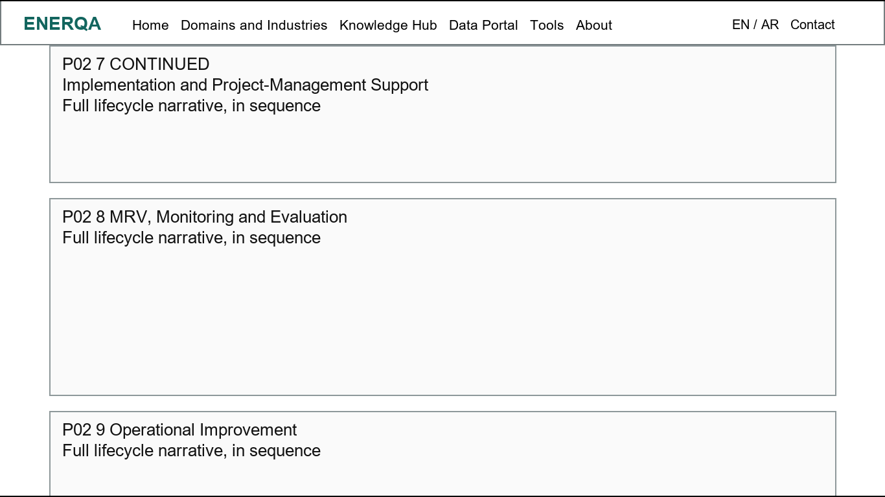

Scroll view 5   \|   Top viewport fold y 3490   \|   Bottom viewport fold y 4258

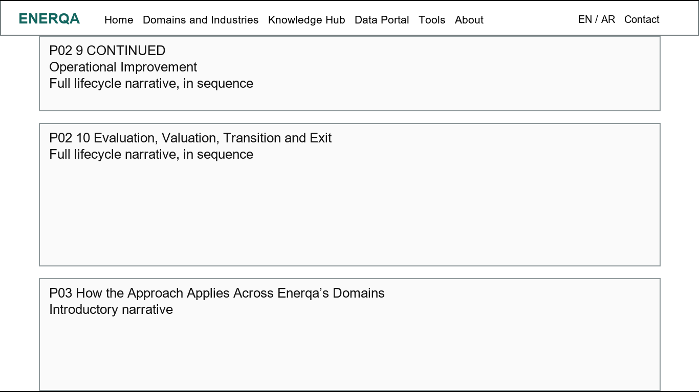

---

## Page 143

[Open PDF page 143](<Enerqa Website Developer Handoff Revised.pdf#page=143>)

#### Project Development and Lifecycle Support continued layout

Scroll view 6   \|   Top viewport fold y 4188   \|   Bottom viewport fold y 4956

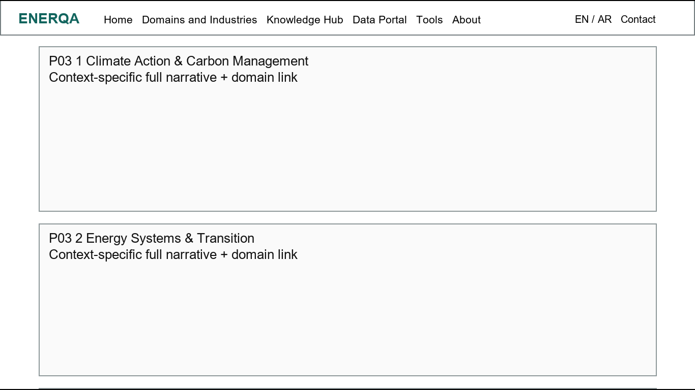

Scroll view 7   \|   Top viewport fold y 4886   \|   Bottom viewport fold y 5654

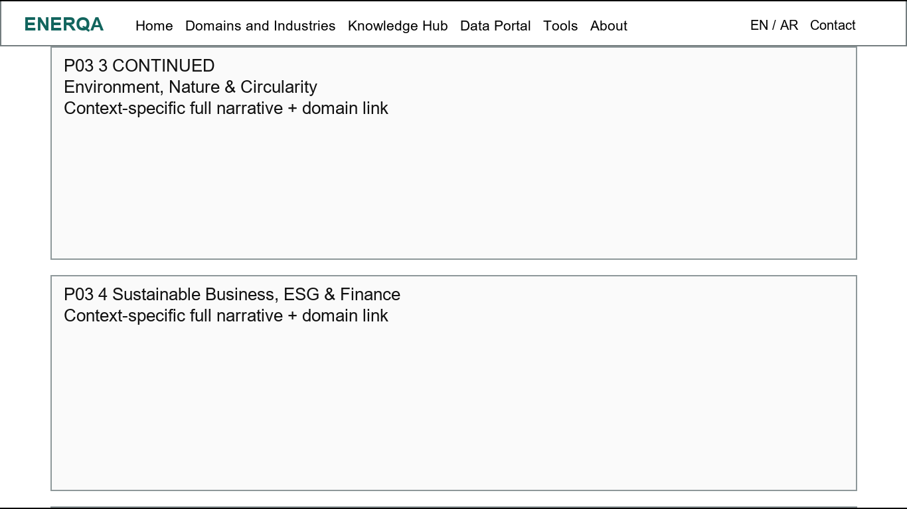

---

## Page 144

[Open PDF page 144](<Enerqa Website Developer Handoff Revised.pdf#page=144>)

#### Project Development and Lifecycle Support continued layout

Scroll view 8   \|   Top viewport fold y 5584   \|   Bottom viewport fold y 6352

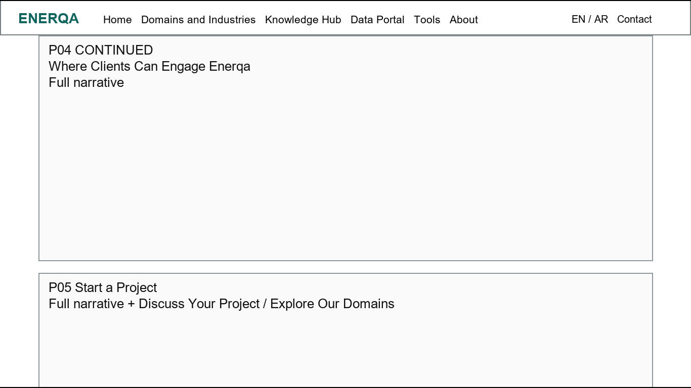

Scroll view 9   \|   Top viewport fold y 5900   \|   Bottom viewport fold y 6668

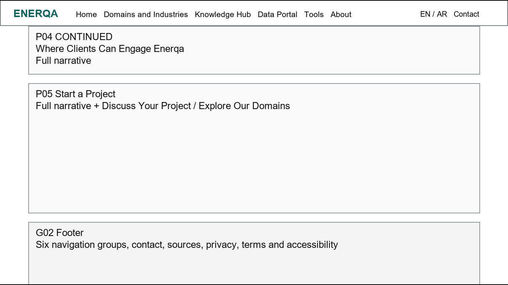

---

## Page 145

[Open PDF page 145](<Enerqa Website Developer Handoff Revised.pdf#page=145>)

#### Page text and API placement

Canonical full narrative. No featured-project examples or experience block is included. Link to this page from the mega menu, homepage, overview, domain pages, industry pages and About.

#### P01 Project Development and Lifecycle Support

Projects are better positioned for investment and successful delivery when the underlying opportunity is clearly defined, thoroughly tested and properly structured. An initial need or idea must be developed into a coherent concept, assessed for technical, commercial, financial, environmental and social feasibility, and translated into a credible business and delivery model.

Project development is the common approach that connects Enerqa’s work across climate action, energy transition, environment, nature, circularity, ESG and sustainable finance. It brings the different dimensions of a project together so that technical studies, commercial decisions, environmental responsibilities, financing requirements and implementation arrangements reinforce one another.

An engagement may begin with needs assessment, research and opportunity identification before progressing into concept development, pre-feasibility and detailed feasibility studies. Business and financial modelling then clarify how the project could operate, create value, attract finance and remain viable over time.

Once viability has been established, the focus moves towards delivery. This may involve structuring finance and partnerships, informing project design, preparing tender and procurement documentation, supporting implementation and establishing systems for performance measurement. Measurement, reporting and verification (MRV) and monitoring and evaluation (M&E) provide the evidence needed to track results, meet reporting obligations and guide improvement.

This lifecycle approach allows clients to engage Enerqa at any stage. We may develop a project from its earliest idea, strengthen an existing concept, address gaps in a feasibility study, prepare an opportunity for investment, support delivery or improve an operating project. Evaluation, valuation, transition and exit planning can also form part of the engagement when a project reaches a new phase.

#### P02 The Project Lifecycle

Every project follows a different route, but effective development depends on a clear progression from need to implementation and long-term value. Enerqa’s adaptable project lifecycle brings technical, commercial, financial, environmental, social and institutional considerations into the process at the stage when they can influence decisions.

Clients may engage Enerqa throughout the complete project cycle or at a specific point where further evidence, structure or delivery support is required.

##### P02 1 Needs and Opportunity Assessment

Website heading: Needs and Opportunity Assessment

Project development begins by understanding the underlying need, the people or organisations affected and the conditions in which a solution must operate. Research, data analysis and stakeholder engagement help identify challenges, policy priorities, market gaps and underused assets or resources.

This work establishes whether a meaningful opportunity exists and how it relates to wider commercial, environmental, social or development objectives. The outcome is a clearly defined need supported by

---

## Page 146

[Open PDF page 146](<Enerqa Website Developer Handoff Revised.pdf#page=146>)

evidence, together with an initial understanding of potential value, constraints, stakeholders and possible routes forward.

##### P02 2 Idea and Concept Development

Website heading: Idea and Concept Development

An identified opportunity is shaped into a coherent project concept with a clear purpose, intended users or beneficiaries, proposed activities and expected results. Alternative approaches are considered before defining the preliminary scope, delivery logic, resource requirements and criteria for success.

This stage provides enough structure to communicate the project to decision-makers, prospective partners, investors and funders. It also identifies the technical, commercial, financial, environmental and institutional questions that must be investigated before the concept can progress.

Depending on the intended audience, the resulting material may take the form of an initial project brief, concept note, funding concept, preliminary scope of work or terms of reference for further studies.

##### P02 3 Pre Feasibility and Feasibility Studies

Website heading: Pre-Feasibility and Feasibility Studies

A pre-feasibility study determines whether a project concept has sufficient potential to justify more detailed investigation. It reviews the principal technical options, market conditions, likely costs, environmental and social considerations, implementation constraints and material risks.

Promising concepts can then progress to a comprehensive feasibility study. This examines technical performance, market demand, legal and regulatory requirements, institutional capacity, financial viability, environmental and social impacts, delivery arrangements and implementation risks in greater depth.

By comparing alternatives and testing critical assumptions, the feasibility process establishes whether the project is viable, how it should be configured and what must be resolved before an investment or implementation decision.

##### P02 4 Business and Financial Modelling

Website heading: Business and Financial Modelling

A technically viable solution also needs a sustainable economic and operational foundation. Business-model development examines how the project will create, deliver and retain value, including its customers or beneficiaries, activities, partners, resources, delivery channels and revenue or funding mechanisms.

Financial modelling translates these assumptions into projected capital expenditure, operating costs, revenues, cash flows, financing requirements and investment returns. It can also examine affordability, funding gaps, repayment structures and the distribution of costs and benefits among participating stakeholders.

Scenario and sensitivity analysis show how changes in key assumptions could affect the project’s profitability, affordability and long-term viability. This gives project sponsors and investors a clearer basis for deciding whether to proceed, modify the concept or undertake further development.

---

## Page 147

[Open PDF page 147](<Enerqa Website Developer Handoff Revised.pdf#page=147>)

##### P02 5 Finance and Partnership Structuring

Website heading: Finance and Partnership Structuring

Many projects depend on a combination of sponsors, public institutions, financiers, technology providers, operators, communities and specialist partners. Partnership structuring clarifies their respective roles, responsibilities, incentives, contributions and allocation of risk.

Potential funding routes may include commercial finance, concessional finance, grants, equity, climate finance, blended-finance arrangements or combinations suited to the project’s characteristics. Each option must be assessed against the project’s revenue model, development impact, risk profile and implementation requirements.

The resulting structure provides a clearer basis for engaging potential partners and funders, preparing investment documentation and moving a sufficiently developed project towards financing and delivery.

##### P02 6 Design  Tendering and Procurement Support

Website heading: Design, Tendering and Procurement Support

Once the preferred project configuration has been established, its requirements must be translated into clear designs, technical specifications and procurement documentation. Technical, environmental, social, operational and performance requirements should be incorporated early so that bidders respond to a consistent and complete project brief.

Tender preparation may include defining the required scope, deliverables, qualification criteria, performance standards and evaluation methodology. Bid evaluation and procurement support then allow clients to compare proposals in terms of technical suitability, whole-life value, implementation capacity and risk rather than initial price alone.

This stage connects the conclusions of the feasibility studies with the contracts, suppliers and delivery arrangements needed for implementation.

##### P02 7 Implementation and Project Management Support

Website heading: Implementation and Project-Management Support

Implementation turns the developed concept into functioning assets, systems or programmes. Effective project management coordinates scope, schedules, budgets, contractors, partners, approvals and stakeholder responsibilities while maintaining oversight of quality, risk and agreed outcomes.

Progress reviews, issue tracking, change control and structured reporting allow emerging challenges to be addressed before they undermine delivery. Environmental, social, technical and financial commitments established during project preparation should remain visible throughout implementation.

Support may continue through construction, system deployment, commissioning, operational readiness, handover and the transition into routine operation.

##### P02 8 MRV Monitoring and Evaluation

Website heading: MRV, Monitoring and Evaluation

Credible results depend on knowing what should be measured, how evidence will be collected and how findings will inform decisions. Measurement, reporting and verification systems establish baselines, indicators, calculation methodologies, data responsibilities and quality controls for greenhouse gas emissions and other quantifiable outcomes.

---

## Page 148

[Open PDF page 148](<Enerqa Website Developer Handoff Revised.pdf#page=148>)

Monitoring and evaluation frameworks examine whether planned activities have been delivered, whether the intended results are being achieved and what wider effects the project is creating. They can also include a theory of change, costed M&E plan, evaluation questions, reporting schedules and learning arrangements.

Together, MRV and M&E strengthen accountability, meet reporting requirements and provide evidence for project owners, funders, regulators, investors and other stakeholders.

##### P02 9 Operational Improvement

Website heading: Operational Improvement

Project development does not end when an asset or programme becomes operational. Performance data, operational experience and user feedback may reveal opportunities to improve efficiency, reduce costs, strengthen environmental and social outcomes or respond to changes in technology, regulation and market conditions.

Comparing actual results with the original business case, design assumptions and performance targets helps identify gaps and priorities. Targeted improvement plans can then address processes, equipment, management systems, resource use, emissions, reporting or other areas affecting performance.

Continual review can protect project value, extend asset life and help an operating project respond to new risks and opportunities.

##### P02 10 Evaluation  Valuation  Transition and Exit

Website heading: Evaluation, Valuation, Transition and Exit

At key milestones or near the end of an investment or operating period, a project may require independent evaluation, updated valuation or preparation for transfer, scaling, refinancing or exit.

Reviewing financial, operational, environmental and social performance provides a clearer picture of the value created, results achieved, remaining liabilities and future potential. Valuation can incorporate the condition and performance of physical assets as well as relevant commercial, environmental and operational considerations.

Transition and exit planning addresses responsibilities, documentation, knowledge transfer, outstanding commitments and continuity arrangements. This helps preserve project outcomes as ownership, financing, management or delivery arrangements change.

#### P03 How the Approach Applies Across Enerqa s Domains

The same development discipline applies across Enerqa’s four domains, but the questions, evidence and implementation pathways vary with each project. Technical analysis is integrated with commercial, financial, environmental, social and institutional considerations so that an opportunity can be developed as a coherent whole rather than as a collection of disconnected studies.

##### P03 1 Climate Action and Carbon Management

Website heading: Climate Action & Carbon Management

Climate priorities can be translated into implementable programmes and finance-ready projects through a lifecycle that begins with emissions, vulnerability or policy evidence. Greenhouse gas inventories, carbon baselines and climate-risk assessments help define the opportunity, while feasibility studies examine mitigation, adaptation, resilience and carbon-market options.

---

## Page 149

[Open PDF page 149](<Enerqa Website Developer Handoff Revised.pdf#page=149>)

Viable concepts can then be developed through climate-finance proposals, delivery arrangements, stakeholder engagement and implementation planning. MRV systems provide the basis for tracking emissions reductions, adaptation outcomes and progress against climate strategies, Nationally Determined Contributions and other climate commitments.

For carbon-credit projects, development may extend from opportunity identification and additionality assessment to methodology selection, project documentation, validation preparation, monitoring and verification support.

##### P03 2 Energy Systems and Transition

Website heading: Energy Systems & Transition

Energy-transition projects begin by establishing how energy is generated, supplied and consumed and where technical or commercial opportunities exist. Energy audits, resource assessments, demand analysis and energy modelling can inform concepts involving energy efficiency, renewable energy, storage, grids or industrial decarbonisation.

Feasibility studies then examine technology selection, system design, costs, revenues, regulatory requirements, environmental considerations and investment performance. As a project advances, support may extend to financial structuring, procurement, implementation and commissioning.

Energy-performance monitoring subsequently allows clients to compare actual results with projected savings, reliability improvements and emissions reductions, identify performance gaps and guide operational improvement.

##### P03 3 Environment  Nature and Circularity

Website heading: Environment, Nature & Circularity

Environmental and nature-related projects require early attention to ecological conditions, resource flows, regulatory obligations and affected stakeholders. Baseline studies, environmental and social impact assessment, biodiversity assessment and material-flow analysis can reveal risks as well as opportunities for nature-based solutions, ecosystem restoration, pollution prevention, waste reduction and resource recovery.

These findings shape project alternatives, permitting strategies, safeguards, circular business models and implementation plans. Technical and commercial feasibility can then determine which environmental opportunities have the potential to become practical and investable projects.

During implementation and operation, environmental management, compliance monitoring and performance evaluation help protect ecosystems and communities, demonstrate results and inform adaptive management, rehabilitation or responsible closure.

##### P03 4 Sustainable Business  ESG and Finance

Website heading: Sustainable Business, ESG & Finance

Sustainability objectives become actionable when they are connected to governance, investment decisions and measurable performance. ESG readiness assessments, materiality analysis and climate-risk reviews can identify priorities, data gaps and opportunities before they are developed into strategies, operating plans or sustainable-finance mechanisms.

For green credit lines and investment programmes, the lifecycle may include taxonomy alignment, eligibility criteria, project screening, financial-product design, risk assessment and environmental and

---

## Page 150

[Open PDF page 150](<Enerqa Website Developer Handoff Revised.pdf#page=150>)

social safeguards. Individual opportunities may also require feasibility studies, business models, financial analysis and investment preparation.

Implementation is strengthened through defined responsibilities, reporting systems and stakeholder engagement, while monitoring and evaluation frameworks track environmental, social and financial outcomes and provide evidence for future decisions.

Domain link: Climate Action & Carbon Management → /domains/climate-action-carbon-management

Domain link: Energy Systems & Transition → /domains/energy-systems-transition

Domain link: Environment, Nature & Circularity → /domains/environment-nature-circularity

Domain link: Sustainable Business, ESG & Finance → /domains/sustainable-business-esg-finance

#### P04 Where Clients Can Engage Enerqa

Clients do not need to begin at the earliest stage or appoint Enerqa for the entire project lifecycle. Some approach us with an initial need that has not yet been shaped into a project. Others already have a concept, feasibility study, financing proposal, design or operating asset that requires further development.

At an early stage, the priority may be to define the opportunity, examine alternative concepts and determine what evidence is needed. A more developed project may require detailed feasibility work, business and financial modelling, environmental studies, climate-finance preparation or a clearer implementation structure.

As a project moves towards delivery, the required support may shift to partnership development, procurement, project management, monitoring systems or operational readiness. Once the project is operating, engagement may focus on performance assessment, emissions or impact reporting, operational improvement, evaluation, valuation, scaling, transition or exit.

Each assignment begins with a review of the project’s current stage, the work already completed and the decisions that remain unresolved. The scope can then concentrate on genuine development gaps without unnecessarily repeating existing work.

This flexible approach allows Enerqa to lead a complete development process, contribute a specialist workstream or strengthen a project at a critical decision point.

#### P05 Start a Project

##### P05 Define the next step for your project

Website heading: Define the next step for your project

Whether you are exploring an early idea, assessing project feasibility, preparing for investment, moving towards implementation or seeking to improve an existing operation, the starting point is a clear understanding of the opportunity and the decisions ahead.

Share the project’s purpose, location, current stage and principal challenges with Enerqa. An initial discussion can identify the technical, commercial, financial, environmental, social or implementation questions that need to be resolved and establish an appropriate scope of support.

A complete project brief is not required. Where available, provide the sector or industry, intended outcome, work already completed, stakeholders involved and the type of assistance being considered.

---

## Page 151

[Open PDF page 151](<Enerqa Website Developer Handoff Revised.pdf#page=151>)

Primary button: Discuss Your Project

Secondary button: Explore Our Domains

CTA actions: Discuss Your Project → /contact?intent=project; Explore Our Domains → /domains-and-industries#domains. No external feed is recommended on this methodology page. Keep attention on the approach and next step.

---

## Page 152

[Open PDF page 152](<Enerqa Website Developer Handoff Revised.pdf#page=152>)

### Knowledge Hub

#### Laptop page design

Route: /knowledge-hub   \|   Reference browser viewport: 1366 × 768 px

Segment IDs map to the copy below. Views advance about 698 px below the sticky header; the final view stops at the page end. Test folds with final fonts, real feeds and Arabic text.

Initial view   \|   Top viewport fold y 0   \|   Bottom viewport fold y 768

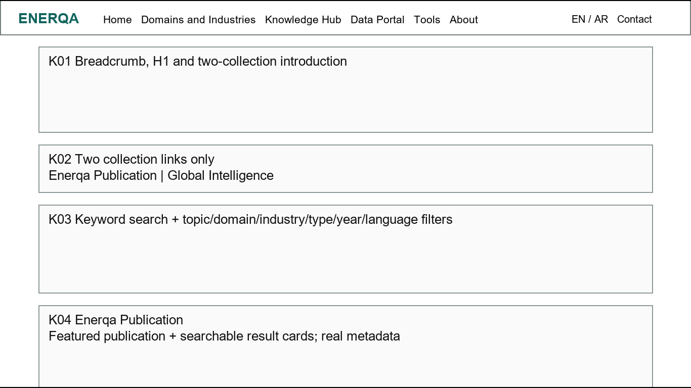

---

## Page 153

[Open PDF page 153](<Enerqa Website Developer Handoff Revised.pdf#page=153>)

Scroll view 1   \|   Top viewport fold y 698   \|   Bottom viewport fold y 1466

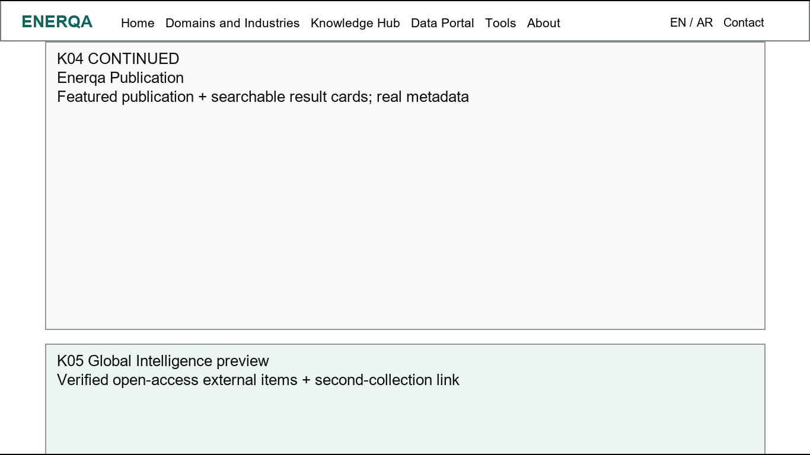

---

## Page 154

[Open PDF page 154](<Enerqa Website Developer Handoff Revised.pdf#page=154>)

#### Knowledge Hub continued layout

Scroll view 2   \|   Top viewport fold y 1108   \|   Bottom viewport fold y 1876

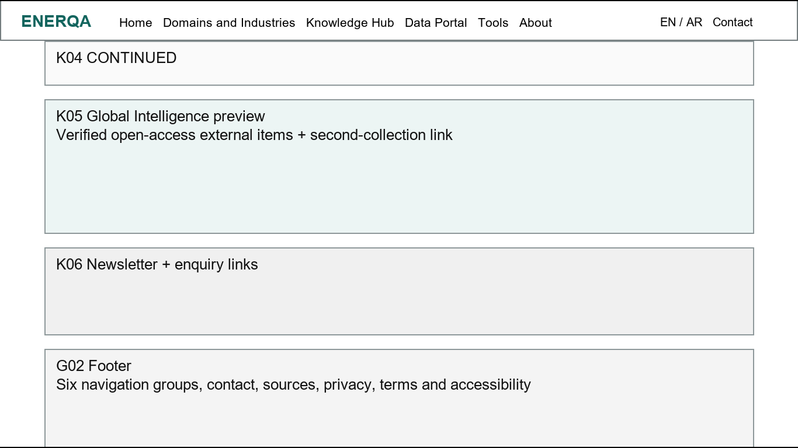

---

## Page 155

[Open PDF page 155](<Enerqa Website Developer Handoff Revised.pdf#page=155>)

#### Page text and API placement

##### K01 Knowledge Hub

Website heading: Knowledge Hub

Explore original Enerqa analysis alongside open-access news, research and official updates from around the world. Choose Enerqa Publication for our own work, or Global Intelligence for external evidence relevant to climate, energy, environment, nature, circularity, ESG and finance.

##### K02 Choose a Collection

Website heading: Choose a Collection

Knowledge Hub contains two collections: Enerqa Publication and Global Intelligence. Each has its own searchable results and filters.

Button or link: Enerqa Publication → /knowledge-hub

Button or link: Global Intelligence → /knowledge-hub/global-intelligence

K02 placement: two prominent collection links directly below the introduction and above search. Enerqa Publication is the default view of /knowledge-hub. The same switch appears on Global Intelligence. News, research, policy and disclosures are content-type filters within Global Intelligence, not additional Knowledge Hub sections. There is no separate Learning, Authors or archive branch.

##### K03 Find a Publication

Website heading: Find a Publication

Search placeholder: Search Enerqa publications by keyword or topic.

Filters: Topic, Domain, Industry, Publication Type, Year, Language and Author. Clear all filters restores the complete collection.

K03 uses first-party CMS search across titles, approved article text, summaries and tags. Show the result count, removable active-filter chips, Clear All and pagination below results. Keep the 2024 archive as a Year = 2024 filter, not a third collection or separate archive landing page. Preserve its four categories as optional secondary tags: Climate Science and Impacts; Energy, Technology and Finance; Environment and Society; Frameworks and Methodologies. Authors are byline metadata, not a public Authors section.

##### K04 Enerqa Publication

Website heading: Enerqa Publication

Read original analysis and practical insights produced by Enerqa. Search by topic or keyword to find publications with clearly identified authors, publication dates and free reading or download formats.

K04 display: title, permitted teaser, author, actual date, content type, language and domain/industry/topic tags. Read Article opens the openly readable canonical detail page. Download Report appears only with an approved file accessible without payment or sign-in. Exclude category separators and biography pages from publication imports. Do not assign one artificial date to the whole archive.

---

## Page 156

[Open PDF page 156](<Enerqa Website Developer Handoff Revised.pdf#page=156>)

##### K05 Global Intelligence

Website heading: Global Intelligence

Follow open-access news, research and official updates from external sources. Search the second collection by topic, domain and geography to explore evidence relevant to your interests.

Button or link: Explore Global Intelligence → /knowledge-hub/global-intelligence

Provider specifications: [newsdata](<#page-210>) \| [gdelt](<#page-211>) \| [openalex](<#page-212>) \| [doaj](<#page-213>)

##### K06 Stay Informed

Website heading: Stay Informed

Receive new Enerqa publications and selected updates.

Button or link: Subscribe → newsletter form

Button or link: Discuss Your Project → /contact?intent=project

---

## Page 157

[Open PDF page 157](<Enerqa Website Developer Handoff Revised.pdf#page=157>)

### Data Portal

#### Laptop page design

Route: /data-portal   \|   Reference browser viewport: 1366 × 768 px

Segment IDs map to the copy below. Views advance about 698 px below the sticky header; the final view stops at the page end. Test folds with final fonts, real feeds and Arabic text.

Initial view   \|   Top viewport fold y 0   \|   Bottom viewport fold y 768

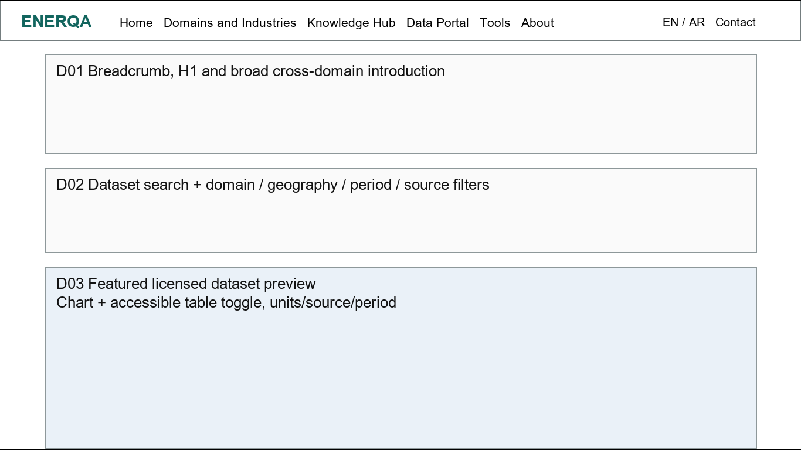

---

## Page 158

[Open PDF page 158](<Enerqa Website Developer Handoff Revised.pdf#page=158>)

Scroll view 1   \|   Top viewport fold y 698   \|   Bottom viewport fold y 1466

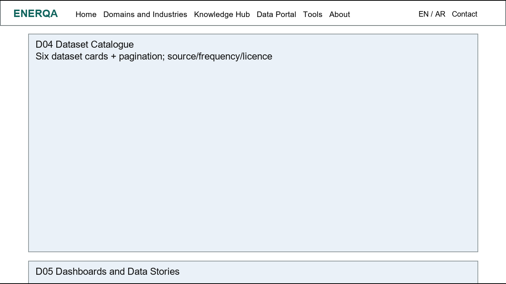

---

## Page 159

[Open PDF page 159](<Enerqa Website Developer Handoff Revised.pdf#page=159>)

#### Data Portal continued layout

Scroll view 2   \|   Top viewport fold y 1313   \|   Bottom viewport fold y 2081

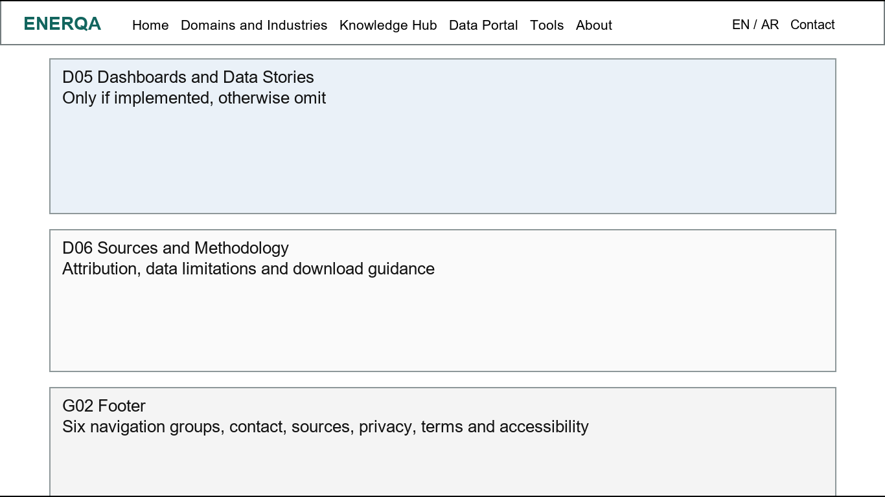

---

## Page 160

[Open PDF page 160](<Enerqa Website Developer Handoff Revised.pdf#page=160>)

#### Page text and API placement

##### D01 Data Portal

Website heading: Data Portal

Explore open-access data relevant to climate, energy, environment, nature, circularity, business and finance. Search datasets supplied through free APIs, compare trends through charts and tables, and download the available data free of charge.

The entire Data Portal uses free APIs only. API keys or provider accounts may be managed privately by Enerqa’s connector, but visitors must not pay, subscribe or sign in to read or download datasets. Exclude a dataset if its licence does not permit the intended corporate display and redistribution. No paid connector, paid data layer, free trial or chargeable overage is allowed.

##### D02 Find Data

Website heading: Find Data

Search placeholder: Search datasets or indicators.

Filters: Domain, Topic, Geography, Observation Period, Source, Frequency and Available Format.

##### D03 Explore a Dataset

Website heading: Explore a Dataset

Choose a geography and observation period to examine the available data. Switch between the chart and accessible table, then open the dataset for source notes, methodology and downloads.

Button or link: Open Dataset → /data-portal/datasets/{dataset-slug}

D03 initial recommendation: a licensed World Bank country indicator or versioned Climate TRACE emissions view, selected for verified coverage. Avoid unsupported live labels and unqualified global totals. Show no fabricated sample values in production.

##### D04 Dataset Catalogue

Website heading: Dataset Catalogue

Browse source-backed datasets with clear descriptions, units, geographic coverage and update information. Each dataset has one canonical detail page shared by relevant domain and industry pages.

| Candidate dataset | Provider | Initial view |
| --- | --- | --- |
| GHG emissions by country and sector | climate-trace | Annual line chart and sector comparison; monthly view only where supported |
| Climate-related development finance by objective | oecd-sdmx | Annual reported finance trends; objective, provider and recipient filters |
| Electricity access and country energy indicators | world-bank-indicators | Country/year comparison; starter series EG.ELC.ACCS.ZS after metadata/licence check |
| Electricity generation mix and selected energy prices | eia-open-data | Generation stacked chart plus selected price series; U.S./international scope clearly distinguished |

---

## Page 161

[Open PDF page 161](<Enerqa Website Developer Handoff Revised.pdf#page=161>)

| Candidate dataset | Provider | Initial view |
| --- | --- | --- |
| Solar resource and meteorological conditions | nasa-power | Location chooser; ALLSKY\_SFC\_SW\_DWN and T2M initial parameters; monthly summary and raw table |
| Biodiversity occurrence records | gbif-occurrence | Selected geography and taxon map/table; CC0/CC BY records only |
| Air pollutant measurements | openaq-v3 | Station/location selector, pollutant line chart and observed-at status |
| Municipal waste generation and treatment | oecd-sdmx | Country annual comparison, per-capita generation and treatment categories; OECD.ENV.EPI,DSD\_MUNW@DF\_MUNW |
| Water stress | world-bank-indicators | Country/year chart and table; ER.H2O.FWST.ZS |
| Economic and investment context | world-bank-indicators | GDP and selected investment/business country indicators; begin NY.GDP.MKTP.CD with nominal-current-USD label |

The catalogue above is a proposed launch shortlist. Enable each record after connector, coverage, licence and schema checks. It is not a claim of implemented datasets. The developer may stage the catalogue rather than publish nonfunctional records.

##### D05 Dashboards and Data Stories

Website heading: Dashboards and Data Stories

Explore connected views that explain trends across related datasets.

Button or link: Explore Dashboards → /data-portal/dashboards/{dashboard-slug}

Omit D05 until actual licensed dashboards or authored data stories exist. Do not advertise an Enerqa public API merely because the site consumes third-party APIs.

##### D06 Sources and Methodology

Website heading: Sources and Methodology

Review where the data comes from, what it measures and how it can be reused. Source notes explain coverage, units, limitations, update schedules and any transformations made for display.

Button or link: Sources and Methodology → /data-portal/sources

Provider specifications: [climate-trace](<#page-218>) \| [world-bank-indicators](<#page-219>) \| [oecd-sdmx](<#page-219>) \| [eia-open-data](<#page-220>) \| [nasa-power](<#page-221>) \| [gbif-occurrence](<#page-222>) \| [openaq-v3](<#page-223>)

---

## Page 162

[Open PDF page 162](<Enerqa Website Developer Handoff Revised.pdf#page=162>)

### Tools

#### Laptop page design

Route: /tools   \|   Reference browser viewport: 1366 × 768 px

Segment IDs map to the copy below. Views advance about 698 px below the sticky header; the final view stops at the page end. Test folds with final fonts, real feeds and Arabic text.

Initial view   \|   Top viewport fold y 0   \|   Bottom viewport fold y 768

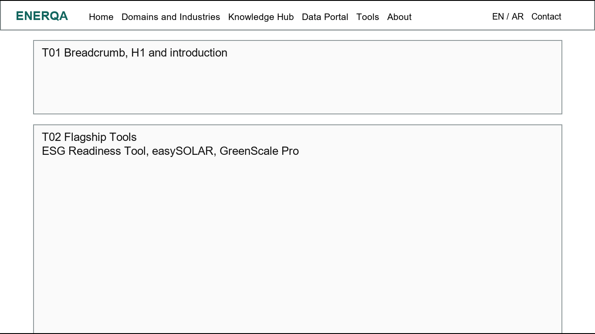

---

## Page 163

[Open PDF page 163](<Enerqa Website Developer Handoff Revised.pdf#page=163>)

Scroll view 1   \|   Top viewport fold y 698   \|   Bottom viewport fold y 1466

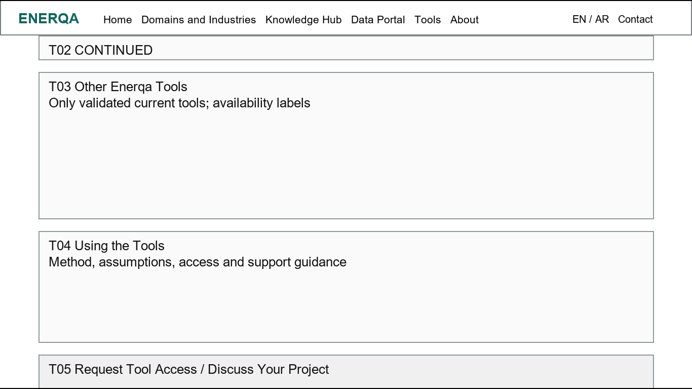

---

## Page 164

[Open PDF page 164](<Enerqa Website Developer Handoff Revised.pdf#page=164>)

#### Tools continued layout

Scroll view 2   \|   Top viewport fold y 984   \|   Bottom viewport fold y 1752

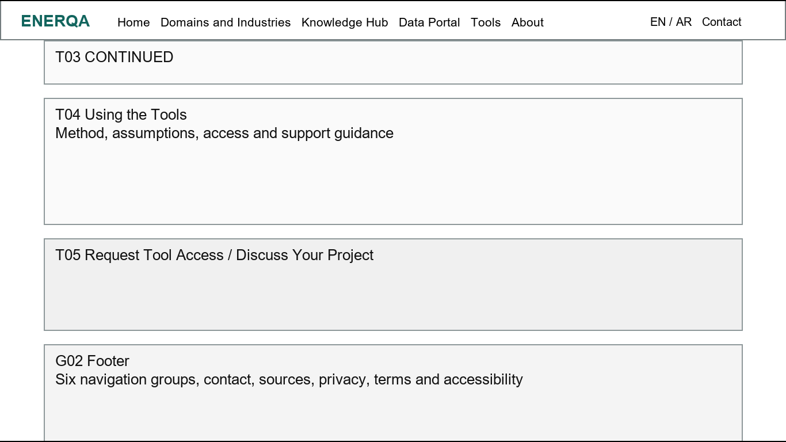

---

## Page 165

[Open PDF page 165](<Enerqa Website Developer Handoff Revised.pdf#page=165>)

#### Page text and API placement

##### T01 Enerqa Tools

Website heading: Enerqa Tools

Explore tools designed to structure assessment, modelling and sustainability decisions. Each tool explains its purpose, inputs, outputs, assumptions and available access route.

##### T02 1 ESG Readiness Tool

Website heading: ESG Readiness Tool

A structured assessment helps organisations understand how their current practices address environmental, social and governance priorities. The ESG Readiness Tool uses criteria and guiding questions to identify readiness gaps and areas for improvement, providing a starting point for a more focused ESG strategy and action plan.

Button or link: Explore Tool → /tools/esg-readiness

Button or link: Request Access → /contact?intent=tool&tool=esg-readiness

##### T02 2 easySOLAR

Website heading: easySOLAR

Early solar-energy decisions depend on the relationship between available irradiance, electricity demand, system configuration and costs. easySOLAR brings solar PV and battery-storage sizing together with capital and operating costs, financial performance, expected savings and avoided GHG emissions. Its assumptions and uncertainty need to remain visible so that an initial assessment can inform, rather than replace, detailed project feasibility and design.

Button or link: Explore Tool → /tools/easysolar

Button or link: Request Access → /contact?intent=tool&tool=easysolar

##### T02 3 GreenScale Pro

Website heading: GreenScale Pro

Sustainability and resilience in buildings and infrastructure require a structured view of the factors affecting design and performance. GreenScale Pro provides an assessment framework for examining sustainability and resilience criteria and identifying priorities for further development.

Button or link: Explore Tool → /tools/greenscale-pro

Button or link: Request Access → /contact?intent=tool&tool=greenscale-pro

Developer notes for T02: the profile describes an Excel-based free ESG Readiness download; validate the current file/release before enabling it. Explain the current GreenScale Pro assessment scope and scoring method without implying independent certification. T02 1, T02 2 and T02 3 are the three child cards inside the T02 catalogue module.

##### T03 Other Enerqa Tools

Website heading: Other Enerqa Tools

Additional tools can address greenhouse gas calculations, MRV, environmental and social risk, and green-project screening. Each will be listed with a clear scope and access state when its current release is available.

---

## Page 166

[Open PDF page 166](<Enerqa Website Developer Handoff Revised.pdf#page=166>)

Validate names and versions for GHG365/GHG Emissions Calculator, MRV Tool, ESIA Risk Assessment Tool and Green Project Scoring Tool before adding them. Do not replace the flagship tools with generic placeholder calculators or maps. Availability labels: Download Available \| Online Tool \| Request Access \| Client Only \| In Development, used only when accurate.

##### T04 Using the Tools

Website heading: Using the Tools

Tool results depend on the quality of the inputs, the selected methodology and the assumptions applied. Review the scope and limitations before using an output for reporting, financing or project decisions. Specialist support can help interpret results and identify the further work required.

##### T05 Request Tool Access

Website heading: Request Tool Access

Tell us which tool you are interested in and how you intend to use it.

Button or link: Request Tool Access → /contact?intent=tool

Button or link: Discuss Your Project → /contact?intent=project

The catalogue itself uses CMS records, not a news API. A tool may consume a numerical source such as NASA POWER only after its actual implementation and data rights are verified. Do not promise a backend integration solely because it would be useful.

---

## Page 167

[Open PDF page 167](<Enerqa Website Developer Handoff Revised.pdf#page=167>)

### About

#### Laptop page design

Route: /about   \|   Reference browser viewport: 1366 × 768 px

Segment IDs map to the copy below. Views advance about 698 px below the sticky header; the final view stops at the page end. Test folds with final fonts, real feeds and Arabic text.

Initial view   \|   Top viewport fold y 0   \|   Bottom viewport fold y 768

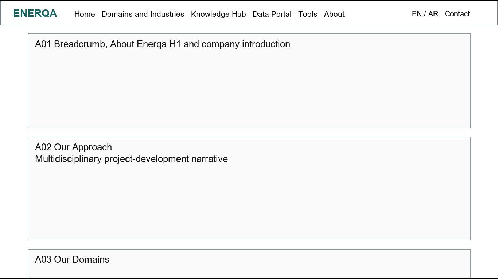

---

## Page 168

[Open PDF page 168](<Enerqa Website Developer Handoff Revised.pdf#page=168>)

Scroll view 1   \|   Top viewport fold y 804   \|   Bottom viewport fold y 1572

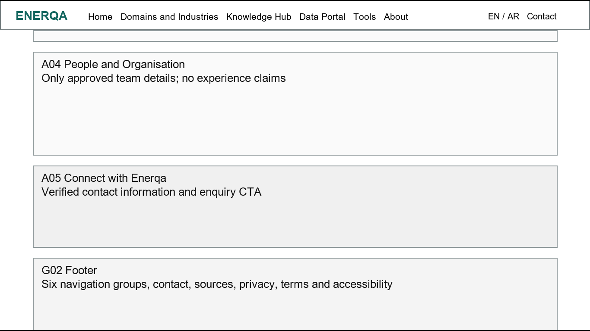

---

## Page 169

[Open PDF page 169](<Enerqa Website Developer Handoff Revised.pdf#page=169>)

#### Page text and API placement

##### A01 About Enerqa

Website heading: About Enerqa

Enerqa is a multidisciplinary project-development and consultancy company working across climate action and carbon management, energy systems and transition, environment, nature and circularity, and sustainable business, ESG and finance. Our role is to connect technical understanding with the commercial, environmental and institutional decisions needed to develop practical initiatives.

##### A02 Our Approach

Website heading: Our Approach

An idea becomes a viable initiative through evidence, careful assessment and a clear delivery structure. Technical studies, business and financial modelling, environmental and social considerations, and implementation requirements need to inform one another.

Engagement can begin with a new opportunity, an existing concept or a specific question within the project cycle. The scope is shaped around the decisions ahead and the work already completed.

Button or link: Project Development and Lifecycle Support → /project-development

##### A03 Our Domains

Website heading: Our Domains

Explore the four interconnected domains that organise Enerqa’s work.

Button or link: Climate Action & Carbon Management → /domains/climate-action-carbon-management

Button or link: Energy Systems & Transition → /domains/energy-systems-transition

Button or link: Environment, Nature & Circularity → /domains/environment-nature-circularity

Button or link: Sustainable Business, ESG & Finance → /domains/sustainable-business-esg-finance

##### A04 People and Organisation

Website heading: People and Organisation

Our multidisciplinary approach brings relevant technical, environmental, climate, energy and business perspectives into the development process.

Add actual approved team names, roles and biographies within this section if requested. Do not publish experience-led biographies, years-of-experience counters, past projects, client galleries or unapproved partner logos at this stage. If no team information is approved, omit individual cards and keep the approach narrative.

##### A05 Connect with Enerqa

Website heading: Connect with Enerqa

Contact us to discuss an idea, a technical question or a project-development need.

Email: info@enerqa.co.uk

Button or link: Contact Enerqa → /contact

Button or link: Discuss Your Project → /contact?intent=project

---

## Page 170

[Open PDF page 170](<Enerqa Website Developer Handoff Revised.pdf#page=170>)

Publish additional addresses, regional-presence details and phone numbers only after current company approval. No external API is recommended on About.

---

## Page 171

[Open PDF page 171](<Enerqa Website Developer Handoff Revised.pdf#page=171>)

### Detail and utility page templates

The following templates are part of the sitemap. Create real pages from validated records; the placeholders describe CMS fields and never become public example text. Each template keeps the same global navigation and footer. Dashboard and careers pages are conditional, not empty launch destinations. Author information remains publication metadata; Knowledge Hub has no additional public collection.

### Enerqa publication detail

#### Laptop page design

Route: /knowledge-hub/{publication-slug}   \|   Reference browser viewport: 1366 × 768 px

Segment IDs map to the copy below. Views advance about 698 px below the sticky header; the final view stops at the page end. Test folds with final fonts, real feeds and Arabic text.

Initial view   \|   Top viewport fold y 0   \|   Bottom viewport fold y 768

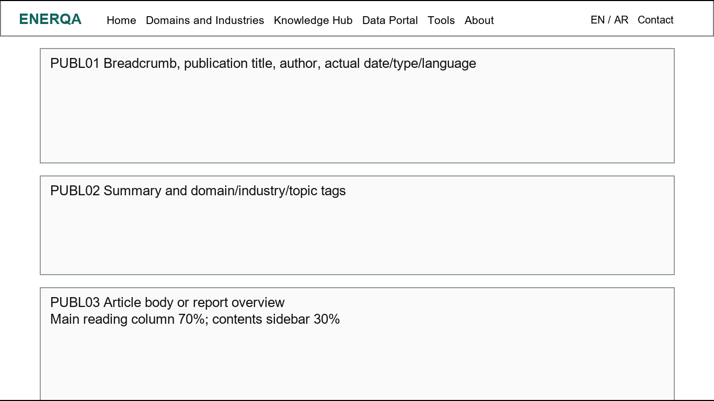

---

## Page 172

[Open PDF page 172](<Enerqa Website Developer Handoff Revised.pdf#page=172>)

Scroll view 1   \|   Top viewport fold y 698   \|   Bottom viewport fold y 1466

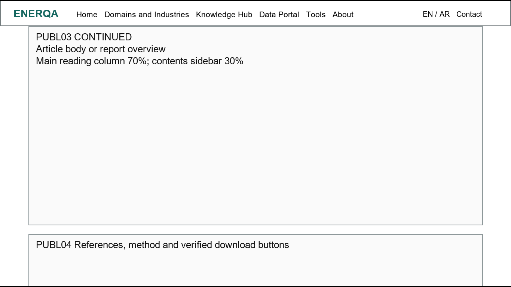

---

## Page 173

[Open PDF page 173](<Enerqa Website Developer Handoff Revised.pdf#page=173>)

#### Enerqa publication detail continued layout

Scroll view 2   \|   Top viewport fold y 1478   \|   Bottom viewport fold y 2246

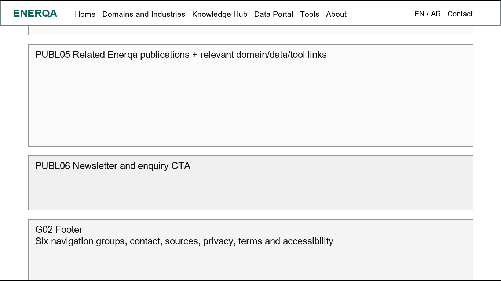

---

## Page 174

[Open PDF page 174](<Enerqa Website Developer Handoff Revised.pdf#page=174>)

#### Page text and API placement

##### PUBL01 Publication Header

Website heading: Publication Header

Populate the original title, author names, publication date, document type and available language from the verified source record. Use one canonical URL; do not republish the same article under both Insights and Knowledge Hub.

##### PUBL02 Summary

Website heading: Summary

Use a publication-specific summary that explains the question, argument or finding without inventing a conclusion. Tags connect this article to relevant domains and industries.

##### PUBL03 Publication Body

Website heading: Publication Body

Use the actual approved article text with semantic headings, captions, accessible figures and references. For a report-only record, provide a meaningful original overview and a real cleared download rather than an empty PDF wrapper. Word/PDF archival content may require editorial cleanup before import.

##### PUBL04 References and Downloads

Website heading: References and Downloads

Button labels: Download Report, Read Original Publication and Cite This Publication, shown only when each destination works and complete reading/download is open without payment or sign-in. Include title, author, year, publisher and DOI/URL where available. Link references only to verified lawful open-access reading. If no verified open-reading destination exists, retain the DOI or citation as plain text rather than a clickable reading link. No API is needed for the body; any DOI metadata enrichment must itself be free and must not overwrite verified source content.

##### PUBL05 Related Content

Website heading: Related Content

Show first-party publications and contextual domain, dataset or tool links, selected by tags and editorial relevance. Do not add project examples.

##### PUBL06 Continue Exploring

Website heading: Continue Exploring

Buttons: Explore the Knowledge Hub → /knowledge-hub; Discuss Your Project → /contact?intent=project. Newsletter subscription is separate explicit consent.

---

## Page 175

[Open PDF page 175](<Enerqa Website Developer Handoff Revised.pdf#page=175>)

### Global Intelligence

#### Laptop page design

Route: /knowledge-hub/global-intelligence   \|   Reference browser viewport: 1366 × 768 px

Segment IDs map to the copy below. Views advance about 698 px below the sticky header; the final view stops at the page end. Test folds with final fonts, real feeds and Arabic text.

Initial view   \|   Top viewport fold y 0   \|   Bottom viewport fold y 768

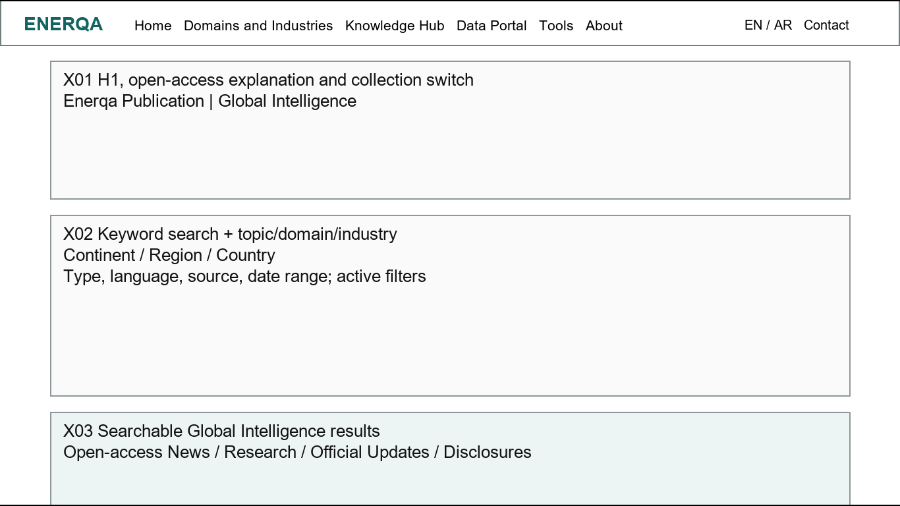

---

## Page 176

[Open PDF page 176](<Enerqa Website Developer Handoff Revised.pdf#page=176>)

Scroll view 1   \|   Top viewport fold y 698   \|   Bottom viewport fold y 1466

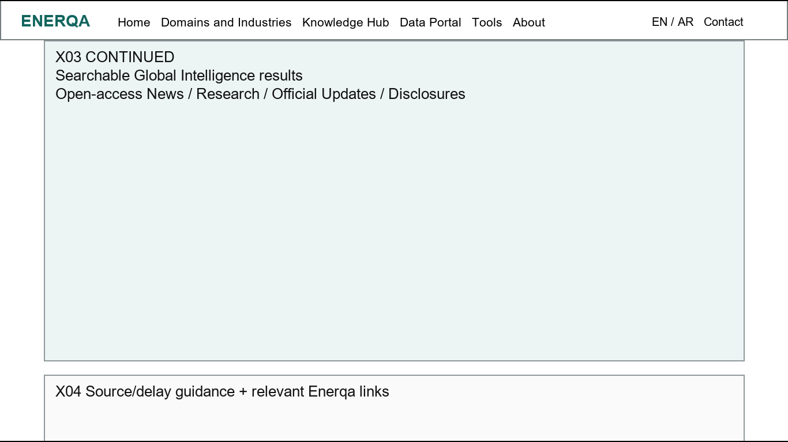

---

## Page 177

[Open PDF page 177](<Enerqa Website Developer Handoff Revised.pdf#page=177>)

#### Global Intelligence continued layout

Scroll view 2   \|   Top viewport fold y 1015   \|   Bottom viewport fold y 1783

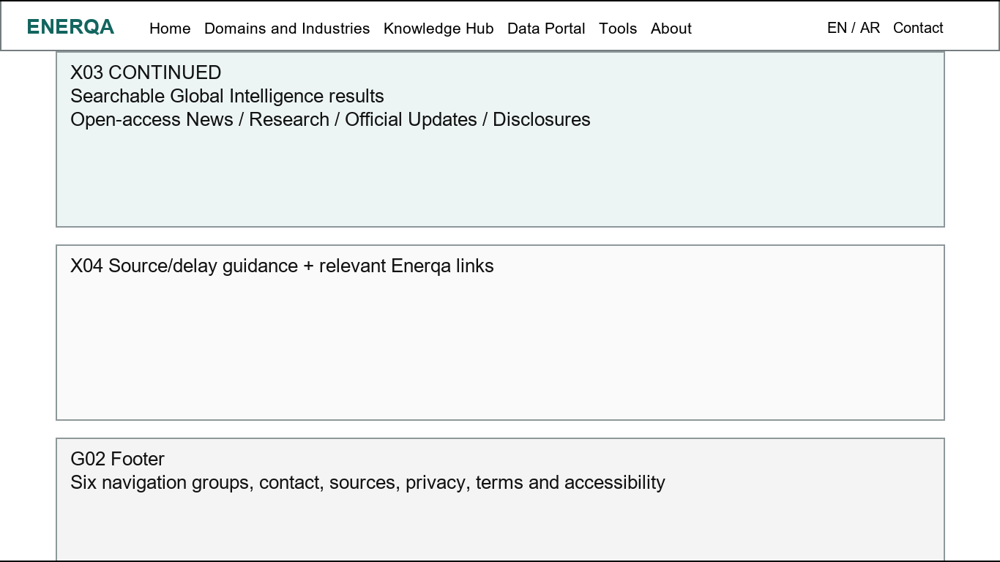

---

## Page 178

[Open PDF page 178](<Enerqa Website Developer Handoff Revised.pdf#page=178>)

#### Page text and API placement

##### X01 Global Intelligence

Website heading: Global Intelligence

Explore open-access news, research and official updates from around the world. Every result links to complete reading available free of charge without a subscription or sign-in. These external records are distinct from Enerqa-authored publications.

##### X02 Search Global Intelligence

Website heading: Search Global Intelligence

Search placeholder: Search global intelligence by keyword or topic.

Filters: Topic, Domain, Industry, Continent, Region, Country, Content Type, Language, Source and Date Range. Content types: News; Research and Articles; Policy and Official Updates; Corporate Disclosures. These are filters within the same collection, not separate Knowledge Hub branches.

##### X03 External Content Cards

Website heading: External Content Cards

News cards use a permitted headline, short description, source and publication date. Research cards add authors, journal or repository and DOI. Official updates add organisation, document type and submission date. Disclosures add issuer, form and filing date. The primary action is Read Full Article, Read Full Paper, Read Full Report or Read Filing, linking directly to a verified lawful open-access destination. Do not link to a paywalled DOI landing page when an eligible repository copy is available. Suppress any result lacking verified complete open reading; do not show locked results or paid-access options.

##### X04 Sources and Context

Website heading: Sources and Context

Explain source delays and rights, then provide genuinely relevant links to Enerqa domains, publications, datasets or tools. Free API sources include NewsData.io and legacy GDELT, OpenAlex with open-access filtering, DOAJ and eligible specialist sources. Public reading does not grant permission to republish complete articles or images.

X01 uses the same two collection links as K02, with Global Intelligence marked current. X02 placement: full-width keyword search and submit first; Topic/Domain/Industry controls below; Continent/Region/Country on the next row. Put Content Type, Language, Source and Date Range in an expandable Additional Filters row if space is tight. All filters remain keyboard accessible. Result count, removable filter chips and Clear All sit between controls and result cards; pagination sits below cards. Filters search the cached eligible index, not chargeable per-user upstream requests.

#### Global Intelligence geography and search rules

Use one maintained geography registry mapping continent to geographical region to country, for example Asia to Western Asia to Qatar. Continent, Region and Country are explicit linked controls. Country selection sets its parent region and continent. Changing a parent clears conflicting children with visible feedback. Overlapping groups such as MENA or GCC may be named regional collections, not contradictory exclusive geography levels.

---

## Page 179

[Open PDF page 179](<Enerqa Website Developer Handoff Revised.pdf#page=179>)

Geography describes the subject and locations covered by an item, not the publisher’s headquarters or a researcher’s affiliation. Records can cover several countries or regions and match each. Use explicit Global, Multiple Regions and Not Specified values where appropriate; never infer coverage from an unrelated address. Apply OR between selections within one field and AND between different fields. Keyword search covers titles, permitted summaries and tags; topic tags use a controlled vocabulary.

When no items match, show No open-access results match these filters, with Clear All and an editable search field. Keep the query and filters in a shareable URL, retain them on pagination and provide a loading state without invented content. Only external results passing the open-access and reuse checks are eligible for indexing.

Provider specifications: [newsdata](<#page-210>) \| [gdelt](<#page-211>) \| [openalex](<#page-212>) \| [doaj](<#page-213>) \| [reliefweb](<#page-213>) \| [eia\_rss](<#page-214>) \| [osti](<#page-215>) \| [eea\_rss](<#page-215>) \| [gbif\_literature](<#page-216>) \| [sec\_edgar](<#page-217>)

---

## Page 180

[Open PDF page 180](<Enerqa Website Developer Handoff Revised.pdf#page=180>)

### Dataset detail

#### Laptop page design

Route: /data-portal/datasets/{dataset-slug}   \|   Reference browser viewport: 1366 × 768 px

Segment IDs map to the copy below. Views advance about 698 px below the sticky header; the final view stops at the page end. Test folds with final fonts, real feeds and Arabic text.

Initial view   \|   Top viewport fold y 0   \|   Bottom viewport fold y 768

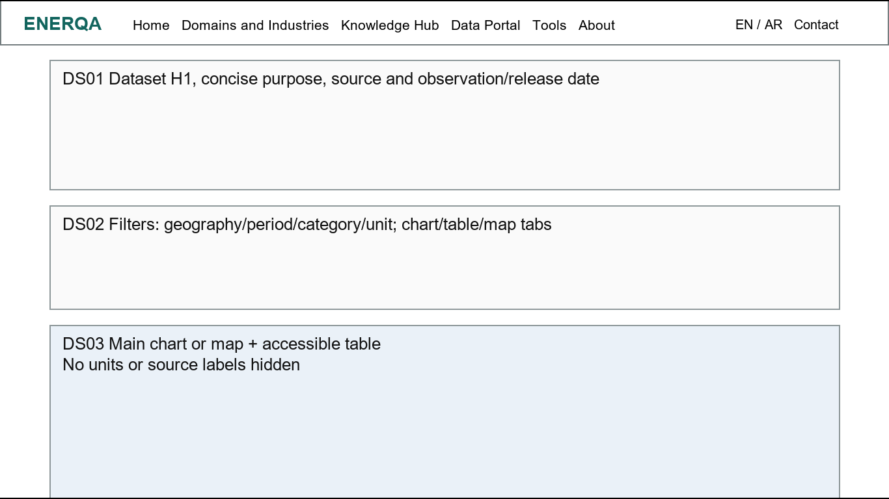

---

## Page 181

[Open PDF page 181](<Enerqa Website Developer Handoff Revised.pdf#page=181>)

Scroll view 1   \|   Top viewport fold y 698   \|   Bottom viewport fold y 1466

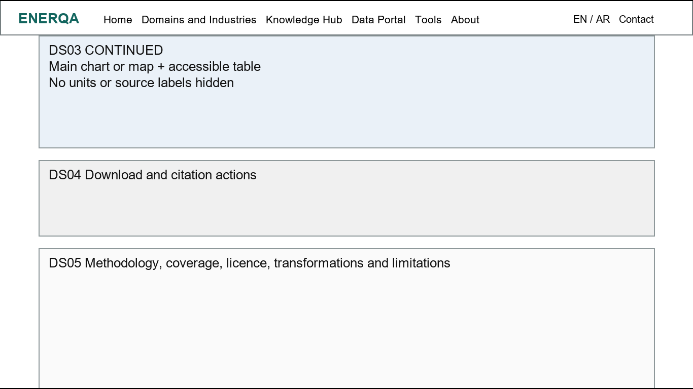

---

## Page 182

[Open PDF page 182](<Enerqa Website Developer Handoff Revised.pdf#page=182>)

#### Dataset detail continued layout

Scroll view 2   \|   Top viewport fold y 1328   \|   Bottom viewport fold y 2096

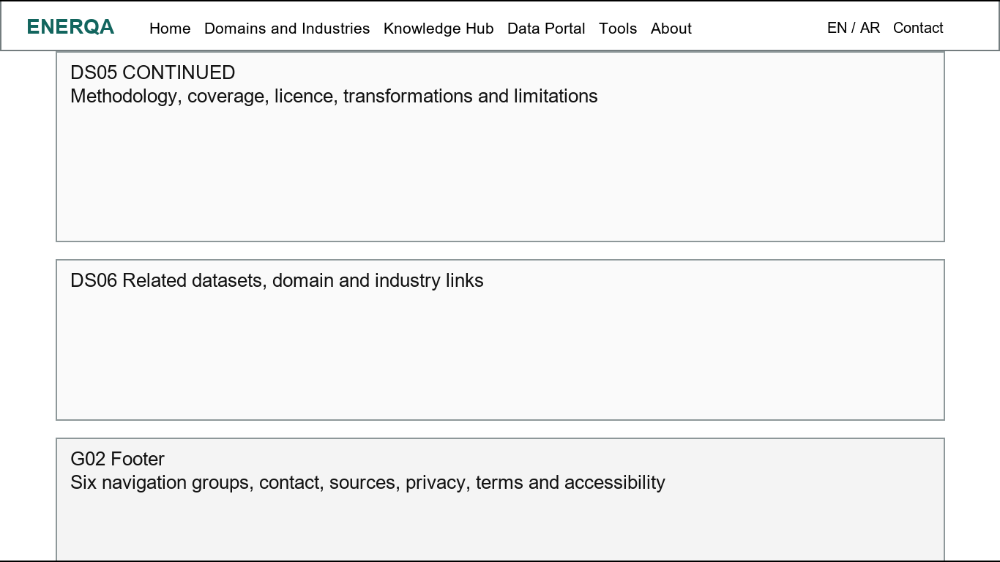

---

## Page 183

[Open PDF page 183](<Enerqa Website Developer Handoff Revised.pdf#page=183>)

#### Page text and API placement

##### DS01 Dataset Summary

Website heading: Dataset Summary

Populate a source-specific title and summary explaining what is measured, by whom, where and for which period. Separate observation period, provider release/version and Enerqa retrieval time.

##### DS02 Explore the Data

Website heading: Explore the Data

Use controls supported by the actual dataset. Never offer a country, date frequency or unit that the provider does not support. Filters update both the visual and accessible table, and persist in a shareable URL.

##### DS03 Chart Table and Map

Website heading: Chart Table and Map

Show the actual source unit, geography, time period, source and latest observation status. Do not fill missing values with zero or label estimates as observations. Maps require a separately cleared base/boundary layer and an equivalent table. Numeric export must match the selected filters.

##### DS04 Download and Cite

Website heading: Download and Cite

Buttons: Download CSV; Download Source File; Copy Citation; View Original Source, shown only when the underlying data and destination are verified openly accessible. Every dataset offered has a free download without payment or sign-in. CSV must include fields/units/date/geography plus a metadata readme or equivalent companion sheet. Exclude datasets whose licences forbid intended redistribution. If an upstream API requires a free provider account, the backend generates and caches the permitted download; never send visitors to a login or create-download screen.

##### DS05 Sources and Methodology

Website heading: Sources and Methodology

Populate provider/dataset/series ID, licence URL, attribution, geographic coverage, frequency, units, release date/version, missing-value rules, calculation transformations and limitations. Include original method link and a last-retrieved timestamp. Data source choices are listed in the numerical API specifications.

##### DS06 Related Data and Domains

Website heading: Related Data and Domains

Reuse the dataset’s taxonomy to link relevant domain and industry pages, without duplicating the dataset into separate canonical URLs.

Provider specifications: [climate-trace](<#page-218>) \| [world-bank-indicators](<#page-219>) \| [oecd-sdmx](<#page-219>) \| [eia-open-data](<#page-220>) \| [nasa-power](<#page-221>) \| [gbif-occurrence](<#page-222>) \| [openaq-v3](<#page-223>)

---

## Page 184

[Open PDF page 184](<Enerqa Website Developer Handoff Revised.pdf#page=184>)

### Dashboard template

#### Laptop page design

Route: /data-portal/dashboards/{dashboard-slug}   \|   Reference browser viewport: 1366 × 768 px

Segment IDs map to the copy below. Views advance about 698 px below the sticky header; the final view stops at the page end. Test folds with final fonts, real feeds and Arabic text.

Initial view   \|   Top viewport fold y 0   \|   Bottom viewport fold y 768

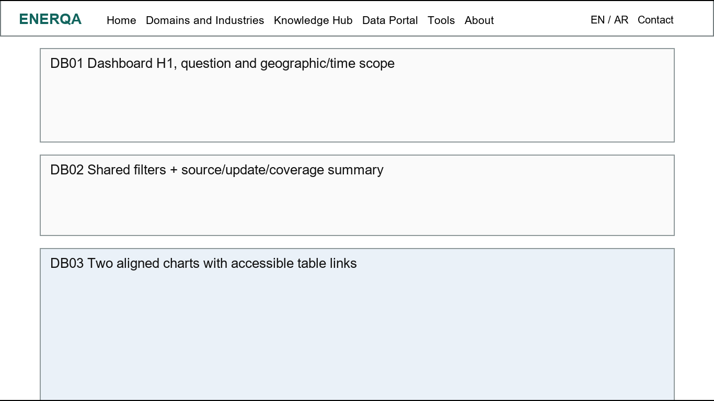

---

## Page 185

[Open PDF page 185](<Enerqa Website Developer Handoff Revised.pdf#page=185>)

Scroll view 1   \|   Top viewport fold y 698   \|   Bottom viewport fold y 1466

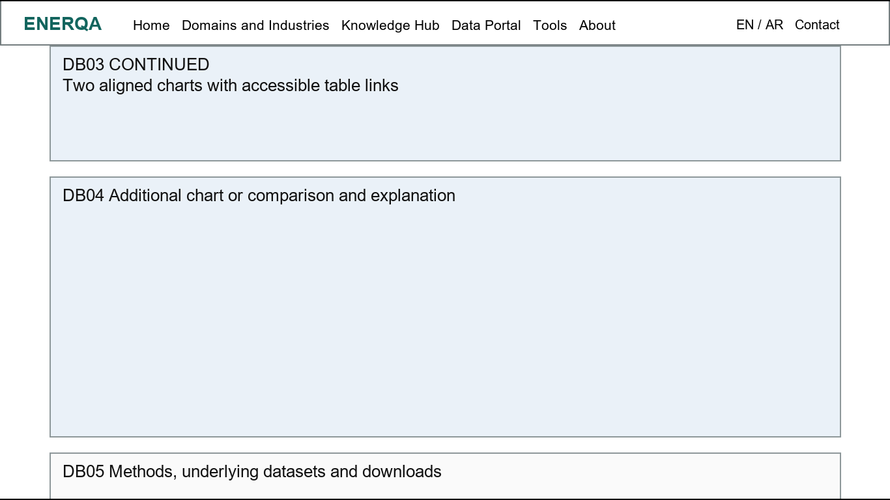

---

## Page 186

[Open PDF page 186](<Enerqa Website Developer Handoff Revised.pdf#page=186>)

#### Dashboard template continued layout

Scroll view 2   \|   Top viewport fold y 1139   \|   Bottom viewport fold y 1907

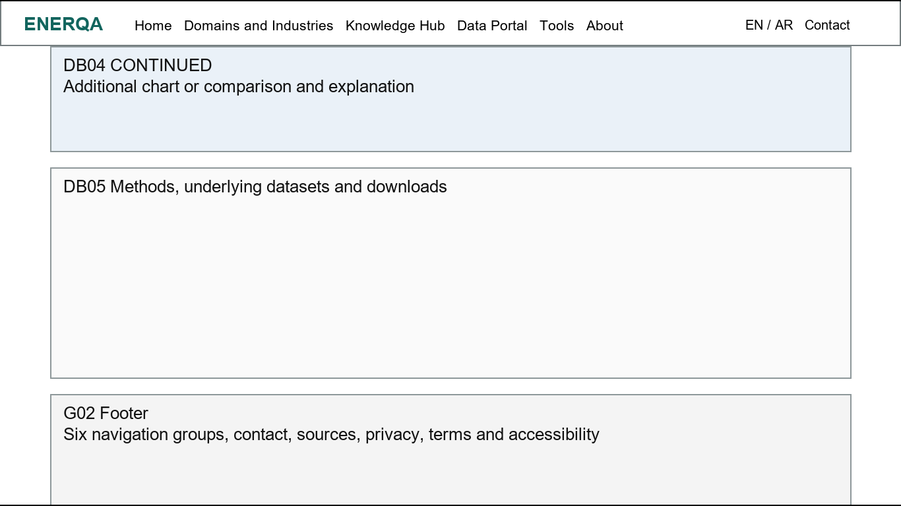

---

## Page 187

[Open PDF page 187](<Enerqa Website Developer Handoff Revised.pdf#page=187>)

#### Page text and API placement

##### DB01 Dashboard Overview

Website heading: Dashboard Overview

Explain the question the dashboard addresses, the included geography, observation period and selected sources. Publish only when the actual dashboard is implemented.

##### DB02 Dashboard Controls

Website heading: Dashboard Controls

Shared filters must apply consistently or identify which panels are unaffected. Do not compare annual and monthly observations, incompatible monetary bases or emissions methodologies without a clear explanation.

##### DB03 Primary Views

Website heading: Primary Views

Use two purposeful views, such as a time trend and a category comparison. Each panel names the measure and unit, links to the underlying canonical dataset and offers an accessible table.

##### DB04 Interpretation

Website heading: Interpretation

Author a short data-specific explanation, with uncertainty and methodological limits. Do not auto-generate unsupported conclusions or claim the dashboard proves project outcomes.

##### DB05 Underlying Sources

Website heading: Underlying Sources

List sources, licences, versions, transformations and data download/citation links. Dashboard query state should be shareable. APIs are inherited from the selected datasets, not a separate unverified Enerqa API.

---

## Page 188

[Open PDF page 188](<Enerqa Website Developer Handoff Revised.pdf#page=188>)

### Tool detail template

#### Laptop page design

Route: /tools/{tool-slug}   \|   Reference browser viewport: 1366 × 768 px

Segment IDs map to the copy below. Views advance about 698 px below the sticky header; the final view stops at the page end. Test folds with final fonts, real feeds and Arabic text.

Initial view   \|   Top viewport fold y 0   \|   Bottom viewport fold y 768

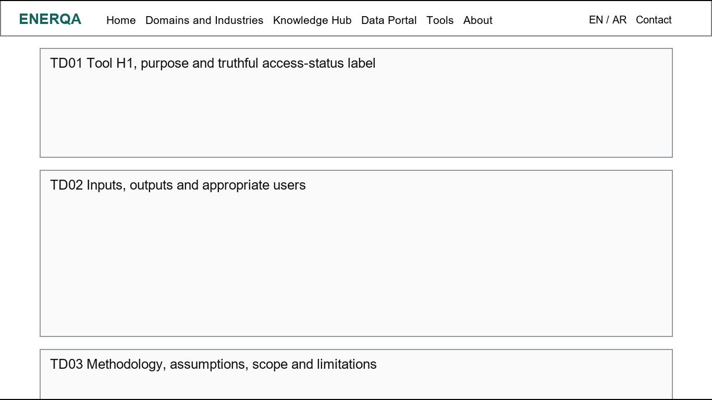

---

## Page 189

[Open PDF page 189](<Enerqa Website Developer Handoff Revised.pdf#page=189>)

Scroll view 1   \|   Top viewport fold y 698   \|   Bottom viewport fold y 1466

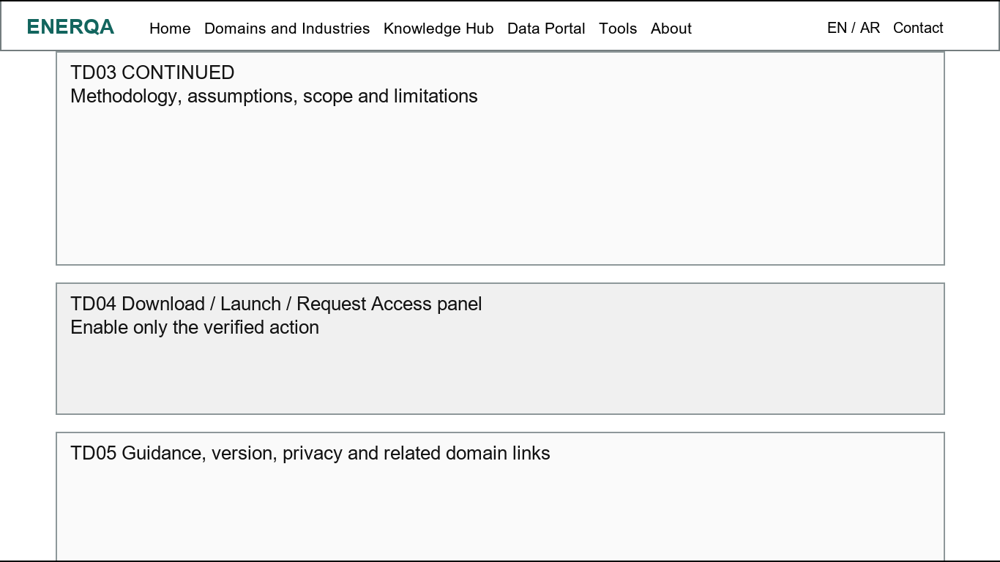

---

## Page 190

[Open PDF page 190](<Enerqa Website Developer Handoff Revised.pdf#page=190>)

#### Tool detail template continued layout

Scroll view 2   \|   Top viewport fold y 974   \|   Bottom viewport fold y 1742

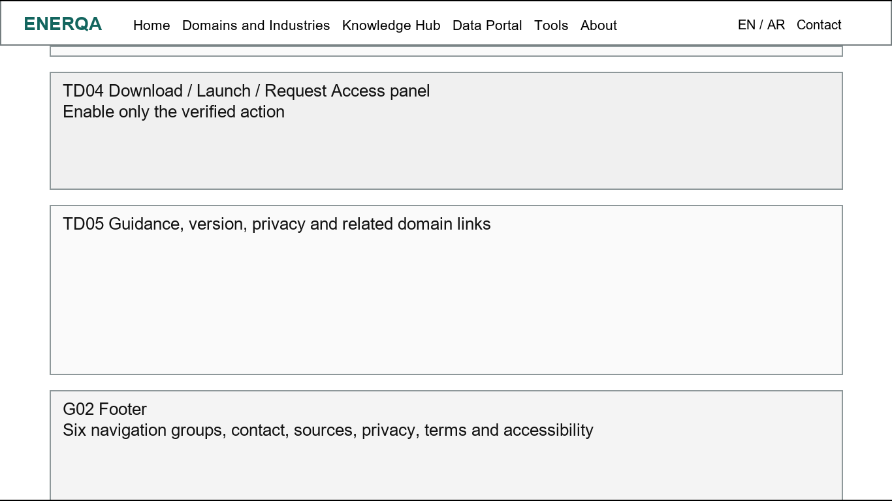

---

## Page 191

[Open PDF page 191](<Enerqa Website Developer Handoff Revised.pdf#page=191>)

#### Page text and API placement

##### TD01 Tool Overview

Website heading: Tool Overview

Use the validated tool name, purpose and current availability. Request Access is the default action until a tested file or online tool is confirmed. Use the flagship descriptions in T02 as the introductory copy for their individual pages.

##### TD02 Inputs and Outputs

Website heading: Inputs and Outputs

List actual required inputs, supported parameters and produced outputs, including units and expected user skill. Do not invent standards alignment, live peer benchmarking or automatic certification.

##### TD03 Methodology and Limits

Website heading: Methodology and Limits

Explain the actual scoring/calculation method, default assumptions, intended use and situations requiring specialist assessment. Identify the tool version/date and any source data versions. easySOLAR is an assessment tool, not a real-time engineering simulation; GreenScale Pro must not imply third-party certification.

##### TD04 Access the Tool

Website heading: Access the Tool

Button labels are conditional: Download Tool for a cleared file; Launch Tool for a functioning application; Request Access for controlled provision. Include file type/version/size, licence and system requirements for downloads. No sample or example.com links.

##### TD05 Guidance and Support

Website heading: Guidance and Support

Link the actual user guide, provide support contact and describe how user inputs are handled. An application must disclose storage, processing, deletion and third-party data use before collecting sensitive organisational data.

The three flagship detail pages use this same placement and their separate T02 narratives. Different access buttons and calculation controls are determined by the actual tool, not by the template.

---

## Page 192

[Open PDF page 192](<Enerqa Website Developer Handoff Revised.pdf#page=192>)

### Sources and Methodology

#### Laptop page design

Route: /data-portal/sources   \|   Reference browser viewport: 1366 × 768 px

Segment IDs map to the copy below. Views advance about 698 px below the sticky header; the final view stops at the page end. Test folds with final fonts, real feeds and Arabic text.

Initial view   \|   Top viewport fold y 0   \|   Bottom viewport fold y 768

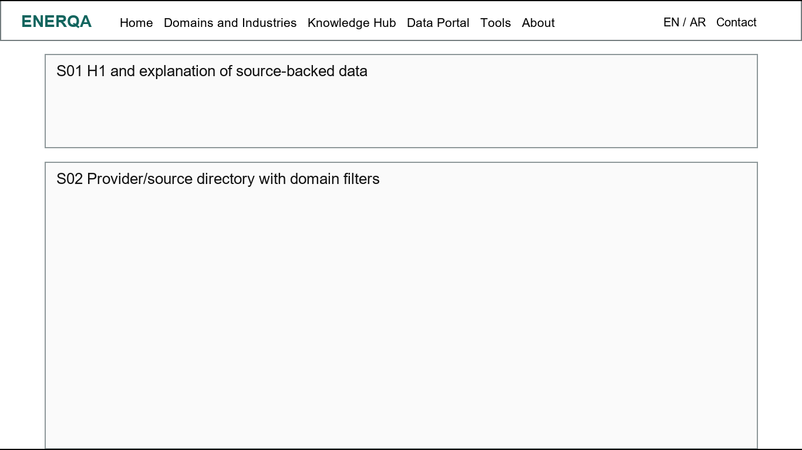

---

## Page 193

[Open PDF page 193](<Enerqa Website Developer Handoff Revised.pdf#page=193>)

Scroll view 1   \|   Top viewport fold y 698   \|   Bottom viewport fold y 1466

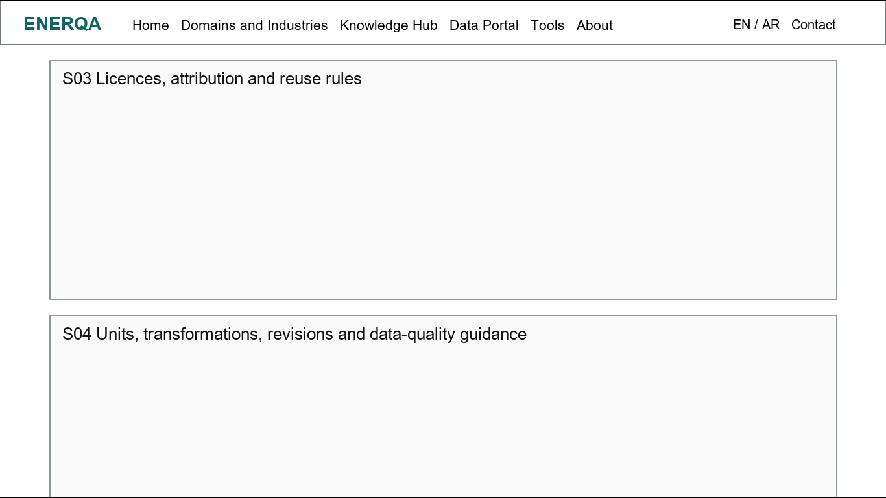

---

## Page 194

[Open PDF page 194](<Enerqa Website Developer Handoff Revised.pdf#page=194>)

#### Sources and Methodology continued layout

Scroll view 2   \|   Top viewport fold y 970   \|   Bottom viewport fold y 1738

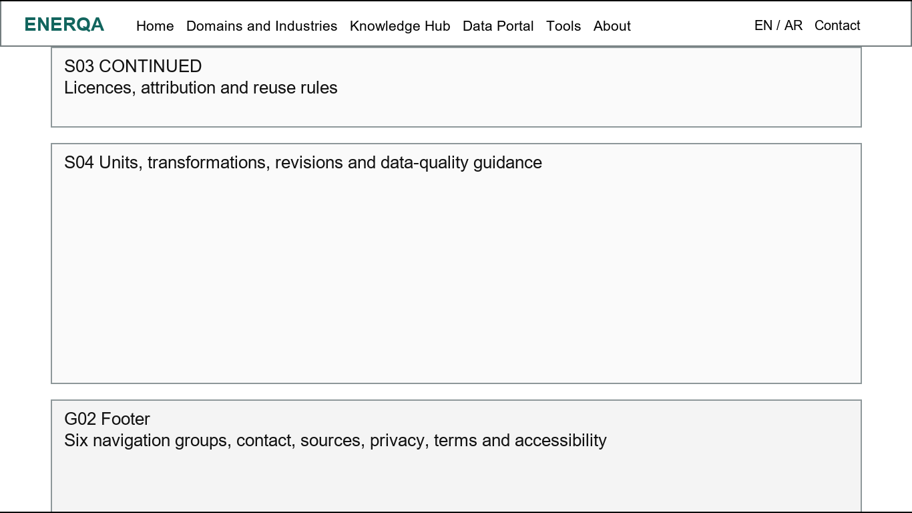

---

## Page 195

[Open PDF page 195](<Enerqa Website Developer Handoff Revised.pdf#page=195>)

#### Page text and API placement

##### S01 Sources and Methodology

Website heading: Sources and Methodology

Our data views identify the original provider, what the measure represents and how it has been prepared for display. Review these notes before comparing, downloading or reusing a dataset.

##### S02 Source Directory

Website heading: Source Directory

Populate provider name, official documentation, dataset IDs, geographic coverage, observation frequency and refresh schedule from the configured connector records. Numerical data sources and news/research sources have different rights and are labelled separately.

##### S03 Attribution and Reuse

Website heading: Attribution and Reuse

Each dataset and external item links to its applicable licence and original source. Public API access does not automatically permit republication of an article, image or dataset. Where rights are unclear, do not automate display or download until cleared.

##### S04 Understanding the Data

Website heading: Understanding the Data

Distinguish measured observations, modelled estimates, forecasts and Enerqa-derived calculations. Show units, missing values, revisions and transformations. Label OECD development finance as periodic reporting rather than live global finance; label Climate TRACE as independent estimates rather than official country inventories.

---

## Page 196

[Open PDF page 196](<Enerqa Website Developer Handoff Revised.pdf#page=196>)

### Contact and project enquiry

#### Laptop page design

Route: /contact   \|   Reference browser viewport: 1366 × 768 px

Segment IDs map to the copy below. Views advance about 698 px below the sticky header; the final view stops at the page end. Test folds with final fonts, real feeds and Arabic text.

Initial view   \|   Top viewport fold y 0   \|   Bottom viewport fold y 768

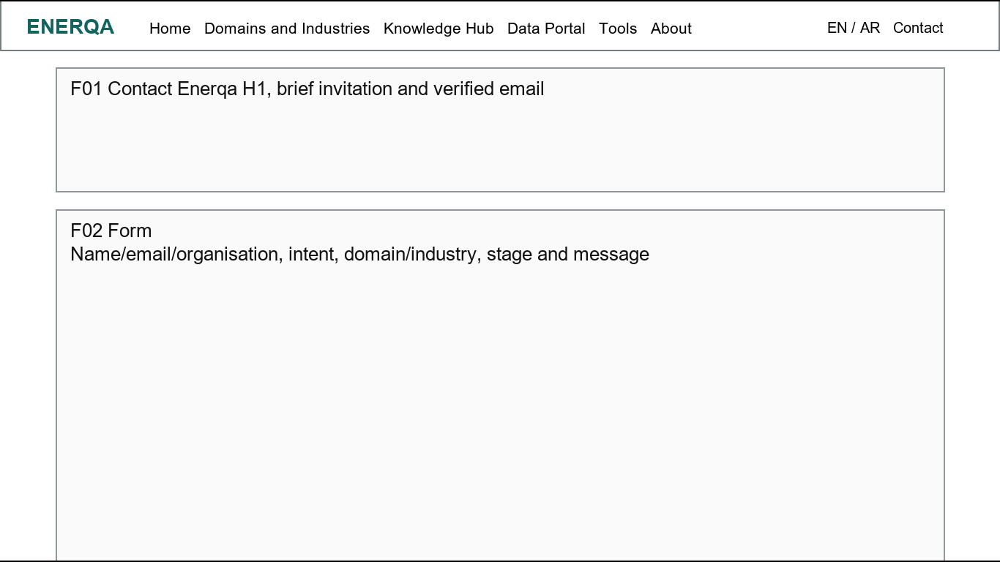

---

## Page 197

[Open PDF page 197](<Enerqa Website Developer Handoff Revised.pdf#page=197>)

Scroll view 1   \|   Top viewport fold y 800   \|   Bottom viewport fold y 1568

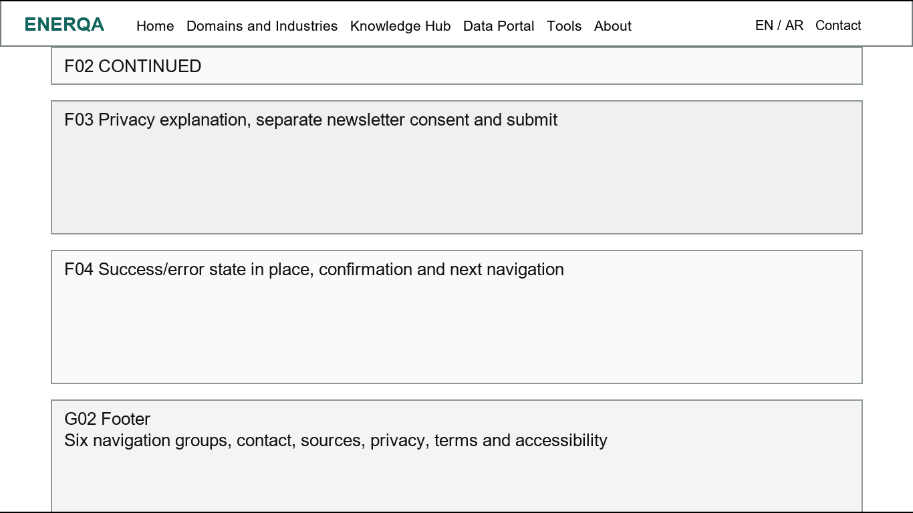

---

## Page 198

[Open PDF page 198](<Enerqa Website Developer Handoff Revised.pdf#page=198>)

#### Page text and API placement

##### F01 Contact Enerqa

Website heading: Contact Enerqa

Share an idea, a project opportunity or a question about Enerqa’s work. A complete project brief is not required to begin a conversation. Email: info@enerqa.co.uk.

##### F02 Tell Us About Your Enquiry

Website heading: Tell Us About Your Enquiry

Fields: Name and Email required; Organisation optional; Enquiry Type required with Project Discussion, Tool Access or General Enquiry; Domain and Industry optional; Project Location and Current Stage optional; Message required. Show required/optional labels explicitly. Query parameters preselect relevant intent/domain/industry/tool but remain editable.

##### F03 Send Your Enquiry

Website heading: Send Your Enquiry

Proposed privacy line: We will use the information you provide to respond to your enquiry. Read our Privacy Notice. Button: Send Enquiry. Newsletter consent is a separate unticked optional checkbox. Do not make marketing consent a condition of the enquiry.

##### F04 Submission States

Website heading: Submission States

Loading: Sending your enquiry. Success: Thank you. Your enquiry has been received. Error: We could not send your enquiry. Please try again or email info@enerqa.co.uk. Do not promise a response time that has not been approved. Preserve input on recoverable errors; prevent duplicate submissions. Optional file uploads require separate security/privacy scope, not assumed here.

---

## Page 199

[Open PDF page 199](<Enerqa Website Developer Handoff Revised.pdf#page=199>)

### AI search and answer page

#### Laptop page design

Route: /search?q={query}   \|   Reference browser viewport: 1366 × 768 px

Segment IDs map to the copy below. Views advance about 698 px below the sticky header; the final view stops at the page end. Test folds with final fonts, real feeds and Arabic text.

Initial view   \|   Top viewport fold y 0   \|   Bottom viewport fold y 768

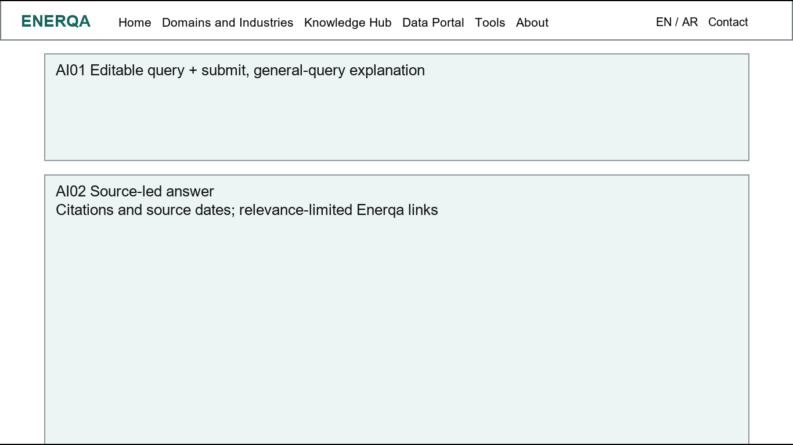

---

## Page 200

[Open PDF page 200](<Enerqa Website Developer Handoff Revised.pdf#page=200>)

Scroll view 1   \|   Top viewport fold y 698   \|   Bottom viewport fold y 1466

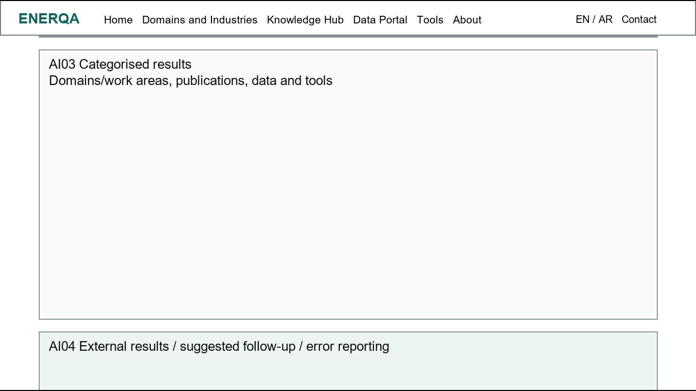

---

## Page 201

[Open PDF page 201](<Enerqa Website Developer Handoff Revised.pdf#page=201>)

#### AI search and answer page continued layout

Scroll view 2   \|   Top viewport fold y 1025   \|   Bottom viewport fold y 1793

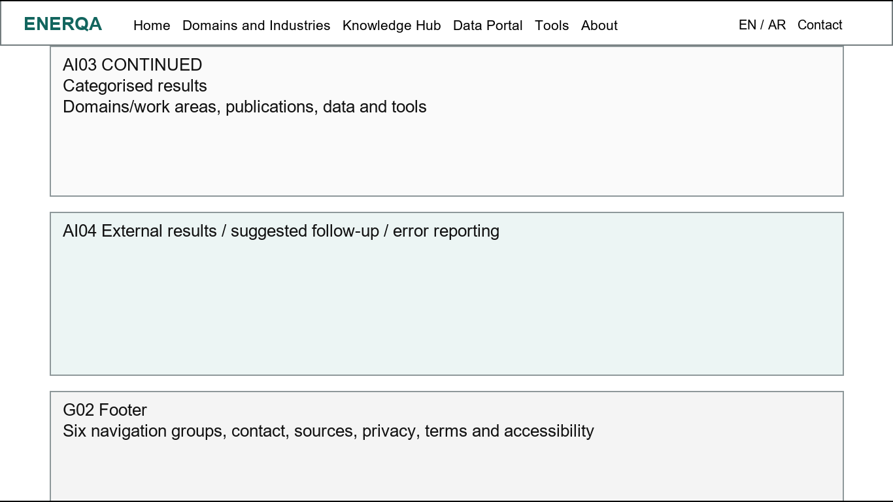

---

## Page 202

[Open PDF page 202](<Enerqa Website Developer Handoff Revised.pdf#page=202>)

#### Page text and API placement

##### AI01 Ask and Explore

Website heading: Ask and Explore

Search placeholder: Ask a question or explore a topic. Keep the user’s query editable and preserve the current query in the URL. Do not require a company-enquiry form before providing search results.

##### AI02 Answer and Sources

Website heading: Answer and Sources

Provide a source-led response with clearly linked citations and source dates. Every citation to external complete reading or data must be verified open access. Retrieve current indexed Enerqa content when it is relevant. A general query can receive a general answer; avoid unsupported claims, fabricated services or forced Enerqa recommendations. Distinguish the generated answer from quoted source material.

##### AI03 Relevant Enerqa Content

Website heading: Relevant Enerqa Content

Group internal results as Domains and Work Areas; Enerqa Publication; Data; Tools. Show a short relevant excerpt and the canonical destination. Show How Enerqa Can Help only when the query has a genuine connection with the offering.

##### AI04 Other Sources and States

Website heading: Other Sources and States

External results identify publisher/source/date and link out. Loading: Searching for relevant information. Empty: No relevant Enerqa content was found; try another query or explore our domains. Failure: Search is temporarily unavailable; use site navigation or keyword search. Do not invent an answer when source retrieval fails. Provide query/privacy and feedback guidance appropriate to the chosen AI provider.

---

## Page 203

[Open PDF page 203](<Enerqa Website Developer Handoff Revised.pdf#page=203>)

### Conditional careers template

#### Laptop page design

Route: /about/careers   \|   Reference browser viewport: 1366 × 768 px

Segment IDs map to the copy below. Views advance about 698 px below the sticky header; the final view stops at the page end. Test folds with final fonts, real feeds and Arabic text.

Initial view   \|   Top viewport fold y 0   \|   Bottom viewport fold y 768

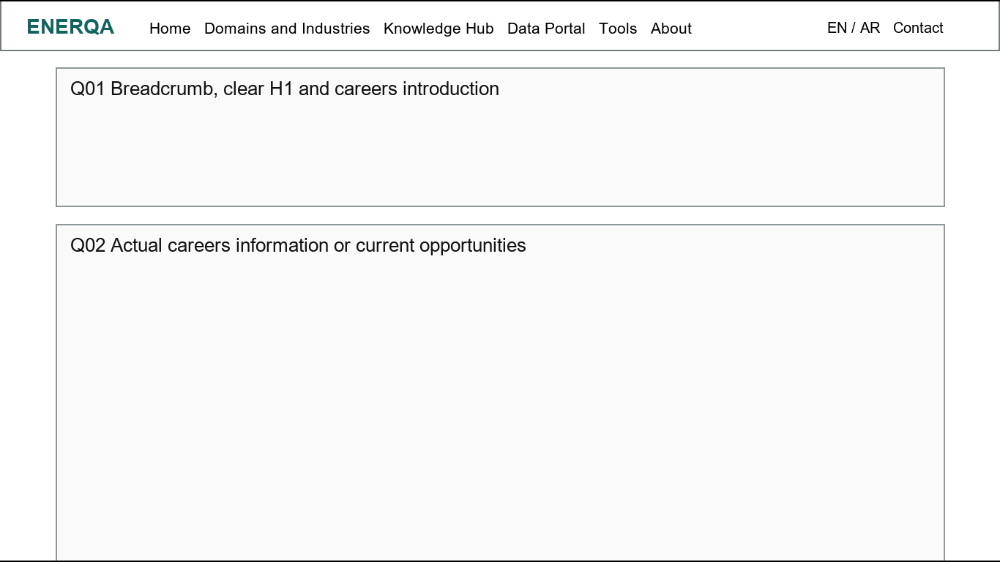

---

## Page 204

[Open PDF page 204](<Enerqa Website Developer Handoff Revised.pdf#page=204>)

Scroll view 1   \|   Top viewport fold y 566   \|   Bottom viewport fold y 1334

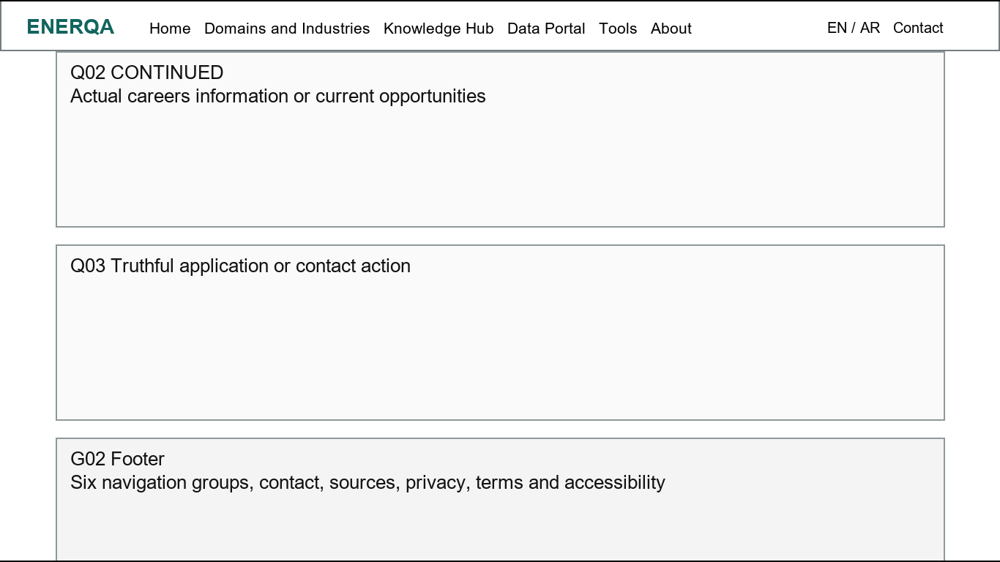

---

## Page 205

[Open PDF page 205](<Enerqa Website Developer Handoff Revised.pdf#page=205>)

#### Page text and API placement

##### Q01 Purpose and Scope

Website heading: Purpose and Scope

Careers uses /about/careers. Publish only with actual approved recruitment content. It is subordinate to About, not part of Knowledge Hub.

##### Q02 Main Content

Website heading: Main Content

Use real current opportunities or approved recruitment information, not fake vacancies. Do not introduce project or experience showcases.

##### Q03 Next Action

Website heading: Next Action

Use an approved application or contact route with privacy information. No external API is essential to this conditional page.

---

## Page 206

[Open PDF page 206](<Enerqa Website Developer Handoff Revised.pdf#page=206>)

### Policy accessibility and error pages

#### Laptop page design

Route: Footer utilities and 404   \|   Reference browser viewport: 1366 × 768 px

Segment IDs map to the copy below. Views advance about 698 px below the sticky header; the final view stops at the page end. Test folds with final fonts, real feeds and Arabic text.

Initial view   \|   Top viewport fold y 0   \|   Bottom viewport fold y 768

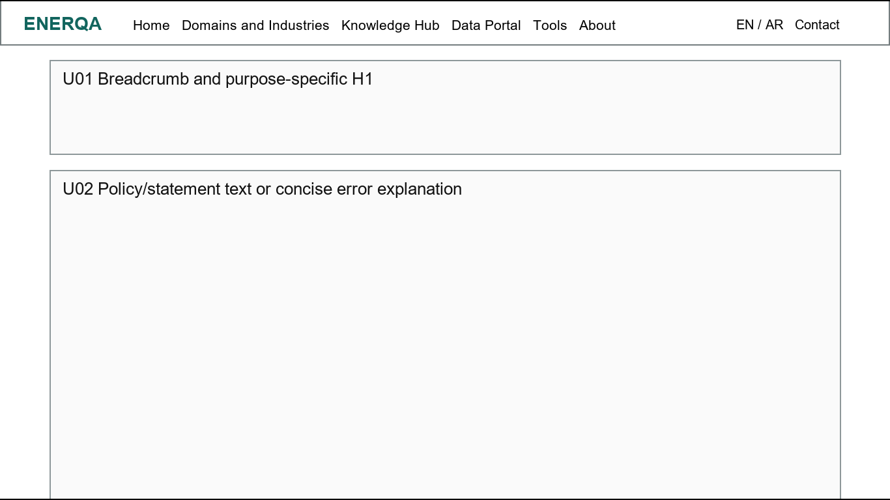

---

## Page 207

[Open PDF page 207](<Enerqa Website Developer Handoff Revised.pdf#page=207>)

Scroll view 1   \|   Top viewport fold y 611   \|   Bottom viewport fold y 1379

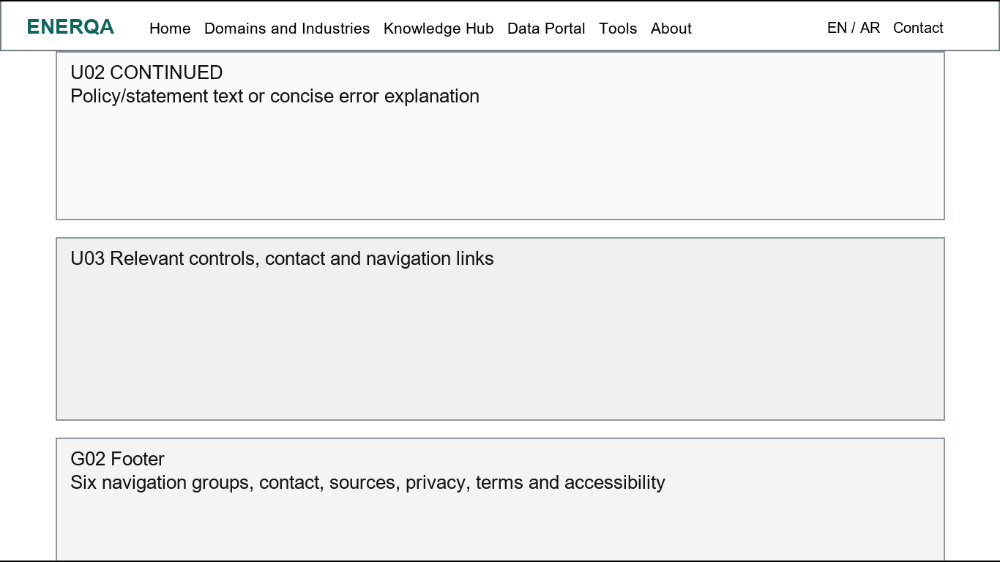

---

## Page 208

[Open PDF page 208](<Enerqa Website Developer Handoff Revised.pdf#page=208>)

#### Page text and API placement

##### U01 Utility Page Titles

Website heading: Utility Page Titles

Create distinct destinations for Privacy Notice, Terms of Use, Cookie Choices and Accessibility Statement. A 404 page uses Page Not Found. Do not route legal or accessibility labels to Contact.

##### U02 Approved Text and Status

Website heading: Approved Text and Status

Policy text must reflect the actual company, hosting, analytics, AI, newsletter, forms, cookies and data processors. Obtain appropriate approval rather than publishing generic fabricated legal content. Accessibility statements must reflect actual testing. 404 proposed message: We could not find this page. Search the site or explore one of the main sections.

##### U03 Actions

Website heading: Actions

Cookie controls must change actual consent settings. Privacy and accessibility provide a working contact route. 404 buttons: Search Enerqa → /search; Go to Homepage → /; Explore Domains and Industries → /domains-and-industries. Source errors within a page use an inline status, not a site-wide 404.

---

## Page 209

[Open PDF page 209](<Enerqa Website Developer Handoff Revised.pdf#page=209>)

### API provider specifications

Every recommended connector must meet the website’s zero-fee and open-access policy. Access, terms and published limits were reviewed on 14 September 2026 and must be checked during implementation and before launch. Free access must permit intended public corporate use, not just development, evaluation or a time-limited trial. Keep provider names in source labels and method notes, not as primary menu labels. Free APIs have usage limits and do not automatically clear linked publisher content.

#### Free API and open access requirements

All website API connectors must use an ongoing zero-fee plan that permits the intended public corporate use. The Data Portal must use only free APIs and openly accessible datasets. API access being free does not establish that the underlying article or dataset is open access or licensed for redistribution. Every Read full article, Read report, View source dataset and Download dataset destination must provide the complete item without payment, subscription, mandatory registration or login. Publish only records whose access and reuse requirements have been checked; exclude unknown, paywalled, registration-gated and embargoed items. Free provider accounts and protected backend API keys are acceptable, but visitors must never need those credentials. There must be no automatic paid upgrade, credit purchase, paid overage or paid fallback. Cache shared results, operate below the free allowance and show an honest cached, unavailable or standard-search fallback when a free allowance is exhausted.

##### Provider eligibility and quota controls

- Record the official free-plan terms, commercial/public-display permission, attribution requirements, quota and last-review date for each connector. Enable only the zero-fee feature set actually available on that plan.

- Use one legitimate organisational account per service, protected backend keys, shared caches and scheduled ingestion. Do not rotate accounts or keys to evade limits.

- Do not attach paid plans, prepaid balances or automated top-ups. A fee/terms change disables ingestion pending review rather than silently incurring a charge.

- Apply a conservative internal request/credit budget below the free allowance, exponential backoff and circuit breakers. Searches should primarily query Enerqa's cached/local index, not call every upstream API per visitor.

##### Reading and dataset eligibility

- Store fullTextUrl or datasetDownloadUrl separately from citationUrl/DOI/abstractUrl. A public abstract, catalogue record or HTTP 200 response alone is insufficient evidence that full reading is available.

- Require documented OA status or a vetted official-source allowlist plus a lawful anonymous-access check of the actual final destination. Resolve redirects and verify that the complete HTML/PDF/data file opens without subscription, login, email capture, payment or embargo.

- Metadata OA filters are necessary where supported but are not sufficient to guarantee current live links. Broken, gated, CAPTCHA-blocked or uncertain destinations remain unpublished pending human review. Never bypass a paywall or access control.

- Validate links at ingestion and recheck periodically; promptly suppress a record whose full-access destination ceases to qualify. A vetted alternative OA copy can replace a gated publisher/DOI destination.

---

## Page 210

[Open PDF page 210](<Enerqa Website Developer Handoff Revised.pdf#page=210>)

- Display factual discovery metadata and only summaries/images that are covered by applicable reuse rights. Open reading is not a blanket licence to mirror full articles or pictures.

- For Data Portal display and CSV/JSON export, separately require free anonymous access, corporate commercial-use permission, redistribution permission and modification permission where transformations are made. Preserve licence, attribution, source, unit, observation period and release/version.

- Enerqa publication reading and downloads must likewise be ungated; email/newsletter signup is optional and must not unlock full reading or datasets.

Only verified\_open records enter public cards, previews, search results and download buttons. Unknown, gated, broken and embargoed are internal review states, never public results. Store the final full-reading or data-download URL separately from the DOI, abstract or catalogue URL.

#### Shared news and research sources

#### NewsData io

Provider ID: newsdata   \|   News metadata API

Purpose. Global environment, climate, energy, technology, business and finance headlines.

Recommended placement. Homepage global news; domain/industry Latest News; Global Intelligence

Endpoint. https://newsdata.io/api/1/latest

Access. Free account/API key; keep server-side.

Rights and free tier. Free plan allowed for commercial purposes per official pricing article; limited-scale corporate feed candidate.

Published limits. 200 credits/day; 10 articles/credit; 30 credits/15 minutes; 100-character search query; 12-hour delay; no full article content.

Display fields. Headline, provider-returned permitted description, publication time, publisher and original URL. Images/full text require independent permission; no assumption that API access clears publisher copyright.

Suggested refresh and caching. Suggested shared server-side fetch every 2 hours across four short topic baskets (48 base credits/day); reserve quota for pagination/retries. Show 12-hour delay and fetched time.

Required open access filtering. Use as metadata discovery only. Restrict returned publishers to a vetted no-paywall/open-access source allowlist and validate each article's anonymous full-reading destination. The API is not an OA-only feed. Exclude records with only a teaser, subscription wall or mandatory registration. Retain copyright/summary/image checks. Use a shared feed cache rather than upstream per-user keyword search.

Query and destination rules. Official client exposes domain/domainurl/excludedomain, but use a post-ingestion source allowlist as the definitive gate. Confirm latest-endpoint free-plan parameter limits in live connector testing; do not assume filters provide OA detection.

Implementation caution. Reuse one cached pool across all pages; deduplicate URLs, allowlist reputable sources; do not request per visitor.

[NewsData.io official reference 1](<https://newsdata.io/blog/pricing-plan-in-newsdata-io/>)

---

## Page 211

[Open PDF page 211](<Enerqa Website Developer Handoff Revised.pdf#page=211>)

[NewsData.io official reference 2](<https://newsdata.io/blog/newsdata-rate-limit/>)

[NewsData.io official reference 3](<https://newsdata.io/documentation>)

[NewsData.io official reference 4](<https://newsdata.io/blog/newsdata-credit-consumption/>)

[NewsData.io official reference 5](<https://github.com/newsdataapi/newsdata-nodejs-client>)

#### GDELT Project legacy DOC 2 0

Provider ID: gdelt   \|   Global news discovery API

Purpose. Broaden geographical/language coverage and discover official/publisher source links.

Recommended placement. Optional supplementary global/local news discovery; source-filtered domain intelligence

Endpoint. https://api.gdeltproject.org/api/v2/doc/doc

Access. No API key for legacy public endpoint.

Rights and free tier. GDELT Project released datasets permit academic/commercial/government use without fee; cite and link to GDELT.

Published limits. Article-list maximum 250 per documented launch reference; no fixed public numeric service quota/SLA located. Recent news queries recommended; test supported search horizon at implementation instead of promising an archive horizon.

Display fields. Headline, source/domain, seen date, source language and original link. Underlying publishers retain article/image rights.

Suggested refresh and caching. Suggested 1–2 hours on backend for selected topic baskets; backoff on overload; monitor reliability.

Required open access filtering. Legacy DOC 2.0 may supplement global discovery, not supply unrestricted publisher full text. Apply exact-domain source allowlisting, item-level access checks and restrained cached polling. Do not infer that a GDELT-indexed article or image is OA. Keep the distinct GDELT Cloud product excluded.

Query and destination rules. Use the legacy endpoint https://api.gdeltproject.org/api/v2/doc/doc with domainis: predicates for an approved source basket, then validate the actual returned destination. Maximum article-list size is documented as 250; reliability/search-horizon testing remains necessary.

Implementation caution. 2026 official notice describes legacy request shedding and migration. GDELT Cloud is a distinct hosted product: free tier evaluation/non-production only, not this recommendation.

[GDELT Project legacy DOC 2.0 official reference 1](<https://blog.gdeltproject.org/gdelt-doc-2-0-api-debuts/>)

[GDELT Project legacy DOC 2.0 official reference 2](<https://gdeltproject.org/about.html>)

[GDELT Project legacy DOC 2.0 official reference 3](<https://blog.gdeltproject.org/scaling-gdelt-for-a-new-era-migrating-to-spanner-with-agentic-interactive-gemini/>)

[GDELT Project legacy DOC 2.0 official reference 4](<https://gdeltcloud.com/terms>)

---

## Page 212

[Open PDF page 212](<Enerqa Website Developer Handoff Revised.pdf#page=212>)

#### OpenAlex

Provider ID: openalex   \|   Scholarly research metadata API

Purpose. Recent research on climate/carbon, energy systems, nature/circularity, ESG and sustainable finance.

Recommended placement. Research & Articles tab on all domain/industry pages; Knowledge Hub external research

Endpoint. https://api.openalex.org/works

Access. Free key recommended; no-key casual use exists; query api\_key or bearer token.

Rights and free tier. CC0 public-domain scholarly metadata; commercial reuse permitted. Article/PDF rights remain separately governed.

Published limits. Free key $1 usage/day; no-key $0.10/day; direct search $0.001/call (~1,000/day) and list/filter $0.0001/call (~10,000/day); single-entity lookup free; 100 req/sec maximum, per\_page max 100.

Display fields. Title, authors, publication date, source, DOI, open-access status, original/publisher link. Clearly label research vs news; not every indexed work peer reviewed.

Suggested refresh and caching. Suggested daily batch per topic/date filter; cache 24 hours; select necessary fields and track usage headers.

Required open access filtering. Enforce filter=is\_oa:true. Current official documentation defines this as full text readable without paying or logging in. Use best\_oa\_location.pdf\_url or best\_oa\_location.landing\_page\_url, falling back to open\_access.oa\_url only after validation. Do not link the generic DOI/publisher page when a vetted repository OA copy is the usable destination. Exclude null/closed/gated destinations.

Query and destination rules. Confirmed syntax example: /works?filter=is\_oa:true&search=climate%20finance&per\_page=100&api\_key=SERVER\_KEY. Cache/dedupe into local search and hard-stop below the daily free budget; search costs more than list/filter queries. Keep copyright/licence/version and preprint labels; no automatic article republication.

Implementation caution. Do not use obsolete '100,000 calls/day free' claim or treat OpenAlex API budget as article republication licence.

[OpenAlex official reference 1](<https://help.openalex.org/api/>)

[OpenAlex official reference 2](<https://help.openalex.org/access/pricing/>)

[OpenAlex official reference 3](<https://help.openalex.org/access/example-costs/>)

[OpenAlex official reference 4](<https://help.openalex.org/api/authentication/>)

[OpenAlex official reference 5](<https://help.openalex.org/data/works/attributes/>)

[OpenAlex official reference 6](<https://help.openalex.org/data/works/open-access/>)

---

## Page 213

[Open PDF page 213](<Enerqa Website Developer Handoff Revised.pdf#page=213>)

#### DOAJ

Provider ID: doaj   \|   Open-access journal/article metadata API

Purpose. Discover journal articles in the open-access journal directory.

Recommended placement. Research & Articles tab, particularly climate/energy/environment; external research search

Endpoint. https://doaj.org/api/search/articles/{query}

Access. Public search access; no account key normally needed for read-only search.

Rights and free tier. Journal and article metadata CC0; commercial metadata reuse allowed; each linked article/full-text licence separate.

Published limits. Current API docs blocked during recheck. No confidently reverified current numeric quota: use conservative \<=2 requests/sec initially and verify official docs before launch; do not advertise unlimited.

Display fields. Article title, journal, authors, publication date, DOI and source URL; open-access/licence information when available.

Suggested refresh and caching. Suggested daily batch and cache 24 hours; DOI dedupe against OpenAlex.

Required open access filtering. Select article full-text links rather than only journal homepages or DOI abstracts. Validate anonymous access and identify the article's own licence. Use factual metadata; republishing full text/images is a separate rights decision.

Query and destination rules. Current v4 documentation returned 403 in this review, so exact query/schema/current quota must be confirmed before enabling. Do not fabricate a numeric free quota or call the service unlimited. Conservative shared daily ingestion is preferable.

Implementation caution. DOAJ indexes open-access journal metadata; not all global scholarship. Current rate/quota verification is a launch gate.

[DOAJ official reference 1](<https://doaj.org/terms/>)

[DOAJ official reference 2](<https://doaj.org/api/v4/docs>)

[DOAJ official reference 3](<https://doaj.org/docs/faq/>)

[DOAJ official reference 4](<https://doaj.org/static/doaj/docs/DOAJquestions-for-reference-only.pdf>)

#### ReliefWeb API v2

Provider ID: reliefweb   \|   Curated humanitarian report/news API

Purpose. Climate impacts, resilience, disasters, drought/flooding, food and water security, loss and damage context.

Recommended placement. Climate adaptation/resilience/disaster intelligence; supplementary water/food/environment feeds

Endpoint. https://api.reliefweb.int/v2/reports

Access. Pre-approved appname required since 1 November 2025; not a secret API key.

---

## Page 214

[Open PDF page 214](<Enerqa Website Developer Handoff Revised.pdf#page=214>)

Rights and free tier. No fees; anyone may use API. Original partner reports may be copyrighted; respect source rights.

Published limits. 1,000 calls/day and 1,000 entries/call.

Display fields. Title, original organisation/source, publication date, country/theme and original report link; no blanket full-text reuse.

Suggested refresh and caching. Suggested every 6 hours backend; query themes/countries/format; cache and exclude irrelevant crisis coverage.

Required open access filtering. Publish only relevant adaptation/resilience/water/food-security reports with complete anonymously accessible report text or attachments. Prefer ReliefWeb-hosted complete report/PDF or a validated open original-source report. Reject summary-only or gated originals. Preserve source organisation/date/country tags; no blanket full-text reuse.

Query and destination rules. Use the approved appname and themes/countries/format filters, then validate the full report destination. Do not present humanitarian coverage as a comprehensive climate-politics or finance feed.

Implementation caution. Humanitarian emphasis; not a comprehensive climate-policy/climate-finance feed. Obtain approved appname before deployment.

[ReliefWeb API v2 official reference 1](<https://apidoc.reliefweb.int/>)

[ReliefWeb API v2 official reference 2](<https://apidoc.reliefweb.int/parameters>)

#### U S  EIA Today in Energy RSS

Provider ID: eia\_rss   \|   Official RSS feed (not REST news API)

Purpose. Energy markets, generation, fuels, consumption, technology and policy-context analysis.

Recommended placement. Energy Systems & Transition analysis; homepage energy feed

Endpoint. https://www.eia.gov/rss/todayinenergy.xml

Access. Keyless RSS.

Rights and free tier. EIA-owned U.S. government publications public domain; acknowledge EIA and publication date. Third-party content/photos and trademarks are excluded.

Published limits. No numeric RSS quota located; reasonable cached polling.

Display fields. Headline, supplied feed summary, date, EIA attribution and original article link. Do not automatically reuse photos or EIA logo.

Suggested refresh and caching. Suggested every 6 hours (daily editorial publication pattern); cache and label official analysis.

Required open access filtering. Prioritise EIA's open full analysis pages for energy news and market context. Validate final article access; avoid automatically importing photographs/logos. Label as official energy analysis, with visible U.S./international coverage and supplied publication date.

Implementation caution. Strong U.S. energy focus with international content; complement for global coverage. Numerical EIA Open Data is separate from article RSS.

[U.S. EIA Today in Energy RSS official reference 1](<https://www.eia.gov/tools/rssfeeds/>)

---

## Page 215

[Open PDF page 215](<Enerqa Website Developer Handoff Revised.pdf#page=215>)

[U.S. EIA Today in Energy RSS official reference 2](<https://www.eia.gov/about/copyrights_reuse.php>)

[U.S. EIA Today in Energy RSS official reference 3](<https://www.eia.gov/rss/todayinenergy.xml>)

#### DOE OSTI GOV API v1

Provider ID: osti   \|   Energy research repository metadata API

Purpose. DOE-funded energy research reports, journal records, datasets, software and technical outputs.

Recommended placement. Energy research tab; relevant technology/climate research

Endpoint. https://www.osti.gov/api/v1/records

Access. Keyless GET examples in official docs; no public read-only credential requirement located.

Rights and free tier. Public repository access; linked publications have individual rights. Official policy requests linking to OSTI instead of mirroring website portions.

Published limits. No fixed current numeric quota located; public docs briefly timed out during recheck, indexed official documentation available.

Display fields. Title, authors, date, product type, DOI/OSTI identifier and official OSTI/publisher URL; link out, do not mirror full text.

Suggested refresh and caching. Suggested daily batch and cache 24 hours; topic/publication-date filters.

Required open access filtering. Require has\_fulltext=true and a returned links entry with rel=fulltext. Validate the full resource anonymously. Reject citation-only, unavailable and administrative-interval/embargo items; do not use a request-access instruction as the reading destination. Link to OSTI/resource rather than mirror material.

Query and destination rules. Confirmed query parameter: /api/v1/records?has\_fulltext=true&q=energy%20storage. Prefer returned rel=fulltext href; no guessed purl URL if the field is absent.

Implementation caution. Publicly accessible is not blanket full-text commercial republication permission. Use descriptive User-Agent and restrained batching.

[DOE OSTI.GOV API v1 official reference 1](<https://www.osti.gov/api/v1/docs>)

[DOE OSTI.GOV API v1 official reference 2](<https://www.osti.gov/disclaim>)

[DOE OSTI.GOV API v1 official reference 3](<https://www.osti.gov/persistent-identifier-services-developer-tools>)

[DOE OSTI.GOV API v1 official reference 4](<https://www.osti.gov/faqs>)

#### European Environment Agency RSS

Provider ID: eea\_rss   \|   Official news/publication RSS feeds

Purpose. European environment, biodiversity, ecosystems, pollution, water, waste, resource use and circular economy.

Recommended placement. Environment, Nature & Circularity news/research; climate and circularity official updates

Endpoint. Choose published press-release, featured-article and publication feeds from official feed directory.

---

## Page 216

[Open PDF page 216](<Enerqa Website Developer Handoff Revised.pdf#page=216>)

Access. Keyless RSS.

Rights and free tier. EEA-owned materials CC-BY/reusable commercial or non-commercial with attribution and meaning retained; third-party content and logo excluded.

Published limits. No fixed numeric RSS quota located.

Display fields. Headline, supplied summary, date, EEA source attribution and original URL; respect item exceptions.

Suggested refresh and caching. Suggested every 6 hours backend; topic tag relevance and cache.

Required open access filtering. Use current newsroom press-release, featured-article and publication feed URLs. Validate complete reading/PDF access and individual rights; exclude only-summaries/gated third-party items. Strong environment, biodiversity, pollution and circular-economy source, transparently labelled Europe-focused.

Implementation caution. EU/Europe geographical focus; complement global feed. Feed URLs should be taken from current directory, not guessed.

[European Environment Agency RSS official reference 1](<https://www.eea.europa.eu/en/newsroom/rss-feeds>)

[European Environment Agency RSS official reference 2](<https://www.eea.europa.eu/en/legal-notice>)

#### GBIF Literature API

Provider ID: gbif\_literature   \|   Biodiversity literature metadata API

Purpose. Peer-reviewed papers and other literature indexed by GBIF citing GBIF datasets/downloads; filter biodiversity/ecosystem/land-use research.

Recommended placement. Environment, Nature & Circularity biodiversity research tab

Endpoint. https://api.gbif.org/v1/literature/search

Access. Most read-only API queries do not require authentication.

Rights and free tier. Public access and website embedding supported. Paper full-text rights are independent; do not confuse source-code Apache licence or occurrence-data CC licences with all literature rights.

Published limits. Dynamic search throttling depending on server load; HTTP429; no guaranteed fixed query rate.

Display fields. Title, authors, year, journal/source, DOI, country/topic, peer-review and open-access labels where returned; cite GBIF and DOI and link original.

Suggested refresh and caching. Suggested daily batch/cache 24 hours; descriptive URL/email User-Agent; reduce the request rate and back off after HTTP 429.

Required open access filtering. Require openAccess=true, then resolve a vetted OA full-text location rather than blindly linking DOI. Use OpenAlex OA-location enrichment if necessary and exclude records without a verified full-reading URL. Preserve researcher-country versus coverage-country distinction.

Query and destination rules. Confirmed GBIF-owned service parameter: /v1/literature/search?openAccess=true&q=biodiversity. countriesOfCoverage is the study-focus geography; countriesOfResearcher is institutional affiliation. The Apache software licence does not license all paper content.

---

## Page 217

[Open PDF page 217](<Enerqa Website Developer Handoff Revised.pdf#page=217>)

Implementation caution. Not a comprehensive biodiversity article corpus. For numerical GBIF occurrences later, check each dataset licence (CC0/CCBY/BY-NC) and exclude BY-NC corporate reuse unless authorised.

[GBIF Literature API official reference 1](<https://techdocs.gbif.org/en/openapi/>)

[GBIF Literature API official reference 2](<https://techdocs.gbif.org/en/openapi/v1/literature>)

[GBIF Literature API official reference 3](<https://github.com/gbif/literature-ws>)

[GBIF Literature API official reference 4](<https://www.gbif.org/publishing-data/summary>)

#### SEC EDGAR data APIs

Provider ID: sec\_edgar   \|   Corporate disclosure/financial filings API (not news API)

Purpose. Selected issuers' annual/interim/event disclosures and financial XBRL.

Recommended placement. Sustainable Business, ESG & Finance disclosures tab; optional financial data portal

Endpoint. https://data.sec.gov/submissions/CIK##########.json

Access. No API key/authentication; declare real company/contact User-Agent.

Rights and free tier. Official SEC FAQ says government-created content and EDGAR public filing content free to access/reuse; stock-art and trademark exceptions still apply.

Published limits. Maximum 10 requests/sec; data updated as disseminated; filings often available 1–3 minutes but lag not guaranteed; bulk JSON nightly.

Display fields. Issuer name, form, filing date, report period, document title, SEC source and original filing URL. Label as corporate disclosure, not news or Enerqa analysis.

Suggested refresh and caching. Suggested selected CIK watchlist every 6 hours; backend caching; no per-visitor calls.

Required open access filtering. Link directly to the public SEC filing HTML, complete filing or compatible public XBRL dataset rather than issuer investor-portal paywalls. Validate public access. Label as Corporate disclosure within Global Intelligence, not as a third Knowledge Hub collection or live stock-market feed.

Query and destination rules. Use cached selected-CIK submissions/watchlists. Company submissions are not universal country/topic ESG keyword discovery; item relevance/geographic coverage requires separate tagging.

Implementation caution. Company submissions API is not general keyword ESG search. Applicable ESG passages must be identified/curated separately; do not imply universal global issuer coverage or market quotes.

[SEC EDGAR data APIs official reference 1](<https://www.sec.gov/search-filings/edgar-application-programming-interfaces>)

[SEC EDGAR data APIs official reference 2](<https://www.sec.gov/about/webmaster-frequently-asked-questions>)

---

## Page 218

[Open PDF page 218](<Enerqa Website Developer Handoff Revised.pdf#page=218>)

#### Numerical data sources

#### Climate TRACE Public API Beta

Provider ID: climate-trace

Purpose. Explore independently estimated greenhouse gas emissions by country, sector and emitting source, with geography and time filters.

Recommended placement. Climate domain emissions preview and Data Portal emissions dataset detail; sector-filtered links from relevant industries.

Access. Public beta. The public landing documentation does not state a key requirement; developer must confirm the current v7 specification during connector testing. Do not promise a tested unauthenticated endpoint until verified.

Published limits. No fixed numeric quota published on the data page. Provider says keep volume low and warns production availability is not guaranteed.

Rights and attribution. Climate TRACE emissions and associated metadata are CC BY 4.0, allowing commercial reuse with attribution and changes identified. External datasets and geographic boundary products can have separate terms; review exceptions.

Coverage and frequency. Country, sector, source and other geographic summaries; monthly and annual observations depending on output. Monthly releases have approximately 60-day lag; latest checked release 5.10.0 dated 27 August 2026 covers June 2026. API version v7 is not the inventory release version.

Views and downloads. Annual/monthly line chart, sector bar chart, source table and optional map; export a licensed filtered CSV. Prefer a versioned cached release rather than querying the beta API per visitor.

Suggested caching. Check release monthly; ingest a consistent inventory version; preserve old version for reproducibility.

Required free API and open access use. Climate TRACE emissions/metadata are CC BY 4.0 except stated external datasets. Keep the free public API candidate, beta/reliability warning and low-volume ingestion. Link to open source data and offer licensed, anonymous Enerqa CSV downloads from a consistent API-ingested cached release. Verify current v7 authentication/schema. Original-source bulk files may be offered as additional open downloads only; they do not replace free-API ingestion.

Interpretation limits. Modelled estimates may use observed activity or forward projections and may revise prior months. Not an official country submission to UNFCCC, not a substitute for an organisation's GHG inventory or verified MRV, and not automatically Scope 1/2/3 or carbon-credit verification. Display gas, unit and CO2e 20-year/100-year horizon explicitly.

[Climate TRACE Public API Beta Official API documentation](<https://api.climatetrace.org/v7/docs/index.html>)

[Climate TRACE Public API Beta Official terms](<https://climatetrace.org/terms>)

---

## Page 219

[Open PDF page 219](<Enerqa Website Developer Handoff Revised.pdf#page=219>)

#### World Bank Indicators API v2

Provider ID: world-bank-indicators

Purpose. Compare country-level development, energy, environmental and economic indicators, supported by source metadata and methodological notes.

Recommended placement. Shared country indicator catalogue in Data Portal, with relevant small previews on domain and industry pages.

Access. No API key or other authentication necessary.

Published limits. No fixed request quota published in reviewed documentation; reasonable-volume use required. Default pagination 50 records; use per\_page and pagination. Multiple-indicator request up to 60 indicators and documented URL length limits.

Rights and attribution. Dataset terms normally CC BY 4.0 with additional World Bank terms; dataset/indicator metadata may specify third-party exceptions. Dataset terms prevail over general site terms. Preserve World Bank, dataset and underlying provider attribution; verify each selected series licence.

Coverage and frequency. Mostly national annual time series, with some higher-frequency databases. Refresh and release lag vary by indicator; missing values are common. Do not assume the most recent available year is the current year.

Views and downloads. Country comparison line/bar charts and tables; filtered CSV created from JSON/XML or provider download. Include indicator name/code, source, unit, country and observation year.

Suggested caching. Weekly metadata/release check; daily cache is sufficient for requested lookups. Refresh according to individual source releases.

Required free API and open access use. Indicators API requires no authentication. Dataset-specific terms normally grant CC BY 4.0 with exceptions and prevail over general site terms. Include only selected series with compatible corporate display/redistribution rights. Reading/data destinations and Enerqa exports must be anonymously open, with indicator/source attribution. Do not apply these dataset terms to D&R reports.

Interpretation limits. Not a live equity feed, ESG company rating, project-level finance database or exact local-site assessment. Country coverage and underlying methodologies vary; GDP current USD must not be treated as real growth.

[World Bank Indicators API v2 Official API documentation](<https://datahelpdesk.worldbank.org/knowledgebase/articles/889392-about-the-indicators-api-documentation>)

[World Bank Indicators API v2 Official terms](<https://www.worldbank.org/ext/en/legal/terms-conditions/datasets>)

#### OECD Data Explorer SDMX API

Provider ID: oecd-sdmx

Purpose. Explore reported climate-related development finance and municipal waste generation and treatment using clearly defined official statistical series.

Recommended placement. Data Portal climate-related development finance and circular economy catalogue; climate and ESG finance domain previews link to the same canonical datasets.

---

## Page 220

[Open PDF page 220](<Enerqa Website Developer Handoff Revised.pdf#page=220>)

Access. Public API, free of charge, no key shown in the official query builder. Use the API query generated by Data Explorer rather than inventing dimension positions.

Published limits. Maximum 60 data downloads per hour in current official guidance; requests above this temporarily blocked. VPN/anonymised-origin traffic not allowed. Some large CRS query parameters are restricted; cache consolidated slices and use explicit time bounds.

Rights and attribution. OECD-owned data can be extracted, adapted, shared and embedded for any purpose including commercial use with attribution. Verify metadata for third-party rights and additional restrictions. Do not imply OECD endorsement.

Coverage and frequency. Annual and periodically revised finance reporting by providers, recipients, sectors and environmental objectives; CRDF activity-level files are also available as downloadable Excel releases. Municipal waste is country/year with generation, treatment and units. Not a real-time finance tracker.

Views and downloads. Finance trends by provider/recipient/sector/objective; waste per-capita trends and treatment comparisons. Use free SDMX JSON/XML/CSV API slices. Starter flows: OECD.DCD.FSD,DSD\_RIOMRKR@DF\_RIOMARKERS and OECD.ENV.EPI,DSD\_MUNW@DF\_MUNW; choose the actual current version in the query builder. The portal ingests free API data, not manually uploaded Excel releases. Optional original-source bulk links must be openly accessible and are additional downloads only.

Suggested caching. Check source update/version weekly; fetch on change. Do not repeatedly reload annual series per visitor.

Required free API and open access use. Public API is free; OECD-owned data can be downloaded/adapted/shared/embedded commercially with attribution, except third-party/additional restrictions. Use free SDMX data slices and anonymous source/CSV links, below the documented 60 downloads/hour. The Data Portal should not depend on manual Excel uploads as its data-source architecture; richer non-API releases are optional source downloads, not a substitute paid feed. Keep finance reporting periodic and accurately labelled.

Interpretation limits. Call the widget Climate-related development finance, not all global climate finance. Climate-related Rio-marker amounts can include whole project values, unlike climate-specific components. Mark commitments vs disbursements explicitly where provided and do not relabel commitments as cash delivered. Keep provider and recipient perspectives separate; do not add adaptation and mitigation totals with overlapping activities without deduplication. Municipal waste definitions and treatment coverage vary by country.

[OECD Data Explorer SDMX API Official API documentation](<https://www.oecd.org/en/data/insights/data-explainers/2024/09/api.html>)

[OECD Data Explorer SDMX API Official terms](<https://www.oecd.org/en/about/terms-conditions.html>)

[OECD Data Explorer SDMX API Climate-finance methodology](<https://www.oecd.org/en/data/insights/data-explainers/2024/12/climate-and-development-finance-faq.html>)

[OECD Data Explorer SDMX API Rate guidance](<https://www.oecd.org/en/data/insights/data-explainers/2024/11/Api-best-practices-and-recommendations.html>)

#### U S  EIA Open Data API v2

Provider ID: eia-open-data

Purpose. Track energy production, consumption, electricity generation and selected energy-price series from official EIA datasets.

---

## Page 221

[Open PDF page 221](<Enerqa Website Developer Handoff Revised.pdf#page=221>)

Recommended placement. Energy domain data preview and Data Portal energy markets/generation dataset details, with geographic coverage visibly labelled.

Access. Free API key from EIA; keep it server-side.

Published limits. Maximum 5,000 rows per JSON response; paginate or filter. Official FAQ recommends sustained less than approximately 9,000 requests/hour and burst under 5/second under ideal conditions; actual security throttles vary by demand and route.

Rights and attribution. API terms expressly allow search/display/analysis/retrieval. Identify EIA as source, do not imply endorsement or use logo without permission, and do not misrepresent modified data as original EIA output.

Coverage and frequency. Series dependent: hourly, daily, weekly, monthly or annual, with substantial U.S. coverage and selected international series. API accesses public databases that update with releases or incrementally; this does not make every series real-time.

Views and downloads. Generation mix stacked chart, selected fuel-price line chart, electricity consumption tables and CSV downloads retaining route/series/facets, original units and time frequency.

Suggested caching. Daily for monthly/annual series; selected daily/weekly price series on source release. Any higher-frequency view must use an explicit scoped connector and source schedule.

Required free API and open access use. EIA key is free and protected backend only; API terms allow data analysis/retrieval/display. Visitors receive ungated chart/table/CSV access and open source destinations rather than an API-key registration screen. Label each original series/frequency/unit and credit EIA. Do not import third-party protected photos/logos or call all energy prices live.

Interpretation limits. Not a global stock-index API or necessarily a live global energy exchange quote. Routes may combine releases; select comparable frequency and geography and label units carefully.

[U.S. EIA Open Data API v2 Official API documentation](<https://www.eia.gov/opendata/documentation.php>)

[U.S. EIA Open Data API v2 Official terms](<https://www.eia.gov/opendata/terms-of-service.php>)

[U.S. EIA Open Data API v2 Rate guidance](<https://www.eia.gov/opendata/faqs.php>)

#### NASA POWER Temporal APIs

Provider ID: nasa-power

Purpose. Explore solar resource and meteorological time series for an entered location, supporting early energy, agricultural and building assessments.

Recommended placement. Energy solar-resource preview and Data Portal location-based solar/meteorological dataset; relevant to agriculture, infrastructure and energy industry pages.

Access. POWER Temporal API examples use no API key. This is distinct from other api.nasa.gov products that use keys.

Published limits. NASA POWER team states no set rate limit, but monitors and limits usage for equitable access; documentation includes HTTP 429. Keep concurrent requests low and reuse grid-cell results; hourly requests allow maximum 15 parameters in reviewed documentation.

Rights and attribution. NASA Earth science data are free/open; cite NASA POWER, underlying data/source and version where available, without implying NASA endorsement. Review selected product/source notices before redistribution.

---

## Page 222

[Open PDF page 222](<Enerqa Website Developer Handoff Revised.pdf#page=222>)

Coverage and frequency. Hourly, daily, monthly/annual and climatology at source grid resolution. Reviewed guidance gives meteorology around 0.5 x 0.625 degrees and solar around 1 x 1 degree; verify selected current parameter resolution. Typical latency 2-3 days meteorology and 5-7 days solar.

Views and downloads. Location line charts, monthly solar-resource summaries, parameter tables; provider supports CSV, JSON, ASCII and NetCDF, with community-specific units.

Suggested caching. Cache identical parameter/date/grid-cell requests. For newest data check daily; static historical queries can be held until version/source changes.

Required free API and open access use. POWER official examples provide free globally available climate data through keyless URLs. Keep restrained cached point/grid queries; provide direct anonymous resource/CSV access with NASA/source/version citations and appropriate modelled-grid limitations. Do not link visitors to other Earthdata products that need login as the full-dataset button.

Interpretation limits. Grid-cell modelled/satellite-derived values are not site measurements or detailed project design evidence. Local solar time differs from civil time; show UTC or LST. Historical resource data are not automatically forecasts or climate projections.

[NASA POWER Temporal APIs Official API documentation](<https://power.larc.nasa.gov/docs/services/api/>)

[NASA POWER Temporal APIs Official terms](<https://www.earthdata.nasa.gov/engage/open-data-services-software/data-use-policy>)

[NASA POWER Temporal APIs Data methodology](<https://power.larc.nasa.gov/docs/faqs/data/>)

[NASA POWER Temporal APIs Rate guidance](<https://forum.earthdata.nasa.gov/viewtopic.php?t=4273>)

#### GBIF Occurrence and Download APIs

Provider ID: gbif-occurrence

Purpose. Explore published biodiversity occurrence records by geography and taxon, with links to their original datasets and evidence quality.

Recommended placement. Nature/biodiversity preview and Data Portal species-occurrence map/table; preserve original dataset citation and licence.

Access. Most read-only search requests need no authentication. Programmatic large download requests require a free GBIF account using HTTP Basic Authentication; protect credentials server-side.

Published limits. No guaranteed fixed query rate; search API rate limits vary with load and return 429. Use asynchronous downloads for large extracts rather than serially paging search results.

Rights and attribution. Dataset licences include CC0, CC BY and CC BY-NC. For a corporate launch restrict to CC0/CC BY unless separate permission obtained; preserve original publisher/dataset attribution and download DOI. Images have their own licences.

Coverage and frequency. Individual published occurrence records with taxon, event date, geography and coordinate uncertainty where supplied. Coverage and ingestion timing vary by publisher; historical event dates must not be called current biodiversity conditions.

Views and downloads. Licensed occurrence points/map and record table, taxon/year summaries labelled as record counts rather than species abundance; filtered CSV via a cited reproducible download, subject to licence permissions.

Suggested caching. Weekly/monthly curated geographical extracts; source releases do not need minute-by-minute refresh.

---

## Page 223

[Open PDF page 223](<Enerqa Website Developer Handoff Revised.pdf#page=223>)

Required free API and open access use. Restrict occurrences to CC0/CC BY (no BY-NC corporate reuse without permission). Most search calls are unauthenticated, but creating a large download requires Enerqa's free backend account. Do not send visitors to Create new download/sign-in. Pre-generate compatible extracts server-side and expose the returned public ZIP/DOI plus ungated Enerqa CSV; anonymously validate the returned URL. Preserve publisher/dataset licence and DOI, sensitivity and sampling-bias notes.

Interpretation limits. Presence-only observations and sampling biases; absence of records is not absence of species. Not a biodiversity-impact assessment, protected-status authority, comprehensive natural-capital valuation or substitute for field surveys. Coordinate sensitivity/uncertainty must be respected.

[GBIF Occurrence and Download APIs Official API documentation](<https://techdocs.gbif.org/en/openapi/>)

[GBIF Occurrence and Download APIs Official terms](<https://www.gbif.org/terms>)

#### OpenAQ API v3

Provider ID: openaq-v3

Purpose. Explore measured air pollutant concentrations from available monitoring networks, including sensor details, observation times and source providers.

Recommended placement. Environment air-quality preview and Data Portal station-level air pollution dataset; selected geography/active sensors only.

Access. Free account/API key; X-API-Key header. Keep key server-side.

Published limits. Free general use: 60 requests/minute and 2,000/hour per API key. Higher usage requires custom pricing. Observe rate-limit headers, 429 and source attribution terms.

Rights and attribution. Per-source licences differ. Use license resource flags including commercialUseAllowed, redistributionAllowed, modificationAllowed and attributionRequired; include only compatible providers for public corporate display/download. Preserve provider, owner and licence links; do not assume all records share one OpenAQ licence.

Coverage and frequency. Sensor/location measurement series and latest observations with aggregated hourly/daily/monthly/yearly resources. Sampling intervals and ingestion delay vary by provider; always show measured-at timestamp and whether a station is stale.

Views and downloads. Selected pollutant station line chart, table and location map; downloadable filtered CSV only where redistribution licence permits. Label concentrations and averaging period, not a universal AQI.

Suggested caching. 15-60 minutes for a small active-location latest panel, daily for historical curated datasets; not polling the entire global network.

Required free API and open access use. Free general use is 60 calls/minute and 2,000/hour; no custom paid plan. Require commercialUseAllowed=true and redistributionAllowed=true, plus modificationAllowed=true for derived/transformed exports; satisfy attribution/share-alike where applicable and resolve licence-field inconsistencies conservatively. Visitors must get ungated Enerqa exports, not key/account signup. Validate any external dataset download before linking; exclude incompatible/unknown sources.

---

## Page 224

[Open PDF page 224](<Enerqa Website Developer Handoff Revised.pdf#page=224>)

Interpretation limits. Uneven geography and sensor quality; check units, pollutant and averaging periods, instrument type and data flags. Not complete global coverage, official public-health advice, emissions inventory or automatic compliance evidence. Do not display old measurements as live.

[OpenAQ API v3 Official API documentation](<https://docs.openaq.org/api>)

[OpenAQ API v3 Provider licence documentation](<https://docs.openaq.org/resources/licenses>)

[OpenAQ API v3 Rate guidance](<https://docs.openaq.org/using-the-api/rate-limits>)

#### Market data and AI provider decisions

No paid market-data API, licence purchase or paid fallback is permitted. Until a genuinely free public-corporate numerical feed and openly accessible destinations are confirmed, H04 displays eligible open-access market commentary from the shared free news pool, without numerical rows or live claims. A separately approved free display-only widget is not an API, cannot supply downloadable datasets and stays outside the Data Portal.

AI search must likewise avoid API fees. Cloudflare Workers AI on its Free plan is a candidate within the documented allowance of 10,000 neurons per day. Select a currently Free-eligible model, keep a conservative internal hard budget and do not attach a paid plan, prepaid balance, auto-top-up or paid fallback. At exhaustion, show cached results or normal keyword search with an honest notice. Model licence, privacy, input handling, public-use terms and capacity must pass review before enabling inference. Self-hosting an appropriately licensed model is another zero-inference-fee route, but infrastructure and operating costs remain separate. No unlimited or zero-hosting-cost promise is made.

[Cloudflare Workers AI Free allowance and pricing](<https://developers.cloudflare.com/workers-ai/platform/pricing/>)

[Cloudflare Workers AI current models](<https://developers.cloudflare.com/workers-ai/models/>)

[TradingView widgets display only and no data export](<https://www.tradingview.com/widget-docs/faq/data/>)

---

## Page 225

[Open PDF page 225](<Enerqa Website Developer Handoff Revised.pdf#page=225>)

### Developer implementation and acceptance requirements

#### Changes from the zero draft

- Replace the full-height rotating hero with the compact first-fold search/news/markets composition. Keep news and markets meaningfully visible without scroll at the reference laptop viewport.

- Replace legacy domain titles, add all 13 industries, and include the exact canonical lifecycle link in the mega menu.

- Remove every project/experience section, case-study filter, history/impact counter and project-client gallery.

- Consolidate /insights and /knowledge-hub into one canonical first-party publication library; retain external intelligence as a labelled separate destination.

- Clean publication imports: category headings, biographies and archive separators are not articles; recover true dates and authors.

- Broaden the Climate Data Portal to Data Portal across all four domains, with source-backed dataset details and real downloads.

- Prioritise the three named flagship tools, validate access and remove placeholder/nonfunctional downloads.

- Replace fake utility destinations and public API promises with genuine tested pages or omit them.

#### CMS content model

Knowledge Hub contains exactly Enerqa Publication and Global Intelligence. Remove Learning and Authors public branches and separate archive destinations. Use author metadata and a Year = 2024 filter inside Enerqa Publication. Both collections provide keyword/topic search; Global Intelligence additionally exposes continent, region and country coverage filters.

| Record | Core fields | Reuse |
| --- | --- | --- |
| Domain | Title, narrative, capability sections, domain tags, CTAs | Domain page, menu, overview and home cards |
| Industry | Title, narrative, related capability links, lifecycle module | Industry page and menu |
| Capability section | Heading, slug, narrative, parent domain | Anchored domain content; no separate page at launch |
| Publication | Title, body, author, actual date, type, file, tags, language | Enerqa Publication and contextual first-party cards |
| External item | Provider, source/date/type, full-reading URL, covered geography, access evidence, rights | Global Intelligence and contextual external cards |
| Dataset | Free provider/series/version/licence/unit/geography/period/method; open download | Portal detail and small contextual previews |
| Tool | Purpose, inputs/outputs/method/version/access/privacy | Catalogue and tool detail |

---

## Page 226

[Open PDF page 226](<Enerqa Website Developer Handoff Revised.pdf#page=226>)

| Record | Core fields | Reuse |
| --- | --- | --- |
| Author metadata | Approved byline identity and actual authored publications | Internal metadata, publication bylines and search filters only |
| Utility and form | Approved page text, route, consent/state rules | Footer and contact/search flows |

No Project, Case Study or Experience record type is required for launch. Taxonomy: domain, industry, capability, lifecycle stage, topic, covered country codes, region IDs, continent IDs, geographic scope, content type, first-party/external, source, author, date, language, access/status and data frequency/format. Author affiliations and publisher locations must remain separate from subject-coverage geography.

#### External source pipeline

Fetch through server-side connectors and a shared cache, not once per visitor or separately for every page. Store original IDs and URLs, source timestamps, retrieval time, provider, rights status and provenance. Reuse filtered records across home, domains, industries and Global Intelligence. Keep credentials out of the browser.

Apply source quality controls, language/geography tags, domain and industry relevance, URL/DOI deduplication and publication-date validation before display. Respect the NewsData query cap through separate topic baskets rather than an oversized query. Do not treat a country name or generic politics headline as climate-policy relevance.

Use suggested provider refresh schedules in the specifications, request budgets, backoff for 429/errors and stale-cache notices. Loading reserves the card/chart dimensions. Empty results say No relevant updates are available; service failures show latest cached items with their age or an honest unavailable state. A temporary failed call does not become fabricated content. Rights review applies to thumbnails and summaries as well as full text.

#### Data integrity and download behaviour

Every Data Portal value and export must derive from a permitted free API connector and its versioned cache. No paid dataset, paid map/data API, trial-only connector or manual-upload dependency is permitted. Original-source files may be offered as additional open downloads but do not replace the free-API ingestion architecture. Every published dataset must support a free anonymous download; credentials are held only by the backend.

Serve all external data through a server-side connector and cache. Store provider, dataset/series identifier, licence, original unit, geographic level, observation period, release/version and retrieval time.

Publish separate labels for the observation period, source release date and Enerqa retrieval time; none is automatically a live timestamp.

Charts must have accessible tabular equivalents. CSV downloads must contain filtered data plus attribution, units, methodology links and transformation notes. Do not redistribute data unless the original source licence allows it.

---

## Page 227

[Open PDF page 227](<Enerqa Website Developer Handoff Revised.pdf#page=227>)

Do not fill missing values with zero. Do not silently mix annual and monthly observations, modelled estimates and national inventories, nominal and constant currency, or different CO2e global warming potential horizons.

If the source is unavailable, show the latest cached release with a stale-data notice and original-source link. If no licensed cached data exist, hide the chart and provide an honest unavailable state.

#### Open access controls across the website

The same provider and item eligibility rules apply to Homepage, every domain and industry page, Global Intelligence, all Data Portal views, tool data connectors and AI citations. An API can be free while the linked article is paywalled; such a record is excluded from public results. Validate complete anonymous reading/download at ingestion and periodically thereafter, without bypassing access controls. HTTP 200 or an open abstract is not sufficient evidence.

Maintain provider free terms, quota budgets and last-review dates. Store fullTextUrl or datasetDownloadUrl, accessStatus, accessCheckedAt, accessEvidence, licence URL, corporate reuse/redistribution flags and attribution. Only verified\_open records publish. Terms becoming chargeable disable the connector pending review; exhaustion uses cached results or an honest unavailable state, never a paid upgrade.

#### Search and AI behaviour

Index canonical first-party domain/capability, industry, lifecycle, publication, dataset metadata and tool pages. Return relevant destinations with excerpt, category and source date. Keep unapproved drafts, confidential briefs, internal CMS records and restricted tool inputs out of the public index. External material used by the AI must comply with its own licence and source terms.

Test general queries unrelated to Enerqa, relevant project questions, ambiguous terminology, Arabic queries, conflicting sources and retrieval failures. Relevant Enerqa results are useful when they directly address the question; they should not be inserted into every answer. Generated responses cite the content actually retrieved and never fabricate company work, credentials or data.

#### SEO and canonical content

Use a unique descriptive title and meta description, one H1 and a coherent H2/H3 hierarchy on each substantive page. Natural domain and industry keywords already appear in the approved narrative; retain them without repetition or keyword stuffing. No copy can guarantee a top Google ranking.

Keep Project Development and Lifecycle Support as one canonical full page. Contextual modules point back to it. Domain capability anchors use stable heading-derived slugs; indexed pages should not be thin duplicates. Consolidate first-party article duplicates item by item, publish clean canonical URLs and include valid launch pages in an XML sitemap. Noindex search results and low-value filter combinations where appropriate.

Use appropriate valid organisation, article and breadcrumb structured data only from verified fields. Do not manufacture review ratings, FAQ claims or experience figures. Bilingual equivalents require accurate Arabic translation, RTL layout, language metadata and reciprocal hreflang only for real corresponding pages.

---

## Page 228

[Open PDF page 228](<Enerqa Website Developer Handoff Revised.pdf#page=228>)

#### Redirect register

| Existing path | Proposed destination | Instruction |
| --- | --- | --- |
| /services | /domains-and-industries | Permanent closest-equivalent redirect |
| /services/climate-change | /domains/climate-action-carbon-management | Update internal links and canonical |
| /services/energy | /domains/energy-systems-transition | Update internal links and canonical |
| /services/environment-esg | Review environment vs ESG destination | Choose closest equivalent after content split |
| /services/business-solutions | /domains/sustainable-business-esg-finance | Update internal links and canonical |
| /insights | /knowledge-hub | Merge owned article index |
| /insights/{slug} | /knowledge-hub/{matching-slug} | Deduplicate and map each article individually |

Review the current live site’s full URL inventory before applying redirects. Preserve valuable publication slugs where possible. Do not redirect all retired URLs to Homepage and do not leave redirect chains.

#### Accessibility responsive behaviour and performance

Use semantic navigation and headings, visible keyboard focus, labelled form controls and buttons, sufficient contrast, reduced-motion support and readable body type. Charts need accessible tables and non-colour-only labels. Dialog/menu focus and Escape behaviour must work by keyboard; long Arabic labels must not clip. The first-fold brief is a laptop design target, not a reason to compress mobile content into one screen.

Reserve feed/widget dimensions to prevent layout shift. Lazy-load below-fold charts and large external widgets; keep the first viewport lightweight. Test typical laptop widths, mobile layouts, slow network, blocked third-party scripts, provider timeout, long headlines and 125 percent zoom. Avoid unrequested heavy video embeds in the first-fold news/market area.

#### Form privacy and operational handover

Enquiry and newsletter forms need server-side validation, spam protection, confirmation and delivery-error handling. Protect personal data and keep project messages confidential. Marketing consent remains optional and separate. Use actual approved privacy text for the chosen processors, retention and data flows.

Handover must include editable CMS templates, taxonomy guide, provider credentials and account owners, request budgets, connector/error logs, source-rights register, redirect list, analytics configuration, bilingual editing guidance and tested download/tool access. Do not send credentials in this document or publish them in frontend code.

---

## Page 229

[Open PDF page 229](<Enerqa Website Developer Handoff Revised.pdf#page=229>)

#### Launch acceptance checklist

- Six primary menu sections and the mega menu work by pointer, keyboard and mobile interaction; all 13 industry pages and the exact lifecycle link are reachable.

- Homepage search, meaningful news and the compliant free market/commentary panel fit the reference initial viewport; source/delay labels remain legible.

- No Projects, Experience, Case Studies, history counters or project-client galleries appear anywhere.

- All four domain narratives, 29 capability descriptions, 13 industry narratives and contextual lifecycle modules are mapped to the correct pages.

- The dedicated lifecycle page has five sections including Start a Project, without featured examples.

- External source cards, datasets, download files and tool actions are genuine, rights-cleared and tested; unavailable states work.

- Owned publications and external items cannot be confused; imported titles, types, authors and dates are verified.

- Charts/tables/CSV agree with filter selections; source, unit, geography, period, version and licence are visible.

- Canonical URLs, item-level redirects, metadata, XML sitemap and real bilingual equivalents are validated.

- Policy destinations, privacy/consent controls, form delivery, analytics and CMS handover are complete.

- The sitemap infographic is editable, includes no suggested URLs and preserves all six primary sections, four domains, thirteen industries and the canonical lifecycle link.

- Knowledge Hub has exactly two searchable collections: Enerqa Publication and Global Intelligence. No Learning or Authors public branch or separate archive collection appears.

- Keyword/topic search works in both collections. Global Intelligence continent/region/country filters reflect subject coverage and combine consistently with domain, industry, source, type, language and date filters.

- All enabled APIs permit free public corporate use within documented allowances, with hard budgets and no automatic paid fallback, overage, upgrade or trial dependency.

- Every full-reading/dataset button, contextual preview and AI source destination is verified open access. Every published dataset has an ungated free download; closed, uncertain, broken and embargoed records stay unpublished.

#### Reference materials

Company profile: ENERQA profile compressed 1 PowerPoint, including the development lifecycle and tool descriptions. Publication source: enerQA’s 2024 publication archive PDF. Website scope: Enerqa Website Development Word document. Current live site and zero draft inform the migration and layout changes; the new structure replaces their existing organisation.

[Current Enerqa website](<https://www.enerqa.co.uk/>)

[Zero draft website](<https://enerqa-co-uk.vercel.app/>)
